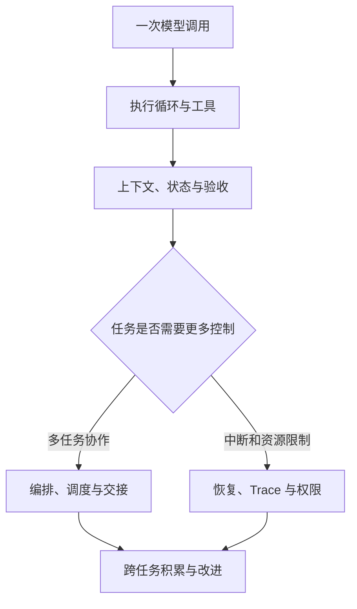

# 连续学习路线

先做完一次“模型提出动作、程序执行、结果回到模型”的循环，再逐步加入其他组件。目录编号用于定位组件；初次阅读可以直接从第 03 章开始，也可以先运行无需密钥的第 01 章任务验收。

| 阶段 | 阅读入口 | 要观察什么 |
|---|---|---|
| 第一次运行 | [03 执行循环](../10-Knowledge/03-agent-loop/README.md) 的 01—02 | prompt、response、tool call、observation 如何连接 |
| 控制一次任务 | 第 03 章的 03—04 | 历史何时更新，何时退出，错误怎样反馈，预算怎样计数 |
| 对照运行证据 | 第 03 章的 05—06 | Notebook、运行产物和 OpenHands 源码之间的对应关系 |
| 明确输入输出 | [01 任务协议](../10-Knowledge/01-task-contracts/README.md)、[02 模型接入](../10-Knowledge/02-model-adapters/README.md) | 什么叫完成；供应商响应怎样转成本程序使用的数据 |
| 补齐单 Agent | [06 上下文](../10-Knowledge/06-context-management/README.md)、[07 状态产物](../10-Knowledge/07-state-and-artifacts/README.md)、[08 工具环境](../10-Knowledge/08-tools-and-environment/README.md)、[10 验收](../10-Knowledge/10-evaluation-and-acceptance/README.md) | 模型看到了什么，工具做了什么，产物是否符合要求 |
| 扩展协作 | [04 编排调度](../10-Knowledge/04-orchestration-and-scheduling/README.md)、[05 通信交接](../10-Knowledge/05-communication-and-handoff/README.md) | 哪些子任务可开始，结果怎样交回与合并 |
| 保证持续执行 | [09 故障恢复](../10-Knowledge/09-persistence-and-recovery/README.md)、[11 Trace](../10-Knowledge/11-trace-and-observability/README.md)、[12 权限资源](../10-Knowledge/12-permissions-and-resources/README.md) | 从哪里恢复，怎样定位错误，动作何时被拒绝 |
| 跨任务积累 | [13 Memory](../10-Knowledge/13-memory/README.md)、[14 Skills](../10-Knowledge/14-skills/README.md)、[15 自进化](../10-Knowledge/15-self-improvement/README.md) | 保存什么经验，如何复用，修改是否有证据支持 |

15 个组件均从各自 README 进入递进正文与实验。需要补数学、模型原理或完整 RAG 专题时，查阅[旧知识库](../10-Knowledge/_archive/README.md)。

实践项目见[项目总表](../20-Projects/README.md)，环境与仓库检查命令见[运行说明](../scripts/README.md)。
