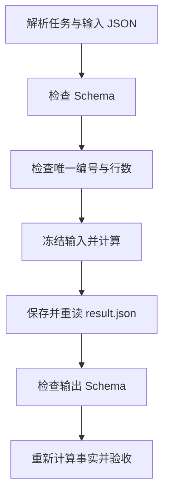

# 02｜Schema 与结果验收

[阅读路线](README.md) · [上一篇：任务对象与身份](01-request-and-identity.md) · [下一篇：错误类型、实验与源码](03-errors-and-experiments.md)

本章总览图如下：



`hours="2.5"` 是输入类型错误，应在计算前发现；`total_hours=99` 是结果数值错误，应由事实验收发现。

## 1. JSON 解析与 Schema 校验

`{"hours":"2.5"}` 是合法 JSON；解析后仍然是字符串。本章使用 JSON Schema 描述字段的类型与范围，使用 `jsonschema` 包真正执行检查。

下面是完整、可在章节目录执行的片段。它不读取输入文件，故意传入一条错误记录：

```python
from jsonschema import Draft202012Validator

schema = {
    "type": "object",
    "properties": {"hours": {"type": "number", "minimum": 0}},
    "required": ["hours"],
    "additionalProperties": False,
}
errors = list(Draft202012Validator(schema).iter_errors({"hours": "2.5"}))
print(len(errors))
print(errors[0].validator)
print(list(errors[0].path))
```

准确标准输出：

```text
1
type
['hours']
```

构造 `schema` 字典不会自动检查数据。`iter_errors` 才逐条产生错误，`path` 告诉调用者出错位置。完整实现把路径与错误文本放入 `ContractError`，供运行记录使用。

## 2. 任务、输入与输出 Schema

三份 Schema 分别校验任务对象、输入工单和输出结果。

| Schema | 被检查的值 | 关键规则 |
|---|---|---|
| [task.schema.json](schemas/task.schema.json) | 任务字典 | ID 格式、正整数版本、必须提供全部约束 |
| [tickets.schema.json](schemas/tickets.schema.json) | 工单列表 | 每项有 `id/status/hours`；工时 0—1000；状态来自枚举 |
| [result.schema.json](schemas/result.schema.json) | 结果字典 | 数量非负、工时为数值、输入摘要为 64 位十六进制字符 |

`properties` 描述已知字段，`required` 要求字段出现，`additionalProperties=false` 拒绝多余字段。这三者不能相互代替。例如只写 `properties`，空对象仍可能合法。输入中的 `true` 也不能因为 Python 中布尔值与整数有关，就被当成合法工时或数量。

下面节选 [contracts.py](code/contracts.py) 的 `validate` 核心步骤，是函数内部片段，依赖传入的 `value` 与读入的 `schema`，定义本身不打印：

```python
Draft202012Validator.check_schema(schema)
errors = sorted(
    Draft202012Validator(schema).iter_errors(value),
    key=lambda error: str(list(error.path)),
)
```

第一行校验规则本身，第二步用规则检查数据。完整函数取第一处错误并记录路径；实验不依赖第三方库错误句子的具体英文措辞，而检查稳定错误码，例如 `input_schema`。

## 3. 跨字段约束

一个数组的每一项都可以合法，却有两项共用 `T-101`。`uniqueItems=true` 检查整项是否重复，不能直接表达“两个不同对象的 id 相同”。本章在 `prepare` 中明确检查：

```python
# contracts.py 中 prepare 的节选，tickets 和 task 已通过 Schema。
ids = [row["id"] for row in tickets]
if len(ids) != len(set(ids)):
    raise ContractError("invalid_input", "input", "工单 id 必须唯一")
if len(tickets) > task["constraints"]["max_rows"]:
    raise ContractError("constraint_violation", "input", "输入行数超过 max_rows")
```

这个片段不直接运行；完整入口是 `python code/run_contract.py`。另外，输入路径相对于任务文件解析，解析后的真实路径必须位于该目录内。将路径写成 `../tickets.json` 会返回 `constraint_violation`，而不会继续找一个同名文件。

`prepare` 成功后，执行器把任务与输入放入独立运行目录。计算和验收都读取这份输入副本，因此后续修改 `examples/tickets.json` 不会改变已记录的执行依据。

## 4. 空集合与舍入规则

[calculate](code/contracts.py) 先选择 `done` 行，再求总值。没有已完成工单时，平均值没有定义，因此返回 `empty_selection`，不把它填成一个看似精确的 0。

浮点运算可能使 `0.1 + 0.2` 出现额外的小数位。本章把 JSON 数值的十进制文本转成 `Decimal`，再按任务的位数四舍五入。以下是完整可运行片段，不读文件：

```python
from decimal import Decimal, ROUND_HALF_UP

hours = [Decimal("2.5"), Decimal("1.5"), Decimal("2.0")]
mean = sum(hours) / len(hours)
print(mean.quantize(Decimal("0.01"), rounding=ROUND_HALF_UP))
```

标准输出为 `2.00`。保存 JSON 时转换回数值，文件中可能写为 `2.0`，它和 `2.00` 表示同一个数值；本章验收数值，不检查展示位数。JSON 原始小数已由解析器读为 Python 数值，因此这里是常见业务数值的舍入约定；若需要保留任意精度的原始小数字面量，应在输入协议中使用十进制字符串。

## 5. 产物验收

计算器保存的结果具有以下结构。下例是格式示例，运行 ID 和摘要用说明文字代替，不能直接通过 Schema：

```json
{
  "task_id": "weekly-ticket-hours",
  "task_version": 1,
  "run_id": "run-本次UUID",
  "source_sha256": "实际输入副本的64位SHA256摘要",
  "completed_ids": ["T-101", "T-102", "T-104"],
  "count": 3,
  "total_hours": 6.0,
  "mean_hours": 2.0
}
```

`execute` 不直接相信内存里的结果。它写入 `result.json`，重新读取文件，再调用 `accept`。因此验收检查的是实际交付的文件。

`accept` 先检查输出 Schema，然后从输入副本重新建立 `工单ID → 工时` 的映射，独立求出预期值；它不调用 `calculate` 来获得“标准答案”。两者只共享舍入函数，因为任务本身已经约定同一种舍入方式。

| 检查项 | 检查的事实 | 能发现什么 |
|---|---|---|
| `task_identity`、`run_identity` | 结果属于当前任务版本及运行 | 拿旧结果或其他任务的结果充数 |
| `source_digest` | 结果引用当前输入字节 | 报告关联了另一份输入 |
| `exact_ids`、`count` | 编号集合与数量一致 | 漏算、重复、算入未完成项 |
| `minimum_done` | 已完成数量达到最低要求 | 样本不足却声称任务达标 |
| `total_hours`、`mean_hours` | 统计值与输入重新计算一致 | 字段合法但计算错误 |

SHA256 摘要只是关联记录的方法，不是对抗恶意篡改的签名。摘要正确也不能证明统计值正确，所以这些检查是并列的。

## 6. 运行结果

在章节目录运行：

```bash
python code/run_contract.py
```

默认样本的第一行准确输出为 `status=accepted code=none`。按第二、三行找到运行目录后，可以执行下面的完整片段；将目录变量换为刚输出的实际路径：

```python
import json
from pathlib import Path

run_dir = Path("runs/请替换为实际运行目录名")
result = json.loads((run_dir / "result.json").read_text(encoding="utf-8"))
record = json.loads((run_dir / "run.json").read_text(encoding="utf-8"))
print(result["count"], result["total_hours"], result["mean_hours"])
print(record["acceptance"]["passed"])
print(all(record["acceptance"]["checks"].values()))
```

对默认输入，标准输出为：

```text
3 6.0 2.0
True
True
```

结果通过验收需要满足三项条件：输入符合约定，结果文件存在且字段合法，八项事实检查全部通过。
