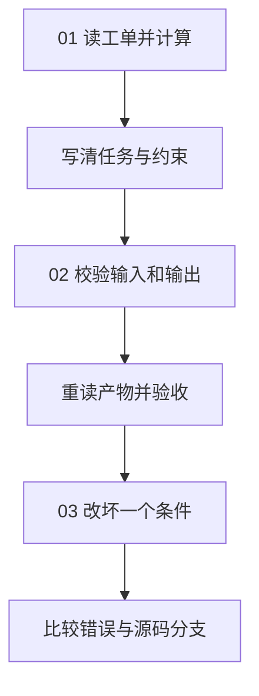

# 01｜任务与协议：让“完成”有可核对的含义

[组件总览](../README.md) · [下一组件：模型接入](../02-model-adapters/README.md)

本章从五张工单中统计“本周已完成的工单数、总工时和平均工时”。先用十几行 Python 算出结果，再给同一任务加上编号、输入输出规则和独立验收。读者只需要会读取 JSON、遍历列表和调用函数；本章全程本地计算，不需要模型密钥。



## 三篇正文与完整代码

| 阅读顺序 | 问题 | 入口与观察对象 |
|---|---|---|
| [01｜从一句要求到一个任务对象](01-request-and-identity.md) | “统计一下工时”还缺哪些约定？ | [v0_count.py](code/v0_count.py)，结果与任务 ID |
| [02｜让输入合法，让结果符合目标](02-schema-and-acceptance.md) | JSON 合法就算做对了吗？ | [contracts.py](code/contracts.py)、[run_contract.py](code/run_contract.py)，结构检查与独立验收 |
| [03｜错误、实验与验证器源码](03-errors-and-experiments.md) | 失败后应该改输入、改结果还是重新执行？ | [experiments.py](code/experiments.py)、[verify_sources.py](code/verify_sources.py)，十二种实际对照 |

## 从这里运行

以下命令的工作目录均为 `10-Knowledge/01-task-contracts/`。使用 Python 3.10 或更新版本，先安装 [requirements.txt](requirements.txt)：

```bash
python -m venv .venv
```

macOS / Linux 执行 `source .venv/bin/activate`；Windows PowerShell 执行 `.venv\Scripts\Activate.ps1`。然后：

```bash
python -m pip install -r requirements.txt
python code/v0_count.py
python code/run_contract.py
python code/experiments.py
python -m unittest discover -s code -p 'test_*.py' -v
python code/verify_sources.py
```

第一条脚本的准确标准输出：

```text
count=3 total_hours=6.0
saved=runs/preview.json
```

`run_contract.py` 成功时输出结构如下；运行编号和目录每次不同：

```text
status=accepted code=none
run_id=run-<本次UUID>
artifacts=<本次运行目录>
```

实验的第一行固定为 `cases=12 matched=12 accepted=1`。这里 `matched=12` 表示所有场景都出现了预期行为，只有正常场景的**任务结果**通过验收。

## 输入、约定与产物各放在哪里

| 文件 | 内容 |
|---|---|
| [examples/tickets.json](examples/tickets.json) | 五张工单，其中三张已完成，工时分别为 2.5、1.5、2.0 |
| [examples/task.json](examples/task.json) | 任务编号、版本、目标、输入路径、行数限制与验收参数 |
| [schemas/task.schema.json](schemas/task.schema.json) | 任务对象的字段约定 |
| [schemas/tickets.schema.json](schemas/tickets.schema.json) | 输入工单的字段约定 |
| [schemas/result.schema.json](schemas/result.schema.json) | 输出结果的字段约定 |
| `runs/<运行目录>/task.json`、`tickets.json` | 本次实际使用的任务与输入副本 |
| `runs/<运行目录>/result.json` | 计算出的统计值、任务身份和输入摘要 |
| `runs/<运行目录>/run.json` | 执行状态、独立验收和错误；输入失败时也会保存 |
| [reports/contract-experiments/comparison.md](reports/contract-experiments/comparison.md) | 已执行的十二种场景对照 |

默认运行生成新目录；`--output <新目录>` 可以指定目录，已有目录会被拒绝，避免把两次运行混在一起。实验保存每个场景的输入、结果与运行记录，原始 `examples/` 不受实验修改影响。

## 已执行的读者路径

已按上述顺序运行最小计算、完整协议、十二场景实验、6 项 unittest 和 3 个源码片段对照，全部通过；记录见 `reports/contract-experiments/`。验证环境为 Python 3.12.14、jsonschema 4.26.0。工时按十进制四舍五入，`attempt=1` 表示每次入口仅执行一次；本章没有自动重试与分布式去重。旧资料保留在[归档任务与协议](../_archive/03-agent-core/01-concepts/05-task-contracts.md)。

开始阅读：[01｜从一句要求到一个任务对象](01-request-and-identity.md)。
