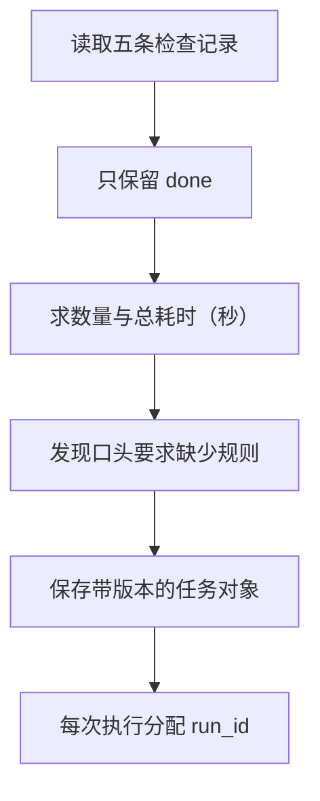

# 01｜任务对象与身份

[阅读路线](README.md) · [下一篇：Schema 与结果验收](02-schema-and-acceptance.md)

本章总览图如下：



“统计一下本周耗时（秒）”至少有两种合理理解：算所有投入过时间的检查记录，或者只算已经完成的检查记录。本章只统计已完成的检查记录。

## 1. 检查记录输入

本章已经放入 [examples/checks.json](examples/checks.json)。它是一个 JSON 数组，读入 Python 后得到 `list[dict]`。三条 `done` 检查记录的耗时（秒）为 2.5、1.5、2.0，另有一张 `in_progress` 和一张 `cancelled`。

下面是可在章节目录执行的完整 Python 片段，直接读取这个文件，没有网络配置：

```python
import json
from pathlib import Path

rows = json.loads(Path("examples/checks.json").read_text(encoding="utf-8"))
completed = [row for row in rows if row["status"] == "done"]
print(len(completed))
print(sum(row["seconds"] for row in completed))
```

准确标准输出：

```text
3
6.0
```

`json.loads` 只完成“JSON 文本 → Python 值”的转换。`row["seconds"]` 能相加，是因为当前文件恰好把它写成了数值。如果有人把 `2.5` 写成字符串 `"2.5"`，这段代码还没有给出容易处理的错误。输入检查见[Schema 与结果验收](02-schema-and-acceptance.md)。

配套的 [v0_count.py](code/v0_count.py) 在相同操作后保存结果。从章节目录运行：

```bash
python code/v0_count.py
```

标准输出：

```text
count=3 total_seconds=6.0
saved=runs/preview.json
```

打开 `runs/preview.json`，可以核对 `count` 与 `total_seconds`。它是可覆盖的最小预览；完整执行会使用独立目录。

## 2. 目标、约束与验收规则

如果把所有状态的耗时（秒）相加，程序会顺利结束，却得到 17.0 小时。任务约定需要明确只统计 `done` 检查记录，才能判断 6.0 小时符合目标。

[examples/task.json](examples/task.json) 是实际运行的任务对象，下面是其完整内容，属于数据格式示例：

```json
{
  "task_id": "weekly-check-seconds",
  "version": 1,
  "goal": "统计本周已完成检查记录的编号、数量、总耗时（秒）和平均耗时（秒）。",
  "input_path": "checks.json",
  "constraints": {"included_status": "done", "max_rows": 100},
  "acceptance": {"min_done": 1, "decimal_places": 2}
}
```

| 字段 | 本例约定 | 程序怎样使用 |
|---|---|---|
| `goal` | 交付编号、数量、总值、平均值 | 供人理解；可执行规则还需要下面的字段和验收函数 |
| `input_path` | 任务文件旁边的 `checks.json` | 相对于任务文件所在目录解析 |
| `included_status` | 只统计 `done` | 筛选输入，排除进行中和取消项 |
| `max_rows` | 输入最多 100 行 | 计算前检查；超限不开始计算 |
| `min_done` | 至少存在一条已完成检查记录 | 验收结果是否达到最低样本要求 |
| `decimal_places` | 保留两位小数 | 统一总值和平均值的舍入方式 |

目标说的是交付什么，约束限制可接受的输入与处理范围，验收条件检查实际结果。执行计划则是“读文件、筛选、求和、保存”，它可以换成数据库查询，不必因此修改任务目标。反过来，把目标改成统计所有检查记录时，应同时修改规则、验收逻辑与任务版本，不能只改 `goal` 文字。

这里 `included_status` 被 Schema 限定为 `done`，意味着当前实现承诺完成这一种任务。读取未知状态不会被悄悄解释成另一种任务。

## 3. 任务 ID 与运行 ID

如果今天运行成功，明天修改输入后运行失败，两次执行仍然可以属于同一个工作项，但它们的记录不能相互覆盖。

| 字段 | 标识的对象 | 何时改变 |
|---|---|---|
| `task_id` | “统计本周已完成检查记录”这个工作项 | 换成另一个独立任务时 |
| `version` | 该任务约定的版本 | 目标、字段含义、约束或验收口径改变时 |
| `run_id` | 一次完整执行 | 每次运行入口时 |
| `attempt` | 本次入口的执行尝试 | 本章固定为 1，不实现自动重试 |
| `source_sha256` | 本次输入副本的字节摘要 | 文件字节内容改变时 |

`task_id` 不是防止重复执行的锁，`run_id` 也不保证业务操作幂等。它们首先解决记录的归属问题。检查记录的 `C-101` 又是第三种编号，表示数据中的一条检查记录，不能拿来当运行编号。

下面是完整、可运行的 Python 片段。它只演示生成身份，不读写文件：

```python
from uuid import uuid4

task_id = "weekly-check-seconds"
run_id = "run-" + uuid4().hex
print(task_id)
print(run_id)
```

输出结构：

```text
weekly-check-seconds
run-<32位十六进制UUID>
```

UUID 的具体值每次不同。完整实现先生成这个编号，再把它同时写入 `result.json` 和 `run.json`，验收时检查二者关联，避免拿上一轮的结果冒充本轮结果。

## 4. 输入快照与重复运行

安装依赖后，在章节目录执行两次：

```bash
python code/run_contract.py
python code/run_contract.py
```

两次都应看到 `status=accepted code=none`，而 `run_id` 和 `artifacts` 不同。分别打开两个运行目录的 `run.json`：`task_id` 相同，`run_id` 不同。打开 `checks.json` 可以看到各自实际使用的输入副本。

还可以复制整个 `examples/` 目录到 `runs/my-input/`，将副本中 `C-104` 的 `seconds` 改为 `3.0`，再运行：

```bash
python code/run_contract.py --task runs/my-input/task.json
```

这条命令依赖你已完成上一句的复制与修改。运行后 `count` 仍为 3，`total_seconds` 变为 7.0，`mean_seconds` 变为 2.33；新输入的摘要也会改变。原始任务身份不变，是因为工作项和统计口径没有改变，而本次输入快照与运行身份记录了这一次的具体事实。
