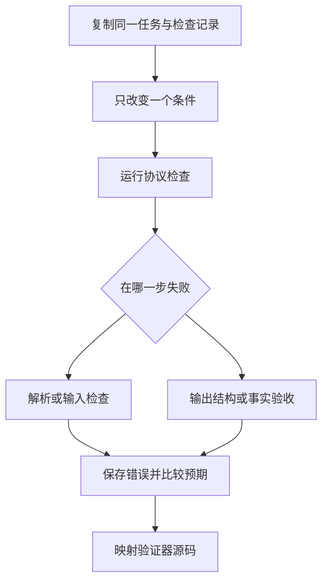

# 03｜错误类型、实验与源码

[阅读路线](README.md) · [上一篇：Schema 与结果验收](02-schema-and-acceptance.md)

本章总览图如下：



错误记录需要区分输入格式、输出结构和事实验收失败，才能定位需要修改的数据或代码。

## 1. 错误结构与处理方式

`ContractError` 保存一个错误字典。下面是 `wrong_total` 实验产生的错误结构：

```json
{
  "code": "acceptance_failed",
  "stage": "accept",
  "detail": "total_seconds",
  "retryable": false
}
```

这是一份格式示例；真实值可以在 [wrong_total/run/run.json](reports/contract-experiments/wrong_total/run/run.json) 核对。`code` 给调用者分支判断，`stage` 定位出错阶段，`detail` 指出失败项。`retryable=false` 表示原封不动再执行同一个操作没有修复依据，不是永远不能重新运行。

| 错误码 | 本例原因 | 合理的下一步 |
|---|---|---|
| `input_missing` | 任务或输入文件不存在 | 修正路径或提供文件 |
| `invalid_json` | JSON 不完整或不是合法 UTF-8 JSON | 修复文件格式 |
| `task_schema` / `input_schema` | 字段缺少、类型不符或取值越界 | 根据字段路径修正数据 |
| `invalid_input` | 两张检查记录共用 ID | 修正检查记录身份 |
| `constraint_violation` | 行数超限或路径越界 | 修改任务许可范围或选择合规输入 |
| `empty_selection` | 没有已完成检查记录 | 补充符合目标的数据，或重新约定空结果语义 |
| `output_schema` | 输出缺少平均值等必需字段 | 修正结果生成代码 |
| `acceptance_failed` | 结构正确，统计值或关联身份不正确 | 根据失败检查项重做结果 |
| `io_error` | 文件系统读取失败 | 检查具体运行环境 |

本章的本地数据错误都不自动重试。主入口返回非零退出码并保存 `run.json`；已有输出目录则在运行前被拒绝，防止覆盖已有记录。不要把 `status=failed` 理解为“没有任何文件”：输出验收失败时，错误结果会留下，方便检查。

## 2. 单变量实验

[experiments.py](code/experiments.py) 每次复制相同任务与输入。正常场景保留所有字段；其他场景各修改一个条件。输出故障通过显式 `mutate` 函数发生在写文件前，这个入口只被实验调用，普通执行不启用。

从章节目录运行完整实验：

```bash
python code/experiments.py
```

标准输出结构：

```text
cases=12 matched=12 accepted=1
artifacts=<本次实验目录>
```

打开新目录的 `comparison.md`，再挑一个场景顺着 `input/task.json → input/checks.json → run/result.json → run/run.json` 阅读。输入检查失败的场景不会出现 `result.json`，因为计算尚未开始。

| 场景 | 改动 | 预期结果 |
|---|---|---|
| `valid` | 无 | 任务通过 |
| `invalid_json` | 输入改成 `[` | `invalid_json` |
| `seconds_as_text` | `2.5` 改成 `"2.5"` | `input_schema` |
| `duplicate_id` | 两行共用 ID | `invalid_input` |
| `row_limit` | 最大行数从 100 改为 4 | `constraint_violation` |
| `no_done` | 所有行改成进行中 | `empty_selection` |
| `missing_mean` | 删除平均值字段 | `output_schema` |
| `wrong_total` | 总耗时（秒）改成 99 | `acceptance_failed` |
| `wrong_task` | 换成另一个任务 ID | `acceptance_failed` |
| `wrong_digest` | 输入摘要改成 64 个 0 | `acceptance_failed` |
| `minimum_done` | 最少已完成检查记录改成 4 | `acceptance_failed` |
| `path_escape` | 路径改成 `../checks.json` | `constraint_violation` |

已有执行记录见 [comparison.json](reports/contract-experiments/comparison.json) 和 [comparison.md](reports/contract-experiments/comparison.md)。其中 `matched=true` 表示实验观察符合预期，`accepted=false` 表示任务没有通过；两个布尔值回答不同问题。

## 3. 输出结构错误与事实错误

`missing_mean` 与 `wrong_total` 都没有交付正确结果，但失败位置不同。

缺少 `mean_seconds` 时，`validate(output, "result", "output")` 就抛出异常，验收尚未得到完整结果，所以 `run.json` 中 `acceptance=null`。总耗时（秒）为 99 时，类型与字段都合法，验收器继续计算，得到 `checks.total_seconds=false`，其余检查仍能保留。

以下是完整可运行片段，工作目录为章节目录，输入是已经提交的实验记录：

```python
import json
from pathlib import Path

root = Path("reports/contract-experiments")
for case in ["missing_mean", "wrong_total"]:
    record = json.loads((root / case / "run/run.json").read_text(encoding="utf-8"))
    print(case, record["error"]["code"], record["acceptance"] is not None)
```

准确标准输出：

```text
missing_mean output_schema False
wrong_total acceptance_failed True
```

把所有错误压成一句“再试一次”，就会丢掉这个区别。一个需要补字段，另一个需要改计算值。

## 4. jsonschema 源码

本章对照实际安装的 `jsonschema 4.26.0`，没有引入 Agent 框架。源码片段保存在 `sources/`，来自该版本 Python 分发包，附有 [MIT 许可证](sources/LICENSE.jsonschema) 和 [清单](sources/manifest.json)。这份清单记录文件摘要与原模块、函数名，来源范围是已安装依赖。

`required` 的关键分支如下，节选自[原函数](sources/required.py.txt)，不能独立运行：

```python
for property in required:
    if property not in instance:
        yield ValidationError(f"{property!r} is a required property")
```

`instance` 是被校验对象，`required` 是 Schema 的字段列表。缺少字段时使用 `yield` 交出错误，这解释了前文为何用 `list(iter_errors(...))` 收集它们。

| 本文步骤 | 固定版本原函数 | 实际分支 | 本文额外检查 |
|---|---|---|---|
| 检查 `seconds` 类型 | `jsonschema._keywords.type`，[片段](sources/type.py.txt) | 遍历允许类型，调用 `validator.is_type` | 不自动把字符串转数值 |
| 检查平均值必需出现 | `jsonschema._keywords.required`，[片段](sources/required.py.txt) | 字段不在对象中则产生错误 | 记录 `output_schema` 与字段路径 |
| 拒绝额外字段 | `jsonschema._keywords.additionalProperties`，[片段](sources/additionalProperties.py.txt) | 找出不在规则内的属性并处理 | 任务对象也使用严格字段集合 |

验证器不知道“done 检查记录总耗时（秒）应为 6.0”。这项知识位于本章 `accept`，与字段检查分工清楚。

在章节目录执行：

```bash
python code/verify_sources.py
```

准确标准输出：

```text
sources=3 version=4.26.0 matched=true
```

脚本同时检查保存片段的 SHA256，并与当前安装的同版本函数逐字对照。升级依赖后出现版本不符，应先重新阅读差异，再更新快照与说明。

## 5. 验收条件变更

复制 `examples/` 到新的输入目录，把 `acceptance.min_done` 从 1 改成 4，使用 `--task` 指向新任务。统计值仍然是 `3、6.0、2.0`，但 `minimum_done=false`，状态变为 `failed`。这说明“计算过程结束”和“达到任务要求”不是同一件事。

再把 `min_done` 改回 1，仅把 `C-103` 的状态改为 `done`。这一次应得到数量 4、总耗时（秒） 14.0、平均耗时（秒） 3.5，并且编号列表包含 `C-103`。如果检查仍然期待旧的固定答案 6.0，就说明验收器没有真正依据新输入工作。
