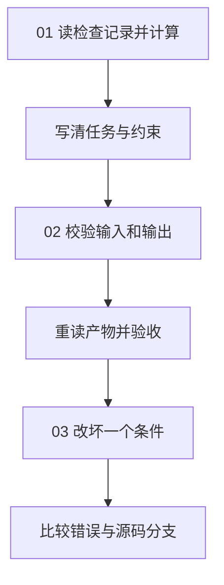

# 01｜任务与协议

本章把统计检查结果写成任务契约：输入、约束、输出结构和验收规则。

[组件总览](../README.md) · [下一组件：模型接入](../02-model-adapters/README.md)

本章的任务是统计五条检查记录中已完成项的数量、总耗时（秒）和平均耗时（秒）。代码使用 Python 本地计算，涉及 JSON 读取、列表遍历和函数调用，无须模型密钥。

本章总览图如下：



## 阅读路线

| 阅读顺序 | 内容 | 入口与观察对象 |
|---|---|---|
| [01｜任务对象与身份](01-request-and-identity.md) | 任务目标、约束、任务 ID 与运行 ID | [v0_count.py](code/v0_count.py)，结果与任务 ID |
| [02｜Schema 与结果验收](02-schema-and-acceptance.md) | 输入输出结构、跨字段约束与事实验收 | [contracts.py](code/contracts.py)、[run_contract.py](code/run_contract.py)，结构检查与独立验收 |
| [03｜错误类型、实验与源码](03-errors-and-experiments.md) | 错误分类、单变量实验与验证器源码 | [experiments.py](code/experiments.py)、[verify_sources.py](code/verify_sources.py)，十二种实际对照 |

## 环境与运行

以下命令的工作目录均为 `10-Knowledge/02 Agent Harness/01-task-contracts/`。使用 Python 3.10 或更新版本，先安装 [requirements.txt](requirements.txt)：

```bash
python -m venv .venv
```

macOS / Linux 执行 `source .venv/bin/activate`；Windows PowerShell 执行 `.venv\Scripts\Activate.ps1`。然后：

```bash
python -m pip install -r requirements.txt
python code/v0_count.py
python code/run_contract.py
python code/experiments.py
python -m unittest discover -s code -p 'test_*.py' -v
python code/verify_sources.py
```

第一条脚本的准确标准输出：

```text
count=3 total_seconds=6.0
saved=runs/preview.json
```

`run_contract.py` 成功时输出结构如下；运行编号和目录每次不同：

```text
status=accepted code=none
run_id=run-<本次UUID>
artifacts=<本次运行目录>
```

实验的第一行固定为 `cases=12 matched=12 accepted=1`。这里 `matched=12` 表示所有场景都出现了预期行为，只有正常场景的**任务结果**通过验收。

## 输入与产物

| 文件 | 内容 |
|---|---|
| [examples/checks.json](examples/checks.json) | 五条检查记录，其中三条已完成，耗时（秒）分别为 2.5、1.5、2.0 |
| [examples/task.json](examples/task.json) | 任务编号、版本、目标、输入路径、行数限制与验收参数 |
| [schemas/task.schema.json](schemas/task.schema.json) | 任务对象的字段约定 |
| [schemas/checks.schema.json](schemas/checks.schema.json) | 输入检查记录的字段约定 |
| [schemas/result.schema.json](schemas/result.schema.json) | 输出结果的字段约定 |
| `runs/<运行目录>/task.json`、`checks.json` | 本次实际使用的任务与输入副本 |
| `runs/<运行目录>/result.json` | 计算出的统计值、任务身份和输入摘要 |
| `runs/<运行目录>/run.json` | 执行状态、独立验收和错误；输入失败时也会保存 |
| [reports/contract-experiments/comparison.md](reports/contract-experiments/comparison.md) | 已执行的十二种场景对照 |

默认运行生成新目录；`--output <新目录>` 可以指定目录，已有目录会被拒绝，避免把两次运行混在一起。实验保存每个场景的输入、结果与运行记录，原始 `examples/` 不受实验修改影响。

## 验证范围

已运行最小计算、完整协议、十二场景实验、6 项 unittest 和 3 个源码片段对照，全部通过；记录见 `reports/contract-experiments/`。验证环境为 Python 3.12.14、jsonschema 4.26.0。耗时（秒）按十进制四舍五入，`attempt=1` 表示每次入口仅执行一次；本章没有自动重试与分布式去重。旧资料保留在[归档任务与协议](../../_archive/03-agent-core/01-concepts/05-task-contracts.md)。

开始阅读：[01｜任务对象与身份](01-request-and-identity.md)。

## 仿真任务入口

[notes.txt](notes.txt) 是交给 Agent 的任务提示词，包含执行命令、输入参数、检查项和产物路径。本章用任务协议描述输入和验收；均值函数用例用于检查仿真的基础计算。

在本章目录执行，使用 Python 3.10+ 标准库：

```bash
python simulate.py --config simulation.json --output runs/simulation
```

标准输出：

```text
samples=64 window=3
input_mse=0.090000 output_mse=0.010082
improvement_db=9.507 passed=True
artifacts=runs/simulation
```

| 文件 | 内容 |
|---|---|
| [simulation.json](simulation.json) | 采样点数、周期数、噪声幅度与滤波窗口 |
| `runs/simulation/metrics.json` | 输入与输出 MSE、改善量和配置摘要 |
| `runs/simulation/samples.csv` | 每个采样点的原始、加噪与滤波数值 |
| `runs/simulation/report.md` | 引用实际指标的仿真报告 |

再次运行时换一个 `--output` 目录。算法、参数对照和参考产物见[统一仿真说明](../_shared/README.md)。
