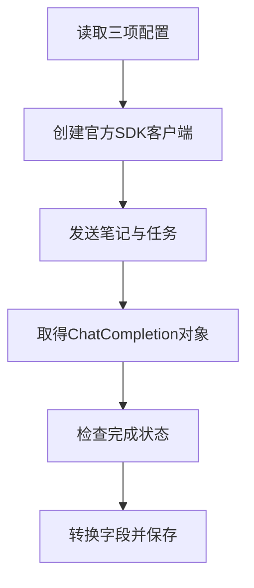

# 01｜API 配置与响应

[阅读路线](README.md) · [下一篇：工具调用与流式片段](02-tools-and-streaming.md)

本章总览图如下：



模型适配器把服务返回的候选列表、完成状态和用量，转换成业务代码使用的响应字典。

## 1. 输入消息

[examples/notes.txt](examples/notes.txt) 的实际内容如下：

```text
完成：工具接入
完成：循环日志
待办：错误重试
```

任务是概括笔记中的完成项和待办项。程序读取本地文件，再把文本放入用户消息；模型服务不能通过本地路径自动取得文件内容。

以下完整片段在章节目录执行，输入就是该文件，标准输出固定：

```python
from pathlib import Path

notes = Path("examples/notes.txt").read_text(encoding="utf-8")
messages = [{"role": "user", "content": "概括完成项与待办项。\n" + notes}]
print(messages[0]["role"])
print(messages[0]["content"])
```

```text
user
概括完成项与待办项。
完成：工具接入
完成：循环日志
待办：错误重试

```

最后的空行来自文件末尾换行与 `print` 的换行。消息列表此时只是 Python 数据，尚未请求模型。

## 2. API 配置与 SDK 对象

API 配置包括基础 URL、API Key 和模型名，安装与填写方法见 [README](README.md)。`OpenAI(...)` 是 Python 代码创建 SDK 客户端对象的表达式；变量 `client` 引用这个对象，用于发送请求和管理连接。

以下完整片段在章节目录执行，读取笔记、调用模型，并在 `with` 块结束时关闭 SDK 连接：

```python
import os
from pathlib import Path
from dotenv import load_dotenv
from openai import OpenAI

load_dotenv(".env", override=False)
notes = Path("examples/notes.txt").read_text(encoding="utf-8")
with OpenAI(
    base_url=os.environ["OPENAI_BASE_URL"],
    api_key=os.environ["OPENAI_API_KEY"],
    timeout=30,
    max_retries=0,
) as client:
    response = client.chat.completions.create(
        model=os.environ["OPENAI_MODEL"],
        messages=[{"role": "user", "content": "概括完成项与待办项。\n" + notes}],
    )
print(response.choices[0].message.content)
```

参考输出为“已完成工具接入和循环日志，待办是错误重试。”；具体措辞依模型而变。本段只展示最小调用，完整入口会先检查配置、检查响应并保存文件：

```bash
python code/live.py --mode text
```

输出结构为 `status=<completed或failed> code=<none或错误码>`，下一行给出实际产物目录。打开 `answer.txt` 看正文，打开 `requests-and-responses.json` 看真正发出的消息。

| 参数 | 改变了什么 | 没有替你完成什么 |
|---|---|---|
| `base_url` | 请求发往哪个 API 基础地址 | 不确认模型支持全部能力 |
| `api_key` | 设置认证信息 | 不属于提示词或报告字段 |
| `model` | 指定本次模型标识 | 不固定每次措辞 |
| `timeout=30` | 限制 SDK 的网络等待 | 不是整个 Agent 任务预算 |
| `max_retries=0` | 关闭 SDK 自动重试 | 上层若要重试，需要显式计数和策略 |

关闭自动重试让一次 `request()` 对应一次尝试，后面的用量覆盖率才有明确分母。网络失败也会占用一次尝试，不能因为没有收到 token 计数就从记录中消失。

## 3. 响应字段

官方 SDK 的 `create` 返回 `ChatCompletion` 对象。本文只请求一个候选，因此检查 `choices` 恰有一项且 `index=0`。这一约定写在 `normalize_completion`，不会悄悄丢弃多余候选。

| SDK 原生字段 | 类型 | 本文响应字典 | 转换 |
|---|---|---|---|
| `choices[0].message.content` | `str` 或 `None` | `content` | 保留正文 |
| `choices[0].message.tool_calls` | 工具对象列表或 `None` | `tool_calls` | 转为统一列表，缺失时用 `[]` |
| `choices[0].finish_reason` | 字符串 | `finish_reason` | 保留并检查结束原因 |
| `usage` | `CompletionUsage` 或 `None` | `usage` | 提取三个 token 计数，缺失字段保留 `None` |

`response.model_dump(mode="json")` 把 SDK 对象转成可 JSON 序列化的 Python 字典。它仍保留服务字段的含义，不会自动解析工具参数中那层 JSON 字符串。工具参数转换见[参数解析](02-tools-and-streaming.md)。

下面是可接在第 2 节取得 `response` 后执行的片段；它没有发起第二次请求：

```python
raw = response.model_dump(mode="json")
print(type(raw).__name__)
print(raw["choices"][0]["finish_reason"])
print(raw["usage"])
```

第一行标准输出为 `dict`；后两行是动态值，正常文本结束通常为 `stop`，用量可能是字典也可能是 `None`。完整适配器保存 `raw` 后，再调用 `normalize_completion(raw)`，所以可以对照原始对象与转换结果。

## 4. 响应结束状态

收到 HTTP 200 只表示接口交互成功，不能直接证明文本或参数完整。[normalize_message](code/adapter.py) 在转换工具参数之前先检查结束状态：

```python
# adapter.py 的函数内部节选，依赖已取得的 message 与 finish_reason。
if message.get("refusal"):
    raise AdapterError("refused", "服务返回 refusal")
if finish_reason == "length":
    raise AdapterError("output_truncated", "输出达到长度上限")
if finish_reason == "content_filter":
    raise AdapterError("content_filtered", "服务结束了受过滤的输出")
if finish_reason not in ("stop", "tool_calls"):
    raise AdapterError("incomplete_response", "没有收到可处理的完成状态")
```

这是函数节选，定义本身没有标准输出。它的作用是阻止半截内容进入后续执行。即使某段被截断的参数恰好能被 JSON 解析，也不能忽略 `length`。

| 情况 | 本文行为 |
|---|---|
| `stop` 且有文本 | 返回文本响应字典 |
| `tool_calls` 且有工具列表 | 检查并返回工具请求 |
| `length` | 保存 `output_truncated`，不使用半成品 |
| `refusal` 有值 | 保存 `refused` |
| 空文本且没有工具 | 保存 `empty_response` |
| 缺少完成状态 | 保存 `incomplete_response` |

文本里写“我已调用 read_file”仍然只是文本。只有原生 `tool_calls` 字段进入工具适配分支。

## 5. 模型适配器与调用记录

[OpenAIAdapter.request](code/adapter.py) 的完整实现有四个动作：构造请求，调用 SDK，保存原生响应，转换为本文响应字典。后面的工具和流式模式复用同一个入口。

下面是函数使用片段，工作目录为章节目录；与 `live.py` 一样，将 `code` 加入模块搜索路径后可单独运行。它发起一次真实请求，但不保存文件，适合观察返回类型：

```python
import sys
sys.path.insert(0, "code")
from adapter import OpenAIAdapter

adapter = OpenAIAdapter.from_env()
try:
    result = adapter.request([{"role": "user", "content": "用一句话解释周报。"}])
    print(sorted(result))
finally:
    adapter.client.close()
```

成功时标准输出为：

```text
['content', 'finish_reason', 'tool_calls', 'usage']
```

`live.py` 会把响应字典连同实际输入一起保存。
