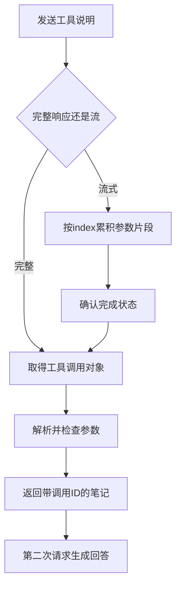

# 02｜工具调用与流式片段

[阅读路线](README.md) · [上一篇：API 配置与响应](01-configuration-and-response.md) · [下一篇：结构化输出、错误与用量](03-structured-output-and-usage.md)

本章总览图如下：



模型第一次只收到 `notes.txt` 的文件名，通过 `read_file` 请求取得笔记。适配器解析请求，工具执行代码检查参数并返回文件内容。

## 1. 工具定义

[live.py](code/live.py) 定义了一个函数工具。下面是完整的工具字典定义；它只创建 `tool` 变量，不打印，也不发起请求：

```python
tool = {
    "type": "function",
    "function": {
        "name": "read_file",
        "description": "读取本周笔记 notes.txt",
        "strict": True,
        "parameters": {
            "type": "object",
            "properties": {"path": {"type": "string", "enum": ["notes.txt"]}},
            "required": ["path"],
            "additionalProperties": False,
        },
    },
}
```

本章只开放一个文件，参数 `path` 因而使用枚举。服务看到工具名称、说明与参数规则，不会得到本机函数体或任意读取权限。

初次请求通过 `tool_choice={"type":"function","function":{"name":"read_file"}}` 要求模型提出一次读取，并设置 `parallel_tool_calls=False`。这是为了让真实示例稳定展示一次工具往返；后面的协议实验仍会独立验证多个工具片段交错的适配能力。

在章节目录运行：

```bash
python code/live.py --mode tool
```

成功时第一行是 `status=completed code=none`。打开本次 `requests-and-responses.json` 的第一条响应，应看到 `tool_calls`。工具调用 ID、参数空格与模型表述都是动态值。

## 2. 参数解析

服务返回的调用通常类似下面的格式。这是原生响应格式示例，ID 仅用于说明：

```json
{
  "id": "call_a",
  "type": "function",
  "function": {
    "name": "read_file",
    "arguments": "{\"path\":\"notes.txt\"}"
  }
}
```

`arguments` 的外层类型是字符串，即使里面看起来像 JSON。完整适配器先检查工具类型、非空 ID 和名称、同一响应内 ID 不重复，再调用 `parse_object`。

| 原生字段 | 原生类型 | 本文字典字段 | 目标类型 |
|---|---|---|---|
| `call.id` | `str` | `id` | `str` |
| `call.function.name` | `str` | `name` | `str` |
| `call.function.arguments` | JSON `str` | `arguments` | `dict` |

下面是完整可运行片段，没有 API 配置要求：

```python
import json

raw_arguments = '{"path":"notes.txt"}'
arguments = json.loads(raw_arguments)
print(type(raw_arguments).__name__)
print(type(arguments).__name__)
print(arguments["path"])
```

标准输出：

```text
str
dict
notes.txt
```

`json.loads("[]")` 也能成功，却返回列表。因此 `parse_object` 还要求根节点必须是字典。随后 `tool_result` 用工具参数 Schema 检查字典：`path=7`、`path="../secret"` 都会被拒绝。解析格式与检查权限分别发生，工具名也必须在白名单内。

## 3. 工具结果与调用 ID

程序在本次运行开始时读入笔记并保存副本；`tool_result(call, notes)` 只在请求通过检查后返回这份内容。这个小例子无需开放通用文件系统工具。

下例是 `tool_result` 返回值的格式示例：

```python
{
    "role": "tool",
    "tool_call_id": "call_a",
    "content": "完成：工具接入\n完成：循环日志\n待办：错误重试\n",
}
```

下一次请求保留三个部分：原用户问题、assistant 工具请求、tool 结果。`assistant_message` 把本文字典里的参数用 `json.dumps` 转回 JSON 字符串，因为供应商请求协议要求这种类型。

| 消息 | 保存什么 | 为什么需要 |
|---|---|---|
| `user` | 原始任务 | 让模型知道回答目标 |
| `assistant` | 工具名称、参数和调用 ID | 说明为何会出现后续工具结果 |
| `tool` | 同一个 `tool_call_id` 和笔记 | 让结果与调用一一对应 |

打开本次 `messages.json` 检查调用 ID，再查看第二条 API 请求，它应包含完整笔记。第二次设置 `tool_choice="none"`，要求模型依据工具结果回答。本文没有把模型说出的任何自然语言当作工具命令执行。

## 4. 流式文本

流式请求在普通请求上增加两个选项：

```python
# OpenAIAdapter.request 的请求构造节选，payload 已包含 model 和 messages。
payload.update(stream=True, stream_options={"include_usage": True})
```

这是接续片段，不单独调用 API。完整请求的返回对象是可迭代的流；迭代时每项是 `ChatCompletionChunk`。正文在 `choices[0].delta.content`，可能为空，也可能只包含一个字或一部分词。

从章节目录运行：

```bash
python code/live.py --mode stream
```

模型文本会逐段打印，最后保存完整 `answer.txt`。分段位置与措辞是动态的，不能把每个 chunk 当成一句话。`request()` 通过 `on_text` 回调显示文本，同时让 `StreamAccumulator` 收集同样的文本；最终拼接结果进入普通响应字典。

## 5. 流式工具参数

同样的流式机制也会拆分工具参数。[examples/stream-tools.jsonl](examples/stream-tools.jsonl) 是显式构造的协议样本，故意让两个读取请求交错抵达：

| 顺序 | 工具 index | 本次 arguments 片段 | 该 index 累积后 |
|---:|---:|---|---|
| 0 | 0、1 | 空字符串，同时给出 ID 和名称 | 都为空 |
| 1 | 0 | `{"path":` | `{"path":` |
| 2 | 1 | `{"path":"notes` | `{"path":"notes` |
| 3 | 0 | `"notes.txt"}` | `{"path":"notes.txt"}` |
| 4 | 1 | `.txt"}` | `{"path":"notes.txt"}` |
| 5 | — | `finish_reason="tool_calls"` | 两个调用完成 |
| 6 | — | 空 `choices` 和 usage | 接收本次用量 |

`index` 是当前响应里工具的位置，`id` 是下一次请求里关联结果的编号。不能按参数到达先后把所有字符串拼成一份 JSON，也不能用后续片段的空 `id` 覆盖第一段已经给出的 ID。

[StreamAccumulator.feed](code/adapter.py) 的关键累积逻辑如下；这是函数内部节选，`fragment` 来自本次 delta：

```python
index = fragment["index"]
buffer = self.tools.setdefault(index, {
    "id": None,
    "type": "function",
    "function": {"name": "", "arguments": ""},
})
function = fragment.get("function") or {}
buffer["function"]["name"] += function.get("name") or ""
buffer["function"]["arguments"] += function.get("arguments") or ""
```

完整实现还检查 index 为非负整数、同一 index 的 ID 不发生冲突，并保留初次出现的 ID。名称也是可选片段；没有名称的后续事件不会清空已有值。

直到流正常结束、取得有效 `finish_reason` 后，`finish()` 才按 index 排序并交给同一个 `normalize_message`。它此时才解析完整参数。某个中间片段“已经能解析”为 JSON，并不是执行许可，因为响应可能继续扩展，或最终以 `length` 结束。

## 6. 协议回放与 API 请求

先在章节目录执行下面的完整片段，输入是实际协议样本，不请求模型：

```python
import json
import sys
from pathlib import Path
sys.path.insert(0, "code")
from adapter import StreamAccumulator

collector = StreamAccumulator()
for line in Path("examples/stream-tools.jsonl").read_text(encoding="utf-8").splitlines():
    collector.feed(json.loads(line))
result = collector.finish()
for call in result["tool_calls"]:
    print(call["id"], call["name"], call["arguments"])
print(result["usage"]["total_tokens"])
```

准确标准输出：

```text
call_a read_file {'path': 'notes.txt'}
call_b read_file {'path': 'notes.txt'}
10
```

然后用已经配置的真实模型运行：

```bash
python code/live.py --mode stream-tools
```

这条入口把第一次工具请求改成流式，第二次仍然接完整回答。本次记录中的 `chunks` 保存原始片段；`normalized.tool_calls` 保存合并并解析后的参数。实际模型受 `parallel_tool_calls=False` 约束，通常只提出一个读取；本地双调用样本用于检验更一般的拼接规则。

如果连接断开，`request()` 保存已经收到的片段和 `transport_error`，不会返回可执行工具字典。最后的 usage 事件也可能未到达，此时用量记为未知。
