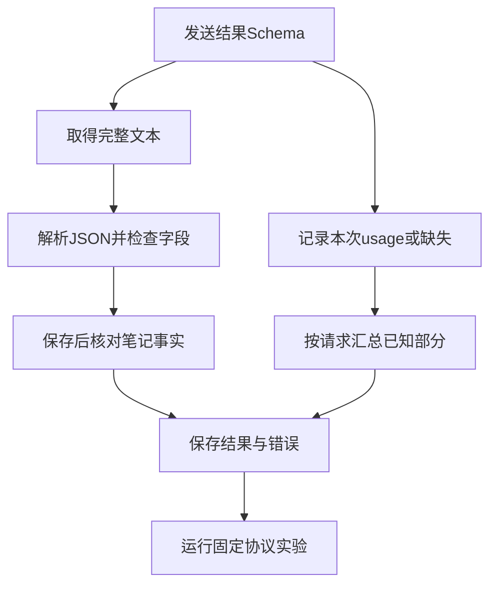

# 03｜结构化输出、错误与用量

[阅读路线](README.md) · [上一篇：工具调用与流式片段](02-tools-and-streaming.md) · [下一篇：OpenAI SDK 源码](04-sdk-source.md)

本章总览图如下：



结构化输出为完成项和待办项提供固定字段；用量记录保留 token 计数及其缺失状态，支持跨请求累计。

## 1. 结构化输出

同一份笔记的目标结果是两个字符串数组：

```json
{
  "completed": ["工具接入", "循环日志"],
  "pending": ["错误重试"]
}
```

这是期望结果的格式示例。为了让 API 按这个结构生成，`live.py` 将 `SCHEMA` 放入 `response_format`。以下是请求配置的完整变量定义，定义本身不会请求模型：

```python
schema = {
    "type": "object",
    "properties": {
        "completed": {"type": "array", "items": {"type": "string"}},
        "pending": {"type": "array", "items": {"type": "string"}},
    },
    "required": ["completed", "pending"],
    "additionalProperties": False,
}
response_format = {
    "type": "json_schema",
    "json_schema": {"name": "weekly_summary", "strict": True, "schema": schema},
}
```

`strict=True` 是向支持该能力的服务提出结构约束，不会替本机 Python 自动创建字典。`message.content` 仍是 JSON **字符串**，需要解析。若服务拒绝该参数，应该先检查服务与模型能力，不自动退回普通文本并声称完成了同一协议。

在章节目录运行：

```bash
python code/live.py --mode structured
```

成功时保存 `answer.txt` 与 `summary.json`。前者是收到的文本，后者是解析后的对象序列化结果，`run.json` 记录验收。措辞、顺序或结果可能变化，因此控制台只给出状态与产物路径。

## 2. Schema 校验与事实验收

[parse_structured](code/adapter.py) 接收已经完成的本文响应字典和 Schema，返回 Python 字典。它先要求 `finish_reason="stop"` 且没有工具调用，再解析 JSON，最后用 `Draft202012Validator` 检查结构。

下面是函数内部节选，所依赖的 `response`、`schema` 来自调用者，本身不打印：

```python
value = parse_object(response["content"], "invalid_structured_output")
errors = list(Draft202012Validator(schema).iter_errors(value))
if errors:
    raise AdapterError("output_schema", errors[0].message)
return value
```

它不从 Markdown 代码围栏中猜测并提取 JSON；文本必须整体符合约定。这使格式错误可观察，也避免把一段解释误当成结果。

通过 Schema 后，`live.py` 保存 `summary.json`，重新读取文件，再调用 `summary_acceptance`。验收从真实笔记的每一行提取“完成：”与“待办：”后的原文，与结果数组比较。顺序可以不同，内容和重复次数必须一致。

| 结果 | Schema | 事实验收 |
|---|---|---|
| 两个数组，事项与原文一致 | 通过 | 通过 |
| `pending` 写成字符串 | 失败 | 尚未进入 |
| 缺少 `completed` | 失败 | 尚未进入 |
| 把“错误重试”归为已完成 | 通过 | 失败 |
| 合法数组中重复“工具接入” | 通过 | 失败 |

最后两项说明结构化输出只约束形状。下面是完整本地片段，展示“字段齐全但事实相反”，不会调用模型：

```python
import sys
from pathlib import Path
sys.path.insert(0, "code")
from live import summary_acceptance

notes = Path("examples/notes.txt").read_text(encoding="utf-8")
value = {"completed": ["错误重试"], "pending": ["工具接入", "循环日志"]}
print(summary_acceptance(value, notes))
```

准确标准输出：

```text
{'passed': False, 'checks': {'completed': False, 'pending': False}}
```

## 3. usage 字段

常见的原生 usage 包含三个整数：`prompt_tokens`、`completion_tokens`、`total_tokens`。本文保留这三个服务计数，不把它们转换成费用。费用还涉及模型、价格与缓存等计费规则，不能只乘一个通用单价。

| 服务返回值 | 本文值 | 含义 |
|---|---|---|
| 非负整数 `8` | `8` | 实际观测到的计数 |
| 明确的 `0` | `0` | 服务报告为零 |
| `usage=null` 或字段缺失 | `None`，JSON 中为 `null` | 未观测到 |
| 字符串、负数或布尔值 | `None` | 不是本程序接受的计数类型 |

`type(value) is int` 避免把 `True` 当作 1。缺失总计时，本文不自行用两个其他字段推导供应商总计；这样报告能明确区分观测值和估计值。

流式请求尤其容易漏用量：完成文本或工具内容后，服务可能再发送一个 `choices=[]` 的 usage 事件。所以 `StreamAccumulator.feed` 先处理 usage，再判断有没有 choices。若先写 `chunk["choices"][0]`，最后一段就会越界。

## 4. 用量快照与跨请求累计

同一请求里的 usage 是本次请求快照。若收到两个用量快照，应该更新该请求的值，而不是把两份都加起来。[StreamAccumulator](code/adapter.py) 使用：

```python
# feed() 内部节选；chunk 是本次事件字典。
if chunk.get("usage") is not None:
    self.usage = chunk["usage"]
```

流结束后，`OpenAIAdapter.request` 在 `finally` 中调用一次 `ledger.add(usage)`。每次请求无论成功、HTTP 错误还是断线，都只增加一条用量记录；断线时最后一段未收到就记录缺失。

多次请求再由 `UsageLedger.summary` 汇总。下面是完整、离线可运行片段，工作目录为章节目录：

```python
import sys
sys.path.insert(0, "code")
from adapter import UsageLedger

ledger = UsageLedger()
ledger.add({"prompt_tokens": 8, "completion_tokens": 2, "total_tokens": 10})
ledger.add(None)
ledger.add({"prompt_tokens": 4})
summary = ledger.summary()
print(summary["request_count"], summary["fully_metered_requests"])
print(summary["fields"]["prompt_tokens"])
print(summary["fields"]["total_tokens"])
```

准确标准输出：

```text
3 1
{'known_sum': 12, 'reported_requests': 2, 'missing_requests': 1}
{'known_sum': 10, 'reported_requests': 1, 'missing_requests': 2}
```

`known_sum=10` 是已知部分，不是三个请求的完整总消耗。这里 `total_tokens` 只覆盖 1/3 个请求，`prompt_tokens` 覆盖 2/3；单独给一个“已计量请求数”还不足以解释部分字段缺失，所以每个字段也保留覆盖数量。

## 5. 错误分类

`AdapterError` 保存稳定错误码、简短详情与是否可重试。API Key、认证头与服务异常原文不会被主动写入错误摘要；原始请求记录也只保存业务 payload。

| 错误 | 产生位置 | 程序行为 |
|---|---|---|
| `configuration` | 请求之前 | 不创建模型请求，不生成假回答 |
| `transport_error` | 连接、超时、流读取 | 保存已收到的片段；可由上层决定有限重试 |
| `http_error` | API 状态码 | 408、429、5xx 标为可重试；其他状态需修正请求或配置 |
| `provider_error` | SDK 收到服务错误事件 | 保留类型；未知原因不自动重试 |
| `invalid_protocol_json` | 流事件不是完整 JSON | 保存错误，不输出可执行调用 |
| `output_truncated` / `refused` | 模型完成状态 | 不把半成品或拒绝内容当成功结果 |
| `invalid_arguments` / `tool_schema` | 工具参数适配或检查 | 不执行该工具 |
| `output_schema` | 结果字段 | 不进入事实验收 |
| `acceptance_failed` | 已保存结构化结果 | 保留失败项，任务未达标 |

这里“可重试”只是供上层策略使用的字段，适配器没有自动重试。工具重做策略与重试预算由执行循环控制。

## 6. 协议实验

在章节目录运行：

```bash
python code/experiments.py
```

前三行准确输出为：

```text
mode=explicit_protocol_replay cases=5 matched=5
tool_calls=2
requests=3 fully_metered=1
```

第四行打印本次目录。实验以 [stream-tools.jsonl](examples/stream-tools.jsonl) 为基线，每次只改一处，保存原样本、转换结果和 [对照报告](reports/protocol-experiments/comparison.md)。

| 场景 | 改动 | 可观察结果 |
|---|---|---|
| `interleaved_tools` | 不修改样本 | 两份独立参数，最终总计为 10 |
| `missing_finish` | 删除结束标记和最后 usage | `incomplete_response`，没有可执行字典 |
| `missing_usage` | 只删除最后 usage | 工具完整可用，计数为未知 |
| `length_limit` | 结束原因改成 `length` | `output_truncated`，即使参数已完整也拒绝执行 |
| `broken_arguments` | 删除一段参数 | `invalid_arguments` |

实验还保存前述三请求用量累计和“结构合格、事实颠倒”的结果。测试文件进一步通过真正的 SDK 和本地 `httpx2.MockTransport` 覆盖 HTTP 429、SSE 解码、连接中断与全部五种入口；传输由测试显式替换，不影响正常入口的模型选择。

可以复制协议样本，删除 `call_b` 的最后一段参数，然后调用 `replay` 观察 `invalid_arguments`。再只删除最后的 usage 事件，结果应能返回，但 `usage.total_tokens is None`。这两个修改分别影响“动作是否完整”和“消耗是否可观测”，不要用同一个成功标志把它们合并。
