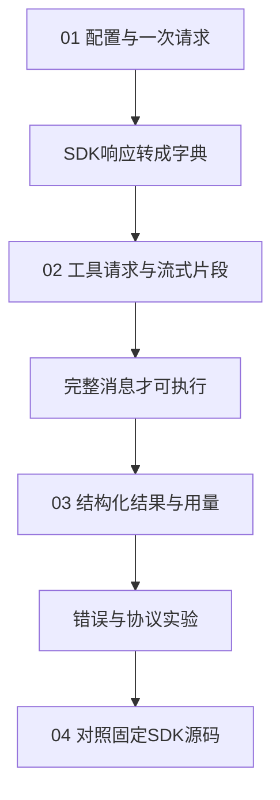

# 02｜模型接入

本章从读取仿真任务说明开始，接入真实模型并保存响应。

[组件总览](../README.md) · [上一组件：任务与协议](../01-task-contracts/README.md) · [下一组件：Agent 执行循环](../03-agent-loop/README.md)

本章使用官方 `openai` SDK 汇总一份仿真任务说明，提取执行命令和三个产物路径。模型接入代码在 [adapter.py](code/adapter.py)，工具执行和文件验收在 [live.py](code/live.py)。

本章总览图如下：



## 阅读路线

| 顺序 | 阅读文件 | 新增机制 | 运行入口 |
|---|---|---|---|
| 01 | [API 配置与响应](01-configuration-and-response.md) | 配置、请求、响应字段转换 | `python code/live.py --mode text` |
| 02 | [工具调用与流式片段](02-tools-and-streaming.md) | 工具参数、调用 ID、流式文本和交错工具参数 | `--mode tool`、`--mode stream`、`--mode stream-tools` |
| 03 | [结构化输出、错误与用量](03-structured-output-and-usage.md) | Schema、事实验收、缺失用量与累计、失败分类 | `--mode structured`、`code/experiments.py` |
| 04 | [OpenAI SDK 源码](04-sdk-source.md) | 固定版本字段和 SSE 分支走读 | `code/verify_sources.py` |

## 环境与 API 配置

以下命令均在 `10-Knowledge/02 Agent Harness/02-model-adapters/` 执行，使用 Python 3.10 或更新版本：

```bash
python -m venv .venv
```

macOS / Linux 执行 `source .venv/bin/activate`；Windows PowerShell 执行 `.venv\Scripts\Activate.ps1`。然后安装已经核对过的依赖：

```bash
python -m pip install -r requirements.txt
```

复制 [.env.example](.env.example) 为 `.env`，填写：

```dotenv
OPENAI_BASE_URL=https://api.openai.com/v1
OPENAI_API_KEY=你的实际密钥
OPENAI_MODEL=你的服务支持的模型名
```

| 配置 | SDK 中的位置 | 注意什么 |
|---|---|---|
| `OPENAI_BASE_URL` | `OpenAI(base_url=...)` | API 基础 URL，不含 `/chat/completions`，不在 URL 中放密钥 |
| `OPENAI_API_KEY` | `OpenAI(api_key=...)` | 用于请求认证，不进入请求记录 |
| `OPENAI_MODEL` | `create(model=...)` | 文本、工具、流式和 JSON Schema 能力由该模型及服务决定 |

环境变量优先于 `.env`。缺失配置时入口保存 `configuration` 错误，退出码为 1；它不会自动使用协议样本代替真实模型。兼容服务不支持某个选项时会返回错误，应根据服务能力选择运行模式。

## 运行模式

文本、工具、流式和结构化输出分别使用以下命令：

```bash
python code/live.py --mode text
python code/live.py --mode tool
python code/live.py --mode stream
python code/live.py --mode stream-tools
python code/live.py --mode structured
```

每次生成新的 `runs/<模式>-<时间>/`。成功时的输出结构为：

```text
status=completed code=none
artifacts=<本次运行目录>
```

`stream` 模式还会先实时打印模型文本，具体措辞不固定。`tool` 与 `stream-tools` 正常完成时发起两次模型请求，其他模式发起一次。第一次请求读取仿真任务说明，第二次依据工具结果回答。

| 输入或产物 | 用来核对什么 |
|---|---|
| [examples/notes.txt](examples/notes.txt) | 三条实际笔记 |
| `runs/.../notes.txt` | 本次输入副本 |
| `runs/.../requests-and-responses.json` | 实际请求、SDK 响应或流片段、转换后的字典、错误与 usage |
| `runs/.../messages.json` | 工具模式的 user、assistant、tool 消息及调用 ID |
| `runs/.../answer.txt` | 模型最终文本 |
| `runs/.../summary.json` | 结构化模式的 JSON 结果 |
| `runs/.../run.json` | 状态、错误、用量覆盖率；结构化模式还包含事实验收 |

## 离线实验与源码核对

这组命令使用明确标注的协议样本和 MockTransport，不需要密钥：

```bash
python code/experiments.py
python -m unittest discover -s code -p 'test_*.py' -v
python code/verify_sources.py
```

实验固定输出前三行为：

```text
mode=explicit_protocol_replay cases=5 matched=5
tool_calls=2
requests=3 fully_metered=1
```

随后打印本次产物目录。可先打开已执行的 [comparison.md](reports/protocol-experiments/comparison.md) 与 [comparison.json](reports/protocol-experiments/comparison.json)，其中包含交错参数、流中断、长度上限、缺失 usage 和结构正确但事实错误的对照。

## 验证范围

已运行五场景协议实验、12 项 unittest、4 个源码文件对照和[缺配置真实入口检查](reports/configuration-check/run.json)。测试通过官方 SDK 的 MockTransport 覆盖全部五种入口、两次工具往返、SSE 与流中断，未发起外部 API 请求。环境使用 Python 3.12.14、openai 3.16.2、python-dotenv 1.2.3、jsonschema 4.26.0、httpx2 2.13.0。当前无 API Key，真实模型响应需读者配置后生成；报告没有预填模型成功率或费用。SDK 快照取自已安装分发包，未声称验证远端提交。旧资料见[归档模型适配器](../../_archive/03-agent-core/01-concepts/03-model-adapters.md)。

开始阅读：[01｜API 配置与响应](01-configuration-and-response.md)。

## 仿真任务入口

[notes.txt](notes.txt) 是交给 Agent 的任务提示词，包含执行命令、输入参数、检查项和产物路径。本章的模型调用先提取仿真命令与产物路径；实际仿真可用下方命令独立运行。

在本章目录执行，使用 Python 3.10+ 标准库：

```bash
python simulate.py --config simulation.json --output runs/simulation
```

标准输出：

```text
samples=64 window=3
input_mse=0.090000 output_mse=0.010082
improvement_db=9.507 passed=True
artifacts=runs/simulation
```

| 文件 | 内容 |
|---|---|
| [simulation.json](simulation.json) | 采样点数、周期数、噪声幅度与滤波窗口 |
| `runs/simulation/metrics.json` | 输入与输出 MSE、改善量和配置摘要 |
| `runs/simulation/samples.csv` | 每个采样点的原始、加噪与滤波数值 |
| `runs/simulation/report.md` | 引用实际指标的仿真报告 |

再次运行时换一个 `--output` 目录。算法、参数对照和参考产物见[统一仿真说明](../_shared/README.md)。
