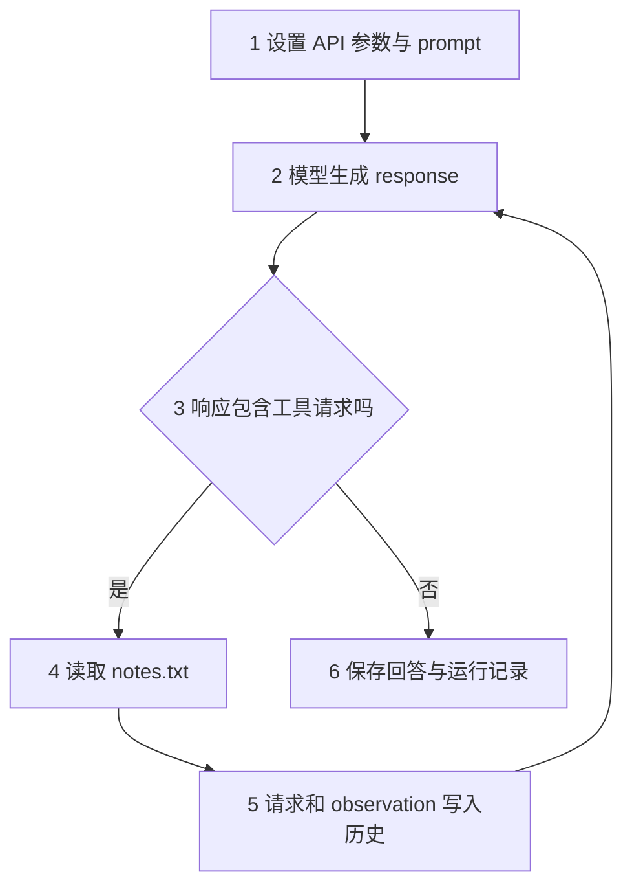
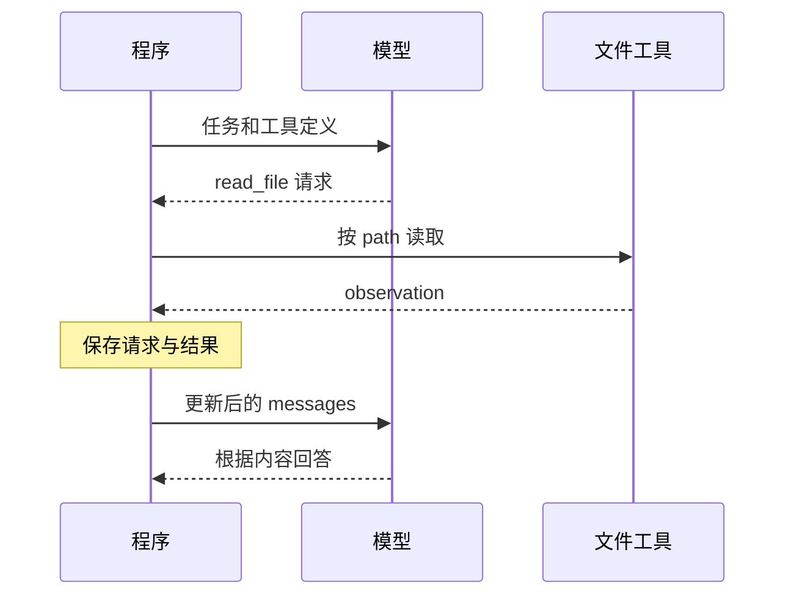

# 01｜模型调用与最小 Agent 循环

> 状态：draft

[阅读路线](README.md) · 下一篇：[02｜工具调用](02-tools-and-observations.md)

本章总览图如下：



**本篇输入：** 根目录的 [notes.txt](notes.txt)。

**运行入口：** `code/v0_model_call.py`、`code/v1_minimal_loop.py`。

**输出位置：** `runs/v0-…/`、`runs/v1-…/`。

## 1. API 配置与模型调用

按 [README 的配置步骤](README.md) 安装依赖并填写 `.env`：

```dotenv
OPENAI_BASE_URL=https://api.openai.com/v1
OPENAI_API_KEY=你的实际密钥
OPENAI_MODEL=你的模型名
```

代码从 `.env` 读取 URL、API Key 和模型名。`OpenAI(...)` 创建用于发送 API 请求的 SDK 对象，赋给变量 `client`。URL 填基础地址，SDK 会补上接口路径。下面的完整片段在章节目录执行：

```python
import os
from dotenv import load_dotenv
from openai import OpenAI

load_dotenv(".env")
client = OpenAI(
    base_url=os.environ["OPENAI_BASE_URL"],
    api_key=os.environ["OPENAI_API_KEY"],
    timeout=30.0,
    max_retries=0,
)
from pathlib import Path
notes = Path("notes.txt").read_text(encoding="utf-8")
messages = [{"role": "user", "content": "根据任务说明列出执行步骤，暂不执行。\n" + notes}]
response = client.chat.completions.create(
    model=os.environ["OPENAI_MODEL"],
    messages=messages,
)
print(response.choices[0].message.content)
```

**这段代码的作用：** 发起一次真实请求，并打印第一条候选响应的正文。

**参考输出：** `读取配置，运行 simulate.py，检查退出码及 MSE，打开生成的报告。` 模型措辞可能不同。

| 对象 | 在这段代码中表示什么 |
|---|---|
| prompt | 本次交给模型的输入，包含 `messages` 中的问题 |
| `client` | `OpenAI(...)` 创建的 SDK 对象，用于发送 API 请求 |
| `response` | API 返回的完整响应对象 |
| `response.choices[0].message` | 第一条候选回答的消息对象 |
| `message.content` | 回答正文 |

配套脚本把同一次调用的输入和响应一起保存。执行：

```bash
python code/v0_model_call.py
```

**输出结构：**

```text
<模型回答>
status=stopped reason=response_received model_calls=1
artifacts=<本次运行目录>
```

打开该目录的 `requests.jsonl`，能看到最初的问题；打开 `responses.jsonl`，能看到完整响应；`answer.md` 保存回答正文。

## 2. 输入文件

根目录已经有一份 `notes.txt`，内容是：

```text
任务：执行一次 Python 信号去噪仿真，并根据实际结果生成报告。
执行：python simulate.py --config simulation.json --output runs/simulation
输入：64 个采样点，2 个正弦周期，交替噪声幅度 0.3，均值滤波窗口 3。
检查：核对进程退出码和输出 MSE；若存在 stats.py，核对 mean 的除数和空列表处理。
产物：runs/simulation/metrics.json、runs/simulation/samples.csv、runs/simulation/report.md
要求：保留原始配置；报告引用真实指标，运行失败时记录原因，不编造成功。
```

先不用模型，直接在章节目录运行下面的完整代码：

```python
from pathlib import Path

text = Path("notes.txt").read_text(encoding="utf-8")
print(text, end="")
```

**标准输出：**

```text
任务：执行一次 Python 信号去噪仿真，并根据实际结果生成报告。
执行：python simulate.py --config simulation.json --output runs/simulation
输入：64 个采样点，2 个正弦周期，交替噪声幅度 0.3，均值滤波窗口 3。
检查：核对进程退出码和输出 MSE；若存在 stats.py，核对 mean 的除数和空列表处理。
产物：runs/simulation/metrics.json、runs/simulation/samples.csv、runs/simulation/report.md
要求：保留原始配置；报告引用真实指标，运行失败时记录原因，不编造成功。
```

这就是读取工具最终要执行的操作。再运行配套入口：

```bash
python code/inspect_input.py
```

**标准输出：**

```text
任务：执行一次 Python 信号去噪仿真，并根据实际结果生成报告。
执行：python simulate.py --config simulation.json --output runs/simulation
输入：64 个采样点，2 个正弦周期，交替噪声幅度 0.3，均值滤波窗口 3。
检查：核对进程退出码和输出 MSE；若存在 stats.py，核对 mean 的除数和空列表处理。
产物：runs/simulation/metrics.json、runs/simulation/samples.csv、runs/simulation/report.md
要求：保留原始配置；报告引用真实指标，运行失败时记录原因，不编造成功。
saved=runs/input-preview.txt
```

它还生成 `runs/input-preview.txt`。打开这个文件，应当与 `notes.txt` 完全一致。你可以先修改笔记内容，再运行一次，观察两份文件如何对应。

接下来把任务交给模型：“读取 `notes.txt`，说明仿真命令、检查项和产物路径；本轮只读取任务说明。”这一次，模型需要请求程序提供文件内容。

## 3. 工具定义

给模型的工具定义描述名称、用途和参数。下面使用 Chat Completions 的函数工具格式，代码可接在第 1 节创建 `client` 之后：

```python
tools = [{
    "type": "function",
    "function": {
        "name": "read_file",
        "description": "读取当前运行目录中的文本文件",
        "parameters": {
            "type": "object",
            "properties": {"path": {"type": "string"}},
            "required": ["path"],
            "additionalProperties": False,
        },
    },
}]
messages = [{"role": "user", "content": "读取 notes.txt，说明仿真命令、检查项和产物路径；本轮只读取任务说明。"}]
response = client.chat.completions.create(
    model=os.environ["OPENAI_MODEL"],
    messages=messages,
    tools=tools,
    tool_choice={"type": "function", "function": {"name": "read_file"}},
    parallel_tool_calls=False,
)
message = response.choices[0].message
print(message.model_dump_json(indent=2))
```

**这段代码的作用：** 明确要求本次生成一个 `read_file` 调用，便于观察请求结构。自动循环中由模型自己选择下一步。

**参考输出中的关键部分：**

```json
{
  "role": "assistant",
  "content": null,
  "tool_calls": [{
    "id": "call_xxx",
    "type": "function",
    "function": {
      "name": "read_file",
      "arguments": "{\"path\":\"notes.txt\"}"
    }
  }]
}
```

`call_xxx` 由服务生成，实际值会不同。这里还没有文件内容，只有“请读取哪个文件”的请求。[OpenAI 工具调用文档](https://developers.openai.com/api/docs/guides/function-calling)

## 4. 参数解析与工具执行

`function.arguments` 是一段 JSON **字符串**，需要用 `json.loads` 转成 Python 字典，才能取出 `path`。以下代码接在上一段之后：

```python
import json
from pathlib import Path

call = message.tool_calls[0]
arguments = json.loads(call.function.arguments)
root = Path.cwd().resolve()
path = (root / arguments["path"]).resolve()
if not path.is_relative_to(root):
    raise ValueError("文件必须在当前目录内。")
observation = path.read_text(encoding="utf-8")

print(type(call.function.arguments).__name__)
print(type(arguments).__name__)
print(observation, end="")
```

**标准输出：**

```text
str
dict
任务：执行一次 Python 信号去噪仿真，并根据实际结果生成报告。
执行：python simulate.py --config simulation.json --output runs/simulation
输入：64 个采样点，2 个正弦周期，交替噪声幅度 0.3，均值滤波窗口 3。
检查：核对进程退出码和输出 MSE；若存在 stats.py，核对 mean 的除数和空列表处理。
产物：runs/simulation/metrics.json、runs/simulation/samples.csv、runs/simulation/report.md
要求：保留原始配置；报告引用真实指标，运行失败时记录原因，不编造成功。
```

| 变量 | 类型 | 示例值 |
|---|---|---|
| `call.function.arguments` | `str` | `'{"path":"notes.txt"}'`，外层是字符串 |
| `arguments` | `dict` | `{"path": "notes.txt"}` |
| `observation` | `str` | 文件中真实读取到的文本 |

observation 就是操作后的观察结果。本例是文本，执行测试时可以换成检查结果，查询数据库时可以换成记录。

## 5. 结果回传

模型生成的请求与程序执行的结果，需要一起保留：

```python
# 接续上一段；只提取本次对话需要的 API 消息字段。
messages.append({
    "role": "assistant",
    "content": message.content,
    "tool_calls": [c.model_dump() for c in message.tool_calls],
})
messages.append({
    "role": "tool",
    "tool_call_id": call.id,
    "content": observation,
})
print([item["role"] for item in messages])

response = client.chat.completions.create(
    model=os.environ["OPENAI_MODEL"],
    messages=messages,
    tools=tools,
    tool_choice="none",
)
print(response.choices[0].message.content)
```

**标准输出的第一行：**

```text
['user', 'assistant', 'tool']
```

**后续参考回答：** `运行 python simulate.py --config simulation.json --output runs/simulation，检查退出码和 MSE，再读取指标、波形和报告。` 具体措辞由模型生成。

第二次调用通过 `tool_choice="none"` 要求模型直接回答。模型将根据回传的文件内容生成回答。

| 顺序 | 消息角色 | 保存的信息 |
|---:|---|---|
| 0 | `user` | 用户希望读取仿真任务说明并总结 |
| 1 | `assistant` | 模型请求 `read_file`，带调用 ID |
| 2 | `tool` | 对应 ID 的真实读取结果 |



配套命令也可以运行两次调用的过程：

```bash
python code/v1_minimal_loop.py --manual
```

成功时，控制台显示 `reason=manual_two_calls`。此入口同样为两次请求配置了工具选择规则；打开 `requests.jsonl` 的第 2 行，应能找到文件内容。

## 6. 响应格式转换

随着代码变长，我们把 SDK 字段读取集中到 `openai_model.py`。本文循环中的 `response` 是一个 Python 字典：

```python
{
    "content": None,
    "tool_calls": [{
        "id": "call_xxx",
        "name": "read_file",
        "arguments": {"path": "notes.txt"},
    }],
}
```

它只保留循环需要的正文、调用 ID、工具名和已解析参数。转换关系如下：

| API 消息中的字段 | 本文响应字典中的字段 | 转换操作 |
|---|---|---|
| `message.content` | `response["content"]` | 保留正文 |
| `call.id` | `call["id"]` | 保留关联编号 |
| `call.function.name` | `call["name"]` | 提取工具名 |
| `call.function.arguments` | `call["arguments"]` | `json.loads`：字符串转字典 |

对应函数如下。它是函数定义，执行定义本身没有控制台输出；调用后的返回值就是上面的字典结构。

```python
def normalize_message(message):
    return {
        "content": message.content,
        "tool_calls": [
            {
                "id": call.id,
                "name": call.function.name,
                "arguments": json.loads(call.function.arguments),
            }
            for call in (message.tool_calls or [])
            if call.type == "function"
        ],
    }
```

下一次请求 API 时，`api_messages()` 再把工具名放回 `function.name`，用 `json.dumps` 把参数转回 JSON 字符串。`requests.jsonl` 保存发给 API 的格式，`messages.json` 保存本文循环使用的格式，可并排打开比较。

## 7. 最小执行循环

手动版本只处理一次工具调用。如果模型还要继续操作，就需要重复“请求模型 → 执行工具 → 追加结果”。下面是 `v1_minimal_loop.py` 的核心函数，所需导入和工具定义在同一文件中：

```python
def run_loop(model, workspace, max_steps=10):
    messages = initial_messages(TASK)
    for _ in range(max_steps):
        response = model(messages, TOOLS)
        add_assistant(messages, response)
        if not response["tool_calls"]:
            return messages
        for call in response["tool_calls"]:
            if call["name"] != "read_file":
                raise ValueError("阶段 1 只支持 read_file。")
            observation = read_file(workspace, call["arguments"]["path"])
            add_observation(messages, call, observation)
    raise RuntimeError("最小示例达到调用上限。")
```

| 代码步骤 | 对应总览图 | 这一步留下什么 |
|---|---|---|
| `model(messages, TOOLS)` | 模型生成响应 | 本轮 response |
| `add_assistant` | 保存模型请求 | assistant 消息 |
| `read_file` | 读取文件 | observation |
| `add_observation` | 结果进入历史 | 带 `tool_call_id` 的 tool 消息 |
| 下一轮 `for` | 再次输入模型 | 更新后的 messages |
| 没有工具请求时返回 | 保存回答 | 完整历史中的最后一条正文 |

定义函数不打印内容。运行入口负责调用它并保存结果：

```bash
python code/v1_minimal_loop.py
```

**输出结构：**

```text
status=stopped reason=no_tool_calls model_calls=<本次调用次数>
artifacts=<本次运行目录>
```

本版把“没有工具请求”作为退出规则，并用调用上限防止无限循环。第三篇会增加明确的结束信号，第四篇再处理空响应等情况。

## 8. 运行结果

打开本次目录，按下面顺序查看：

| 文件 | 检查方法 |
|---|---|
| `workspace/notes.txt` | 确认本次运行使用的文件内容 |
| `responses.jsonl` | 找到 `read_file` 请求及其参数 |
| `requests.jsonl` | 找到后续请求中的 tool 消息，核对文件内容 |
| `answer.md` | 看回答是否使用了这份笔记 |
| `report.md` | 查看运行状态、调用次数与回答 |

在根目录 `notes.txt` 末尾追加“报告还应说明滤波窗口对结果的影响。”，再运行 v1。比较两个运行目录的输入副本、后续请求和回答。

下一篇加入写入和检查工具，完成 `stats.py` 的修复任务。

[下一篇：02｜工具调用](02-tools-and-observations.md)
