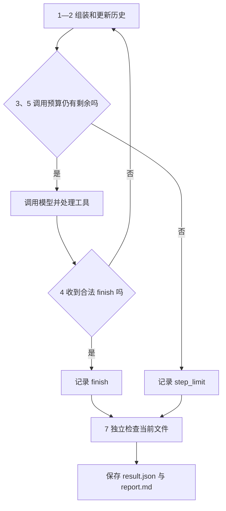
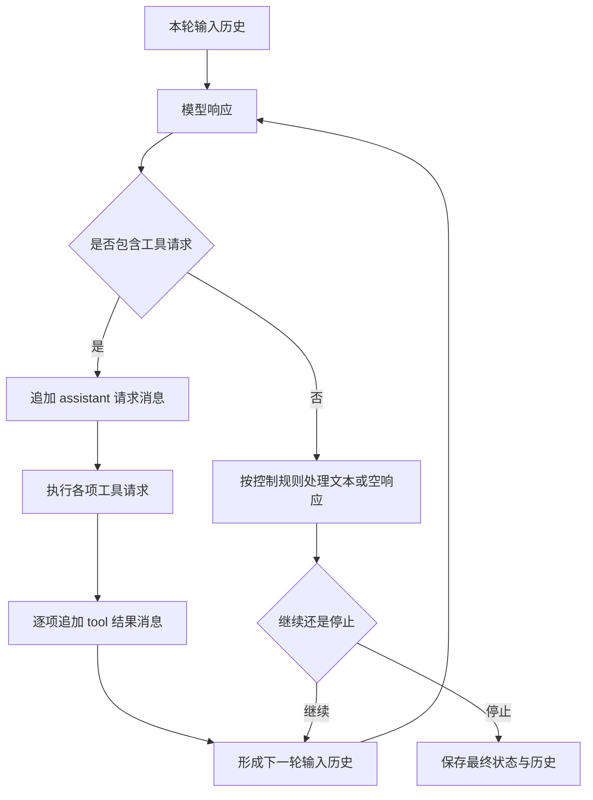
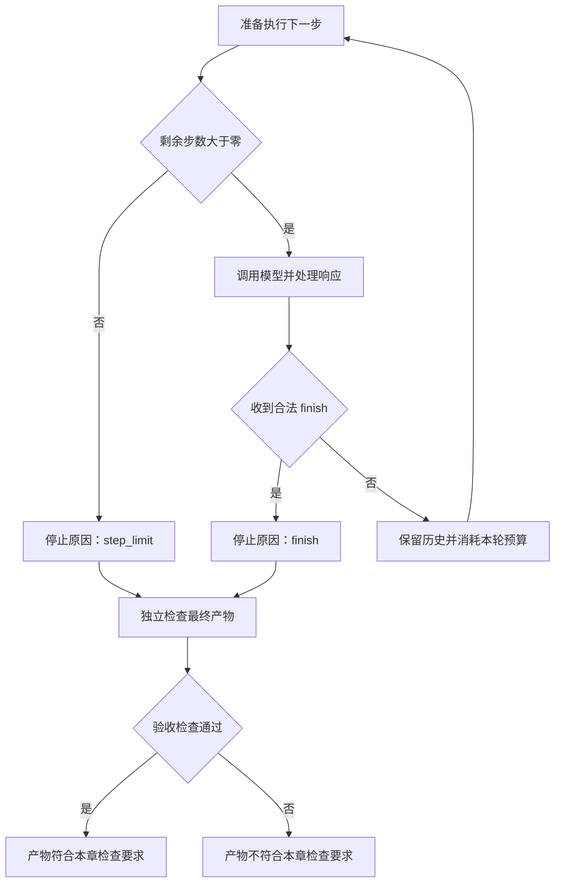

# 03｜历史记录与退出条件

> 状态：draft

> 阅读前提：已经读过 [02｜工具调用](02-tools-and-observations.md)，理解请求、工具结果和调用编号。

> 对应代码：`code/v3_controlled_loop.py`、`code/live_run.py`。

本篇沿用修复 `stats.py` 的任务，增加消息历史、结束请求、步数上限和文件验收。

本章总览图如下：



## 1. 消息历史

程序用 `messages` 列表保存当前运行的消息历史，每次调用 OpenAI SDK 时重新发送更新后的历史。

历史最初包含一条用户任务消息。模型请求读文件后，程序追加模型消息；工具读完文件，再追加工具消息。于是下一轮输入包含了“任务、读取请求、文件内容”，模型才有依据提出修改。

| 时刻 | 新增内容 | 此时模型下一轮能够看到的证据 |
|---|---|---|
| 运行开始 | 任务要求 | 要修什么、怎样算合格 |
| 第一次工具调用后 | 读取请求与读取结果 | `stats.py` 的当前代码 |
| 第二次工具调用后 | 写入请求与写入结果 | 请求写入的内容与写入状态 |
| 第三次工具调用后 | 检查请求与检查结果 | 当前代码是否通过指定检查 |

这里的“历史”先指当前运行的消息列表。它和跨会话记忆、长期知识库不是同一个层次。把全部历史重新发送也会增加输入量；截断、摘要与检索的取舍留给上下文管理章节。

## 2. 历史更新

下面是历史更新的结构示意。它省略了真实程序的检查与错误处理，只强调顺序：

```python
# 伪代码：用来解释历史更新顺序；省略 import json 与函数定义。
messages.append(assistant_message)       # 先记下模型请求
for call in assistant_message["tool_calls"]:
    observation = execute(call)          # 再执行对应动作
    messages.append({
        "role": "tool",
        "tool_call_id": call["id"],
        "content": json.dumps(observation, ensure_ascii=False),
    })
next_response = model(messages)          # 下一轮读取更新后的历史
```

配套程序中，追加工具消息的函数实际如下。`content` 是序列化后的 JSON 字符串，`tool_call_id` 保留关联；这里保存的是本文循环使用的消息。函数不打印内容，而是在原列表中增加一条 tool 消息。

```python
# 来源：code/shared.py；完整函数，依赖 import json。
def add_observation(messages, call, observation):
    messages.append({"role": "tool", "tool_call_id": call["id"],
                     "content": json.dumps(observation, ensure_ascii=False)})
```

如果跳过前面伪代码的第一行，历史里就只有一个来历不明的结果。如果漏掉工具消息，模型只能重复猜测或重新调用工具。对于一次响应中的多个请求，也必须分别记录结果，不能把两个文件内容合成一条无法关联的消息。



历史与运行记录也有区别。历史服务于下一次模型决策；`trace` 服务于排错与回放。一次模型请求失败，可能没有可追加的合法模型消息，但运行记录仍然应该说明发生过失败、是否重试、消耗了多少请求。

## 3. 调用与运行计数

`Run` 表示从接收一个任务到交回控制权的完整过程。`Step` 可以表示推进过程中的一个单位，但不同实现的定义并不相同。

本文程序让每一轮外层循环恰好对应一次模型调用尝试。`max_steps` 限制调用尝试次数；第四版中失败后的重试也要消耗下一轮预算。因此，本章 `max_steps=8` 最多发起 8 次模型调用，无论其中有多少次失败。最后一篇会对照 OpenHands 中不同的 step 定义。

| 名称 | 本章采用的含义 | 一个例子 |
|---|---|---|
| `run` | 一次完整任务执行 | 从接收修复任务到返回结果 |
| `step` | 外层循环的一次推进尝试 | 请求模型并处理本轮响应 |
| `model_calls` | 实际发起模型调用的次数 | 一次失败后重试会再增加一次 |
| `tool_call` | 模型响应中的一个工具请求 | 读取文件、写入文件或执行检查 |
| `observation` | 工具请求对应的执行反馈 | 文件内容、检查详情或错误 |

一个响应可以包含多个工具请求，因此“调用了三个工具”并不必然等于“走了三步”。本章为便于学习采用同步顺序执行；并发工具的调度和完成顺序需要额外规则。

阅读最后一篇 OpenHands 源码时，还会看到不同的 `step` 边界：一个框架步骤不一定发起新模型请求。先写清自己的计数定义，才有办法比较调用数、耗时和费用。

## 4. 结束请求

第二版用“有文本、无工具调用”作为结束条件。现在新增 `finish(summary)`：模型如果认为任务已经可以交付，就明确请求结束。`finish` 是循环控制器处理的操作，不会像 `write_file` 一样修改环境。

```python
# 本文响应字典；这是结束请求的结构示例。
response = {
    "content": None,
    "tool_calls": [{
        "id": "finish-1",
        "name": "finish",
        "arguments": {"summary": "已修改平均值计算，并处理空列表。"},
    }],
}
```

这样，普通文本可以用于说明下一步想做什么；它本身不再终止运行。退出的含义更清楚：程序收到了一个合法的结束请求。

结束请求的合法性和任务结果的正确性仍然是两个问题。即使模型没有读文件、没有修改代码，只要它发出符合协议的 `finish`，控制器也可以结束。本章把“允许停止”和“判定合格”分别实现，便于实验验证。

## 5. 步数上限

任何正常停止条件都有可能一直不触发。模型可能反复读同一个文件，可能连续输出说明文字，也可能始终没有发出 `finish`。如果没有上限，程序就会不断继续。

步数上限把这个问题变成有限过程。它表示最多尝试多少次推进，并不保证这些推进都有效，也不保证能在上限内完成任务。

```python
# 伪代码：只展示 max_steps 的边界，不是完整实现。
for step in range(max_steps):
    response = request_model(messages)
    if contains_valid_finish(response):
        return result(status="stopped", reason="finish")
    process_response(response)
return result(status="stopped", reason="step_limit")
```

最后一轮仍然可能完成重要操作。例如第二轮写入正确代码，但预算已经用尽，无法继续检查和发出 `finish`；此时运行因预算结束，磁盘上的代码却可能已经合格。停止原因描述运行过程，不能代替检查实际产物。



## 6. 资源预算

步数上限限制的是循环次数，不能解决所有等待问题。一次工具运行如果永远不返回，即使 `max_steps=1`，程序也可能一直停在这一步。

| 控制项 | 限制对象 | 本章实现状态 | 不能单独解决的问题 |
|---|---|---|---|
| `max_steps` | 外层循环推进次数 | 第三版已实现 | 单次请求卡住 |
| `max_model_retries` | 连续临时模型错误的额外重试次数 | 第四版实现 | 总运行费用 |
| 模型请求超时 | 一次网络请求的等待 | `OpenAI(timeout=30.0)` | 远端处理可能仍在继续 |
| 检查进程超时 | 本章检查器子进程的等待 | `check_tests` 设置为 5 秒 | 不是整个任务的总时限 |
| 运行截止时间 | 整个任务的墙钟时间 | [第 12 章](../12-permissions-and-resources/README.md)展开 | 阻塞调用不会自动被打断 |
| Token／费用预算 | 模型消耗 | [第 06 章](../06-context-management/README.md)管理输入预算，[第 12 章](../12-permissions-and-resources/README.md)管理费用 | 工具资源消耗 |

若需要运行截止时间，可以用 `time.monotonic()` 计算已消耗时长，在发起下一次请求前检查剩余时间；还要把剩余时间传给支持超时的客户端。仅在 `for` 循环顶端比较时间，不能中断已阻塞的工具。

## 7. 运行状态与任务验收

配套场景把结果分成两组信息：循环返回 `status`、`reason`、`model_calls`、`messages` 与 `trace`；独立检查返回 `acceptance`。检查器重新读取当前文件，不依赖模型声称“已经完成”的文字。

| 结果字段 | 回答的问题 | 例子 |
|---|---|---|
| `status` 与 `reason` | 程序为什么把控制权交回来了 | 收到结束请求、步数耗尽 |
| `model_calls` | 实际发起过多少次模型调用 | 包括第四版中的失败尝试 |
| `trace` | 运行中发生了什么 | 读文件、写文件、检查、重试 |
| `acceptance.passed` | 当前产物是否通过指定检查 | 平均值正确且空列表行为符合要求 |
| `acceptance.source_sha256` | 本次检查针对哪个文件版本 | 当前 `stats.py` 内容的摘要 |

文件摘要用于关联检查结果与产物版本，不是关于代码正确性的证明。相同摘要能够帮助确认内容一致；是否正确仍取决于检查覆盖的行为。

在章节目录先运行正常路径：

```bash
python code/v3_controlled_loop.py
```

**正常运行的输出结构：**

```text
status=stopped reason=finish model_calls=<本次调用次数>
acceptance=<True 或 False>
artifacts=<本次运行目录>
```

再限制为最多两次模型调用：

```bash
python code/v3_controlled_loop.py --max-steps 2
python code/build_report.py
```

`runs/comparison.md` 会列出两次运行的调用次数、退出原因和检查结果。两次调用能完成多少工作取决于模型的实际响应；一个响应也可能提出多个工具请求。

| 可能观察到的结果 | 怎样解释 | 到哪里找证据 |
|---|---|---|
| `finish`，检查通过 | 请求结束时，当前文件满足检查要求 | `result.json`、`workspace/stats.py` |
| `finish`，检查失败 | 请求结束与修复成功是两回事 | 检查失败项与文件内容 |
| `step_limit`，检查通过 | 已经改好文件，但没有在预算内交付 | 修改记录、退出后的独立检查 |
| `step_limit`，检查失败 | 预算耗尽时尚未得到合格产物 | 工具轨迹和失败检查项 |

为了看到模型最后一次决策掌握了什么，打开 `requests.jsonl` 的最后一行；再用 `messages.json` 检查这次请求之后新增的动作与结果。

## 8. 错误处理边界

读到这里，可以从一份记录还原任务要求、模型选择、工具结果和停止原因，也能够重新检查产物。下一处不足是：模型请求抛异常、工具名字拼错、连续空响应时，程序究竟应该继续还是停止？

下一篇介绍工具错误反馈、模型调用重试与失败退出。

[← 02｜工具调用](02-tools-and-observations.md) · [返回阅读路线](README.md) · [04｜错误处理与重试 →](04-errors-and-retries.md)
