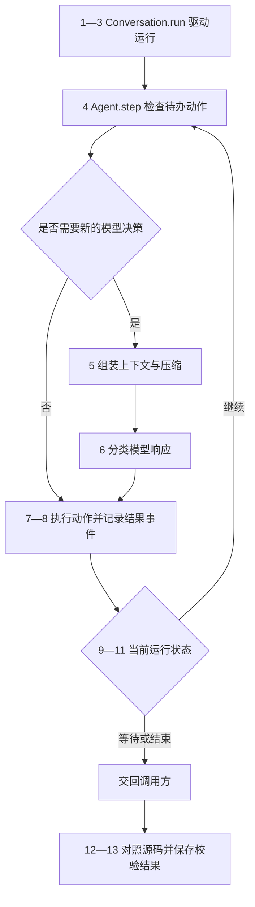
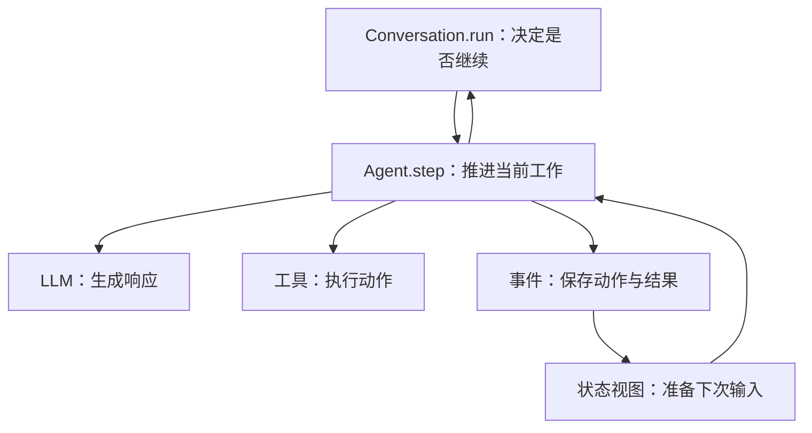
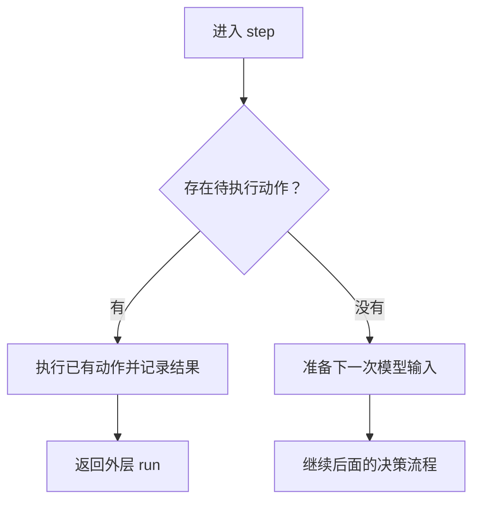
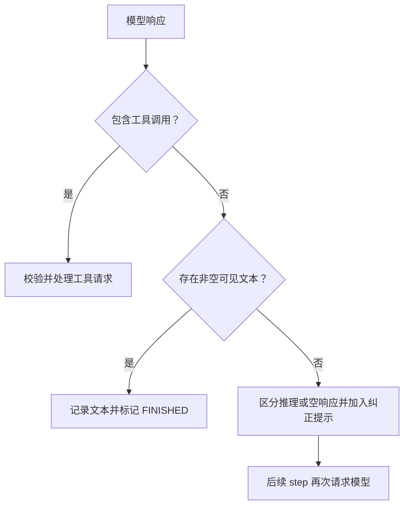
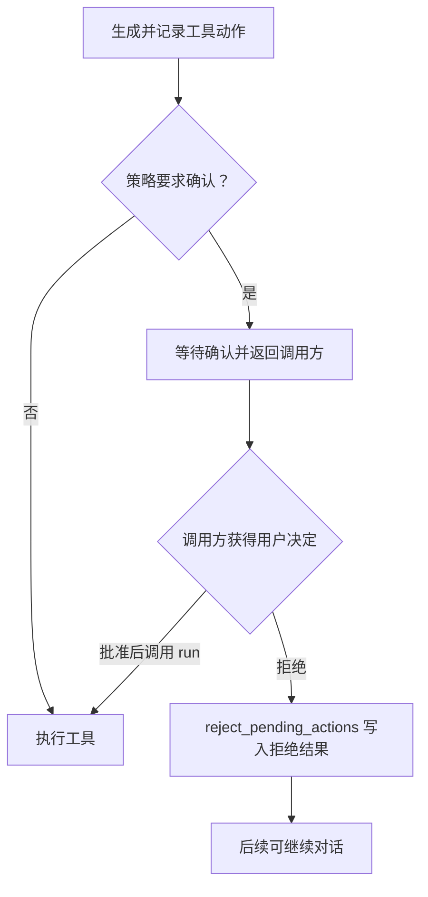
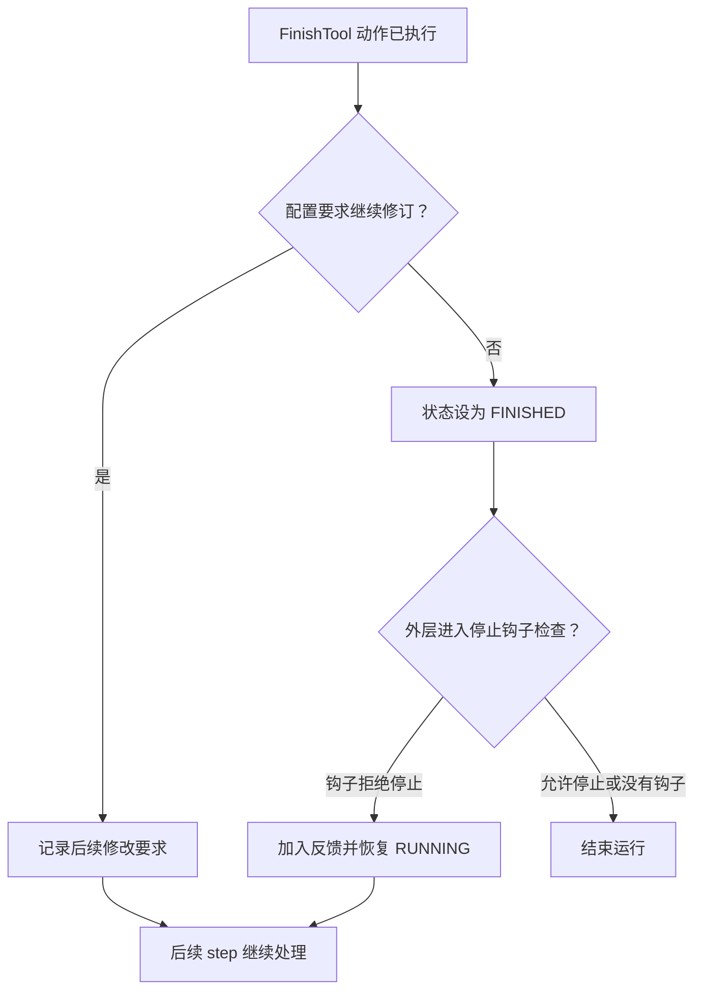

# 06｜OpenHands 执行循环源码

> 状态：draft

[← 05｜执行循环实验](05-loop-experiments.ipynb) · [返回阅读路线](README.md)

本篇分析 OpenHands Software Agent SDK 的同步、本地执行路径，涉及 `Conversation`、`Agent`、事件与工具执行器。相关源码已随章保存，无需安装 SDK。

本章总览图如下：



## 1. 源码版本与文件

本篇使用之前保存的 **v1.49.2 源码快照**，提交为 `d128a786ee2ee570eb23ff5862ec148b43cfad0b`。所有上游链接固定到这个提交，不跟随 `main` 漂移。

| 需要追踪的行为 | 首先打开的原文件 | 本篇阅读位置 |
|---|---|---|
| 持续推进、确认、停止与上限 | [local_conversation.py](sources/upstream/openhands-sdk/openhands/sdk/conversation/impl/local_conversation.py) | `run()` |
| 准备输入、调用模型、执行工具 | [agent.py](sources/upstream/openhands-sdk/openhands/sdk/agent/agent.py) | `step()`、`_step()`、`_execute_action_event()` |
| 根据模型响应选择分支 | [response_dispatch.py](sources/upstream/openhands-sdk/openhands/sdk/agent/response_dispatch.py) | `classify_response()` 与各 handler |
| 查找尚未有结果的动作 | [state.py](sources/upstream/openhands-sdk/openhands/sdk/conversation/state.py) | `get_unmatched_actions()` |
| 请求结束当前任务 | [finish.py](sources/upstream/openhands-sdk/openhands/sdk/tool/builtins/finish.py) | `FinishAction`、`FinishExecutor` |
| 判断结束前是否继续修订 | [critic_mixin.py](sources/upstream/openhands-sdk/openhands/sdk/agent/critic_mixin.py) | `_check_iterative_refinement()` |

**证据范围：**六个原文件及许可证与固定提交的远端内容一致，发布标签指向上述提交；八处摘录与原文件行号逐段核对。本章未运行 OpenHands 真实模型任务。校验记录见 [sources/README.md](sources/README.md) 和 [source-manifest.json](sources/source-manifest.json)。

本篇两种代码块有明确标注：

| 标注 | 表示什么 | 应当怎样使用 |
|---|---|---|
| **原始源码摘录** | 来自固定快照，保留原始内容与缩进 | 对照上游行号阅读，不能单独运行 |
| **流程简写** | 为解释关系而删减、改名的代码 | 理解控制流，不能当作 SDK API 示例 |

原始源码采用 MIT 许可证，完整版权与许可声明保存在 [LICENSE.OpenHands](sources/LICENSE.OpenHands)。

## 2. 核心对象

先回忆前面写过的代码。`model(messages, tools)` 返回统一字典，循环检查 `tool_calls`，执行工具，再把结果加入 `messages`。OpenHands 仍然完成这些工作，只是把它们分到了不同位置。

| 本文程序中的概念 | OpenHands 中对应的对象或方法 | 拆开后能解决什么问题 |
|---|---|---|
| 最外层循环 | `LocalConversation.run()` | 集中处理运行状态、停止检查和迭代上限 |
| 一轮决策与执行 | `Agent.step()` → `_step()` | 允许一步先处理已有动作，也允许先准备上下文 |
| `model(messages, tools)` | `self.llm.generate(...)` | 通过统一模型接口提交消息与工具定义 |
| `response["tool_calls"]` | `Message.tool_calls` → `ActionEvent` | 校验请求后保存动作、来源和关联信息 |
| 工具注册与分发 | `self.tools_map` 与工具定义 | 把名字、参数模型、执行器和结果模型组织在一起 |
| `messages` 与 `trace` | 会话事件、`state.view`、模型消息 | 运行记录和模型实际看到的输入可以分别管理 |
| `status` / `reason` | `execution_status` 与错误事件 | 说明当前状态及停止原因 |
| 运行后由调用方补充的 `acceptance` | 需要任务自己的验收逻辑 | 本文 `run_loop()` 返回运行信息，验收由外层单独执行；SDK 状态也不能替代业务验收 |



图中的 `LLM` 和工具不是两个互相独立的循环。它们都由 `step` 调用；外层 `run` 决定是否还要再推进一步。下面就沿这条调用路径往里读。

## 3. 外层循环：run

`run()` 定义在 `LocalConversation` 中。它先准备 Agent，再进入 `while True`，检查状态并调用 `self.agent.step(...)`。下面只取出最关键的调用位置。

**原始源码摘录：**[`local_conversation.py` 第 1989–1996 行](https://github.com/OpenHands/software-agent-sdk/blob/d128a786ee2ee570eb23ff5862ec148b43cfad0b/openhands-sdk/openhands/sdk/conversation/impl/local_conversation.py#L1989-L1996)，亦可打开[本地切片](sources/excerpts/run_step.py)。

<!-- source-snippet:run_step:begin -->
```python
                    self._step_holds_state_lock = True
                    try:
                        self.agent.step(
                            self, on_event=self._on_event, on_token=self._on_token
                        )
                    finally:
                        self._step_holds_state_lock = False
                    iteration += 1
```
<!-- source-snippet:run_step:end -->

| 代码位置 | 作用 | 与本文循环的联系 |
|---|---|---|
| `self.agent.step(...)` | 让 Agent 推进当前工作 | 类似我们循环里“生成响应、处理响应”的主体 |
| `on_event=self._on_event` | 把新事件交给会话处理 | 类似追加历史与 trace，但入口统一 |
| `on_token=self._on_token` | 传递流式输出回调 | 不决定本次任务是否验收通过 |
| `finally` | 即使 `step` 抛异常，也清除持锁标志 | 这是并发状态管理的工程细节 |
| `iteration += 1` | 在 `step` 正常返回后增加迭代计数 | 这里数的是 `step`，不是模型 API 调用次数 |

因此，前面运行结果里的 `model_calls=3`，不能直接翻译成 OpenHands 的 `iteration=3`。一次 `step` 可能还没有走到主决策模型，也可能执行了多项工具动作。

原方法还有暂停、卡住检测、预算与错误处理，阅读时先把它们理解为外层“能否继续”的检查。完整控制流见 [run() 原文件](https://github.com/OpenHands/software-agent-sdk/blob/d128a786ee2ee570eb23ff5862ec148b43cfad0b/openhands-sdk/openhands/sdk/conversation/impl/local_conversation.py#L1905-L2071)。

## 4. 单步执行：step

进入 `Agent.step()` 后，它会建立流式上下文，再调用 `_step()`。`_step()` 的第一项重要工作是查找待执行动作。

**原始源码摘录：**[`agent.py` 第 652–661 行](https://github.com/OpenHands/software-agent-sdk/blob/d128a786ee2ee570eb23ff5862ec148b43cfad0b/openhands-sdk/openhands/sdk/agent/agent.py#L652-L661)，亦可打开[本地切片](sources/excerpts/pending_actions.py)。

<!-- source-snippet:pending_actions:begin -->
```python
        # Check for pending actions (implicit confirmation)
        # and execute them before sampling new actions.
        pending_actions = ConversationState.get_unmatched_actions(state.active_branch())
        if pending_actions:
            logger.info(
                "Confirmation mode: Executing %d pending action(s)",
                len(pending_actions),
            )
            self._execute_actions(conversation, pending_actions, on_event)
            return
```
<!-- source-snippet:pending_actions:end -->

假设上一步模型请求读取 `stats.py`，请求已经记录了，但执行因为等待用户确认而暂停。恢复时，程序首先完成这条已有请求；这时再向模型索要一个新请求，反而会让旧请求悬在那里。



这里 `return` 的含义是“一步执行完了”。它不等于“任务完成了”。外层 `run` 还会根据会话状态决定要不要继续。

| 这次 step 做了什么 | 是否走到本步的主模型 generate | 外层计数会不会增加 |
|---|---|---|
| 补执行待确认动作 | 否 | 正常返回后会增加 |
| 产出一次上下文压缩事件 | 否 | 正常返回后会增加 |
| 请求模型并执行一个或多个工具 | 是 | 正常返回后增加一次 |
| 请求模型并收到最终文本 | 是 | 正常返回后增加一次 |

第二行不表示“整个系统没有模型费用”：如果使用模型来做摘要，压缩本身仍可能消耗模型调用。准确说法是**没有继续走到当前 `_step()` 中的主决策 `self.llm.generate()`**。

## 5. 上下文组装与压缩

前面的循环把 `messages` 交给模型适配器，再转换成 API 消息。OpenHands 会从 `state.view` 准备模型消息，并让配置的 Condenser 判断是否需要压缩。

**原始源码摘录：**[`agent.py` 第 688–695 行](https://github.com/OpenHands/software-agent-sdk/blob/d128a786ee2ee570eb23ff5862ec148b43cfad0b/openhands-sdk/openhands/sdk/agent/agent.py#L688-L695)，亦可打开[本地切片](sources/excerpts/condensation.py)。

<!-- source-snippet:condensation:begin -->
```python
        _messages_or_condensation = prepare_llm_messages(
            state.view, condenser=self.condenser, llm=self.llm
        )

        # Process condensation event before agent sampels another action
        if isinstance(_messages_or_condensation, Condensation):
            on_event(_messages_or_condensation)
            return
```
<!-- source-snippet:condensation:end -->

`prepare_llm_messages(...)` 在这里有两类返回值：

| 返回值 | 当前 step 的动作 | 后续发生什么 |
|---|---|---|
| 模型消息列表 | 继续向下执行 | 进入本步的模型请求 |
| `Condensation` 事件 | 调用 `on_event(...)` 后立即返回 | 外层再次推进时，基于更新后的视图准备输入 |

为什么不把所有逻辑都藏进模型调用里？因为压缩会改变下一次推理能看到的信息。把它记成事件，就可以在轨迹中区分“做了新的任务动作”和“整理了上下文”。

**流程简写：**

```python
prepared = prepare_input(history)
if prepared.is_compaction:
    record(prepared.event)
    return                    # 只是本 step 返回

response = decision_model(prepared.messages, tool_definitions)
```

原代码还会先解析当前模型的运行元信息，使压缩判断能够参考实际端点限制；本篇只跟踪它如何影响循环，不展开压缩算法。[输入准备与模型调用](https://github.com/OpenHands/software-agent-sdk/blob/d128a786ee2ee570eb23ff5862ec148b43cfad0b/openhands-sdk/openhands/sdk/agent/agent.py#L677-L735)。

## 6. 响应分类

走到 `self.llm.generate(...)` 后，模型拿到 `_messages` 和 `self.tools_map` 中的工具定义。返回结果先提取成 `Message`，再交给 `classify_response()`。

**原始源码摘录：**[`response_dispatch.py` 第 65–78 行](https://github.com/OpenHands/software-agent-sdk/blob/d128a786ee2ee570eb23ff5862ec148b43cfad0b/openhands-sdk/openhands/sdk/agent/response_dispatch.py#L65-L78)，亦可打开[本地切片](sources/excerpts/classify_response.py)。

<!-- source-snippet:classify_response:begin -->
```python
    if message.tool_calls:
        return LLMResponseType.TOOL_CALLS

    if any(isinstance(c, TextContent) and c.text.strip() for c in message.content):
        return LLMResponseType.CONTENT

    if (
        message.responses_reasoning_item is not None
        or message.reasoning_content is not None
        or message.thinking_blocks
    ):
        return LLMResponseType.REASONING_ONLY

    return LLMResponseType.EMPTY
```
<!-- source-snippet:classify_response:end -->

判断顺序很重要。响应可以同时包含说明文本和工具请求，只要存在工具请求，就先进入 `TOOL_CALLS` 分支，不能因为读到一段文本就提前结束。

| 优先级 | 响应内容 | 分类 | 此版本的处理 |
|---|---|---|---|
| 1 | 包含工具调用 | `TOOL_CALLS` | 生成动作事件，按确认策略决定执行或等待 |
| 2 | 没有工具调用，但有非空可见文本 | `CONTENT` | 写入消息事件，设为 `FINISHED` |
| 3 | 没有以上两类内容，但有推理字段 | `REASONING_ONLY` | 记录消息并追加纠正提示，让后续循环继续 |
| 4 | 以上均没有 | `EMPTY` | 记录消息并追加纠正提示，让后续循环继续 |



这一点对应第四份阅读文件中的空响应处理，但两个实现的阈值和状态不能混用：本文代码的连续空响应上限是我们添加的规则；这个源码 handler 本身只发送纠正提示，还需要结合外层上限、卡住检测等机制理解终止条件。

原处理函数分别见 [文本结束分支](https://github.com/OpenHands/software-agent-sdk/blob/d128a786ee2ee570eb23ff5862ec148b43cfad0b/openhands-sdk/openhands/sdk/agent/response_dispatch.py#L248-L261) 与 [无可见内容分支](https://github.com/OpenHands/software-agent-sdk/blob/d128a786ee2ee570eb23ff5862ec148b43cfad0b/openhands-sdk/openhands/sdk/agent/response_dispatch.py#L263-L284)。

## 7. 工具执行

拿到 `tool_calls` 并不意味着立刻执行字符串。`_handle_tool_calls()` 会对每个请求调用 `_get_action_event()`，把模型生成的请求转换成经过校验的动作。

| 顺序 | 源码中的处理 | 如果仍以“读取 stats.py”为例 |
|---|---|---|
| 1 | 解析参数并规范工具名称 | 取出模型给出的名称和参数 |
| 2 | 从 `tools_map` 查找工具 | 判断这个名称是否对应已注册工具 |
| 3 | 按工具的参数模型构建 `Action` | 判断文件路径等字段是否符合接口 |
| 4 | 创建并记录 `ActionEvent` | 保存“准备读取哪个文件” |
| 5 | 检查确认策略与执行钩子 | 判断这项已记录的动作能否现在执行 |
| 6 | 执行工具并产生结果事件 | 保存读到的内容或错误反馈 |

第二份文件中的“注册表 + 参数校验”在这里仍然适用，只是请求、执行结果和历史记录拥有更丰富的类型。[工具请求校验与动作创建](https://github.com/OpenHands/software-agent-sdk/blob/d128a786ee2ee570eb23ff5862ec148b43cfad0b/openhands-sdk/openhands/sdk/agent/agent.py#L1227-L1382)。

正常执行后的结果包装如下。

**原始源码摘录：**[`agent.py` 第 1440–1446 行](https://github.com/OpenHands/software-agent-sdk/blob/d128a786ee2ee570eb23ff5862ec148b43cfad0b/openhands-sdk/openhands/sdk/agent/agent.py#L1440-L1446)，亦可打开[本地切片](sources/excerpts/observation_event.py)。

<!-- source-snippet:observation_event:begin -->
```python
        obs_event = ObservationEvent(
            observation=observation,
            action_id=action_event.id,
            tool_name=tool.name,
            tool_call_id=action_event.tool_call.id,
        )
        return [obs_event]
```
<!-- source-snippet:observation_event:end -->

| 字段 | 用途 | 对应的本文字段 |
|---|---|---|
| `observation` | 工具产生的结构化结果 | 工具结果的内容与执行状态 |
| `action_id` | 关联 SDK 内部的动作事件 | 本文代码没有单独引入这一层事件 ID |
| `tool_name` | 说明哪个工具产生了结果 | 工具名称 |
| `tool_call_id` | 关联模型协议中的工具请求 | `messages` 中工具消息的 `tool_call_id` |

`_execute_action_event()` 返回的是事件列表，调用者随后发出事件。这个函数本身并没有直接把 observation 字符串塞进下一次模型请求。结果先进入会话记录，后续再经视图组装成模型消息。

**流程简写：**

```python
action = validate_and_build(tool_call)
record(ActionEvent(action))
observation = execute(action)
record(ObservationEvent(observation, action_id=action.id))
# 下一次 step 才从更新后的状态准备 messages。
```

## 8. 动作与结果关联

有 `tool_call_id`，就能回答“这个结果属于哪次工具调用”；有内部 `action_id`，就能进一步回答“这项动作是否已经留下结果”。

以下是**示意记录**，不是本次 SDK 实跑输出。

| 事件 | 内部事件 ID | 关联字段 | 代表的事实 |
|---|---|---|---|
| `ActionEvent` | `action-A` | `tool_call_id=call-1` | 模型提出的动作已记录 |
| `ObservationEvent` | `result-A` | `action_id=action-A` | 这项动作有正常 observation |
| `ActionEvent` | `action-B` | `tool_call_id=call-2` | 又出现一项动作 |
| `AgentErrorEvent` | `error-B` | `tool_call_id=call-2` | 这次工具调用已有错误反馈 |
| `ActionEvent` | `action-C` | `tool_call_id=call-3` | 如果没有后续关联结果，它仍可能待处理 |

`get_unmatched_actions()` 从事件序列中找“没有对应结果的可执行动作”。正常 observation 与用户拒绝通过 `action_id` 配对；`AgentErrorEvent` 没有 `action_id`，所以通过 `tool_call_id` 配对。[配对实现](https://github.com/OpenHands/software-agent-sdk/blob/d128a786ee2ee570eb23ff5862ec148b43cfad0b/openhands-sdk/openhands/sdk/conversation/state.py#L675-L716)。

**没有结果记录，只能说明记录没有闭合。** 比如工具已经写入文件，但进程在写 observation 前崩溃，仅凭“没有 observation”不能断言文件没变。第四份文件讨论的幂等、检查实际状态、未知结果，在成熟系统里仍然成立。这个配对函数没有提供外部副作用的“恰好一次”保证。

## 9. 等待确认与恢复调用

当确认策略认为需要用户确认，`_requires_user_confirmation()` 把状态设为 `WAITING_FOR_CONFIRMATION`，工具 handler 返回；外层 `run()` 检测到这个状态后也会退出，让调用方有机会展示待执行动作。[确认策略分支](https://github.com/OpenHands/software-agent-sdk/blob/d128a786ee2ee570eb23ff5862ec148b43cfad0b/openhands-sdk/openhands/sdk/agent/agent.py#L1046-L1087)。

这里有一个必须结合调用方理解的接口约定：**这个固定版本再次调用本地 `run()`，会把等待确认状态清回 `RUNNING`，随后 `step` 执行待办动作。**

**原始源码摘录：**[`local_conversation.py` 第 1977–1984 行](https://github.com/OpenHands/software-agent-sdk/blob/d128a786ee2ee570eb23ff5862ec148b43cfad0b/openhands-sdk/openhands/sdk/conversation/impl/local_conversation.py#L1977-L1984)，亦可打开[本地切片](sources/excerpts/confirmation_resume.py)。

<!-- source-snippet:confirmation_resume:begin -->
```python
                    # clear the flag before calling agent.step() (user approved)
                    if (
                        self._state.execution_status
                        == ConversationExecutionStatus.WAITING_FOR_CONFIRMATION
                    ):
                        self._state.execution_status = (
                            ConversationExecutionStatus.RUNNING
                        )
```
<!-- source-snippet:confirmation_resume:end -->



因此，在等待确认时，不应该通过反复自动调用 `run()` 来轮询状态；这样的调用具有批准语义。调用方应先确认用户选择；拒绝时使用 `reject_pending_actions(reason=...)`，它会为待办动作写入 `UserRejectObservation`。[拒绝实现](https://github.com/OpenHands/software-agent-sdk/blob/d128a786ee2ee570eb23ff5862ec148b43cfad0b/openhands-sdk/openhands/sdk/conversation/impl/local_conversation.py#L2610-L2648)。

这是对本地同步路径的源码说明，不能直接推广成所有 SDK、所有远程协议的恢复语义。读到 `resume`、`continue`、`run` 这样的名字时，要进一步确认：它只是恢复调度，还是同时表达了授权。

## 10. 结束请求与修订

在本版本中，至少有两条需要区分的结束路径。

| 路径 | 发生的事情 | 是否经过下述 FinishAction 修订逻辑 |
|---|---|---|
| 无工具调用的非空文本响应 | 记录 `MessageEvent`，设置 `FINISHED` | 否；可配置的消息 critic 评分也不等于这条修订分支 |
| 模型调用 `FinishTool` | 产生 FinishAction 与工具结果，批次收尾时判断是否继续 | 是，但需要配置 critic、修订条件满足且次数未耗尽 |

`FinishExecutor` 返回一项 FinishObservation；决定是否把会话设为结束的逻辑在动作批次的 `finalize()` 中。

**原始源码摘录：**[`agent.py` 第 355–371 行](https://github.com/OpenHands/software-agent-sdk/blob/d128a786ee2ee570eb23ff5862ec148b43cfad0b/openhands-sdk/openhands/sdk/agent/agent.py#L355-L371)，亦可打开[本地切片](sources/excerpts/finish_transition.py)。

<!-- source-snippet:finish_transition:begin -->
```python
        # Nothing to finalise: no FinishTool, or it was blocked by a hook.
        if not self.has_finish or self.action_events[-1].id in self.blocked_reasons:
            return

        should_continue, followup = check_iterative_refinement(self.action_events[-1])
        if should_continue and followup:
            on_event(
                MessageEvent(
                    source="user",
                    llm_message=Message(
                        role="user",
                        content=[TextContent(text=followup)],
                    ),
                )
            )
        else:
            mark_finished()
```
<!-- source-snippet:finish_transition:end -->

| 这段代码中的判断 | 含义 |
|---|---|
| 没有 Finish 或 Finish 被钩子阻止 | 当前批次不会在这里触发结束转移 |
| `check_iterative_refinement(...)` 返回继续及 follow-up | 追加一条修订要求，让后续循环继续工作 |
| 不再继续修订 | 调用 `mark_finished()` 更新状态 |

继续修订并非默认总会发生。对应方法先检查 critic 与配置，再检查修订次数、当前评分和是否达到阈值。[修订条件](https://github.com/OpenHands/software-agent-sdk/blob/d128a786ee2ee570eb23ff5862ec148b43cfad0b/openhands-sdk/openhands/sdk/agent/critic_mixin.py#L76-L138)。



外层 `run()` 的循环顶部还会检查 Stop hook；钩子拒绝停止时，可以追加反馈并改回 `RUNNING`。[停止钩子分支](https://github.com/OpenHands/software-agent-sdk/blob/d128a786ee2ee570eb23ff5862ec148b43cfad0b/openhands-sdk/openhands/sdk/conversation/impl/local_conversation.py#L1940-L1971)。图只表示进入该检查后的主路径；下一节会看到一个在迭代边界提前 `break` 的分支。

注意 FinishTool 的描述也允许 Agent 在缺少信息、技术限制等情况下交回控制权。因而看到 `FINISHED`，不能直接宣称“代码修复成功”。前面 Notebook 里的 `acceptance` 仍需独立检查：最终文件是什么、测试覆盖了什么、结果对应哪个版本。

## 11. 迭代上限与异常

第三份阅读文件用 `max_steps` 限制模型调用次数，并通过结果字段 `model_calls` 报告计数；第四份沿用这个参数，将失败请求和重试也计入模型请求尝试次数。这里的参数虽叫 steps，每次循环恰好尝试一次模型请求。OpenHands 的 `max_iteration_per_run` 位于更外层，限制的是本次 `run()` 的 `step` 次数，二者不能直接按字段名比较。

**原始源码摘录：**[`local_conversation.py` 第 2020–2042 行](https://github.com/OpenHands/software-agent-sdk/blob/d128a786ee2ee570eb23ff5862ec148b43cfad0b/openhands-sdk/openhands/sdk/conversation/impl/local_conversation.py#L2020-L2042)，亦可打开[本地切片](sources/excerpts/iteration_limit.py)。

<!-- source-snippet:iteration_limit:begin -->
```python
                    if iteration >= self.max_iteration_per_run:
                        # If the agent finished on this final iteration,
                        # preserve the FINISHED status rather than
                        # overwriting it with ERROR.
                        if (
                            self._state.execution_status
                            == ConversationExecutionStatus.FINISHED
                        ):
                            break
                        error_msg = (
                            f"Agent reached maximum iterations limit "
                            f"({self.max_iteration_per_run})."
                        )
                        logger.error(error_msg)
                        self._state.execution_status = ConversationExecutionStatus.ERROR
                        self._on_event(
                            ConversationErrorEvent(
                                source="environment",
                                code="MaxIterationsReached",
                                detail=error_msg,
                            )
                        )
                        break
```
<!-- source-snippet:iteration_limit:end -->

阅读顺序是：先判断是否碰到上限；再判断这一最后步是否已经标记 `FINISHED`；如果没有，就设为 `ERROR` 并记录 `MaxIterationsReached`。

| 运行状态或错误 | 能确定的事情 | 不能据此确定的事情 |
|---|---|---|
| `FINISHED` | 会话走到了结束状态 | 所有用户要求均已满足 |
| `WAITING_FOR_CONFIRMATION` | 已记录动作正等待授权 | 工具已经成功执行 |
| `PAUSED` | 会话在暂停状态交回控制权 | 中断前的每个外部动作都已撤销 |
| `STUCK` | 运行被卡住检测判定应停止 | 文件没有产生任何修改 |
| `ERROR` + `MaxIterationsReached` | 达到本次 run 的步数上限 | 任务产物必然不合格 |
| `ERROR` + 异常事件 | 记录了未在内层消化的异常 | 重试操作不会重复副作用 |

一个细节值得自己沿 `break` 走一遍：**这个快照在“最后一次迭代恰好 FINISHED”时直接退出，保留 FINISHED；因此这一分支不会再进入下一轮顶部的 Stop hook。** 不能只看到有 Stop hook，就假定每条退出路径都会经过它。这个结论来自当前代码的静态控制流；本次没有运行 SDK 来验证这个边界。

内层会把部分可修正错误转成反馈，例如非法函数调用参数；工具执行位置会把 `ValueError` 转成 `AgentErrorEvent`。不能把它概括成“捕获所有错误并继续”。外层未处理异常则设置 `ERROR`、保留错误事件，并抛出 `ConversationRunError`。[工具异常处理](https://github.com/OpenHands/software-agent-sdk/blob/d128a786ee2ee570eb23ff5862ec148b43cfad0b/openhands-sdk/openhands/sdk/agent/agent.py#L1427-L1438)，[外层异常处理](https://github.com/OpenHands/software-agent-sdk/blob/d128a786ee2ee570eb23ff5862ec148b43cfad0b/openhands-sdk/openhands/sdk/conversation/impl/local_conversation.py#L2043-L2069)。

## 12. 实现对照

再回到前面自己写过的四个版本。这里的对应关系是“同一个职责在工程里放到了哪里”，不是说阅读文件复制了 SDK。

| 本文版本 | 你已经实现的机制 | 回看 OpenHands 时应抓住的位置 | 继续深入的边界 |
|---|---|---|---|
| [v1_minimal_loop.py](code/v1_minimal_loop.py) | 模型请求、工具结果、再次调用 | `_step()`、`llm.generate()`、响应分发 | 一步可能不调用主模型 |
| [v2_tool_dispatch.py](code/v2_tool_dispatch.py) | 工具定义、注册表、参数校验 | `tools_map`、`_get_action_event()` | 动作类型与结果类型、批次执行 |
| [v3_controlled_loop.py](code/v3_controlled_loop.py) | 历史、运行记录、预算与验收 | `run()`、`state.view`、事件 | SDK 状态与任务验收分别定义 |
| [v4_resilient_loop.py](code/v4_resilient_loop.py) | 反馈纠错、有限重试、异常退出 | 无内容 handler、错误事件、外层异常 | 上下文恢复、并发、副作用与授权 |

你可以用下面四个问题检查自己是否读懂，不必立刻跑真实模型。

| 阅读练习 | 参考判断 | 可以回到哪里核对 |
|---|---|---|
| 这次 step 只执行了待确认工具，它是否调用了本步主决策模型？ | 没有，待办分支执行后直接返回 | 第 4 节 |
| 模型返回了空文本但包含工具调用，是否应按文本结束？ | 不应，分类优先选择 `TOOL_CALLS` | 第 6 节 |
| 两个结果内容相同，能否判定它们属于同一次请求？ | 不能，需要关联 ID 与事件上下文 | 第 8 节 |
| 模型说“测试通过”并结束，能否直接填 `acceptance=true`？ | 不能，应检查最终产物和对应的验收证据 | 第 10 节 |

继续阅读其他 Agent 框架时，也可以沿用这套方法：先找最外层重复在哪里发生，再找一步执行的提前返回，然后跟踪响应如何成为动作、结果如何回到输入，最后逐条追踪停止与错误出口。这样，新增的工程机制会落回你已经理解的那个最小反馈循环。

[← 返回 05 号实验](05-loop-experiments.ipynb) · [返回 README 阅读路线](README.md)

## 13. 源码校验

在章节目录运行：

```bash
python sources/verify_sources.py --save
```

前两行标准输出为：

```text
PASS: 6 source files; 8 excerpts; matching Markdown; MIT license.
This is local integrity verification, not remote provenance or SDK execution verification.
```

随后会打印保存位置。打开 `runs/source-audit.md` 和 `runs/source-audit.json`，可以查看固定提交、文件数、切片数及校验结果。这条命令只检查资料对应关系，不调用模型。
