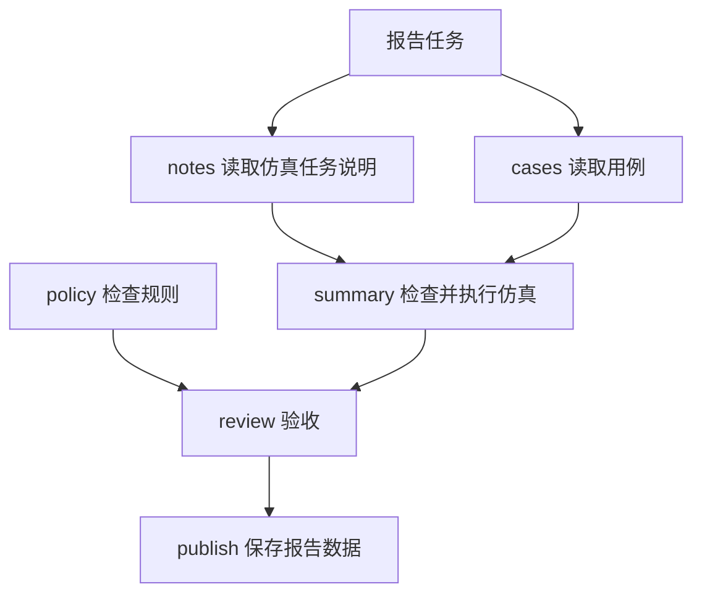

# 01｜任务图与角色选择

[阅读路线](README.md) · [下一篇：02｜任务状态与并发调度](02-scheduling-and-lifecycle.md)

本章总览图如下：



## 1. 读取与检查

任务沿用 Agent Loop：读取仿真任务说明，运行 `stats.py` 中已经修正的 `mean`，把检查结果保存为报告。输入 `[2, 4]` 的均值应为 3，`[-2, 2]` 的均值应为 0。

以下完整片段在本章目录执行，只打印检查数量；完整入口 [v1_report.py](code/v1_report.py) 还会保存结果。

```python
import json
import sys
from pathlib import Path
sys.path.insert(0, "code")
from stats import mean

notes = Path("fixtures/notes.txt").read_text(encoding="utf-8")
cases = json.loads(Path("fixtures/cases-v1.json").read_text(encoding="utf-8"))["cases"]
passed = sum(mean(c["values"]) == c["expected"] for c in cases)
print(f"passed_checks={passed}")
```

标准输出是 `passed_checks=2`。运行完整入口：

```bash
python code/v1_report.py
```

标准输出：

```text
passed_checks=2
artifacts=runs/v1
```

打开 `runs/v1/report.md`，核对任务说明原文和 `通过 2/2`。最小程序顺序执行，下一步把可独立读取的输入拆开。

## 2. 任务拆分

| task_id | 输入 | 返回结果 |
|---|---|---|
| `notes` | `notes.txt` | 任务说明文本 |
| `cases` | `cases-v1.json` | 用例、预期值、版本 |
| `policy` | `policy.json` | 最低通过数、必需任务说明关键词 |
| `summary` | `notes`、`cases` | 实际检查值、通过数、任务说明、仿真指标 |
| `review` | `summary`、`policy` | 是否满足全部用例及规则 |
| `publish` | `review` | 已验收的报告数据 |

`publish` 返回最终字典，随后 `save_run` 写入本地 `report.md`。用例缺少 `expected` 时，`cases` 抛出异常；后继不会拿不完整输入继续运行。

下面是 [ReportWorker](code/report_workflow.py) 中统计检查结果的节选，依赖已收到的 `dependencies`；代码本身没有标准输出。

```python
cases = dependencies["cases"]["cases"]
checks = [{**case, "actual": mean(case["values"])} for case in cases]
passed = sum(c["actual"] == c["expected"] for c in checks)
```

`checks` 保留输入、预期和实际值，`passed` 是相等项的数量。后面增加空列表检查时，把它的结果一并计入总检查数。

## 3. 任务图

`summary` 必须等待任务说明与用例，`review` 必须等待报告与政策。用前驱名字表示这些约束，得到有向无环图，简称 DAG：箭头从前驱指向后继，不允许依赖绕一圈回到自身。

下面是初始计划的完整片段。在本章目录运行，`sys.path` 让解释器找到配套模块；只创建和打印对象，不启动工作或写文件：

```python
import sys
sys.path.insert(0, "code")
from scheduler import Node, validate_plan

nodes = [
    Node("notes", (), "read"),
    Node("cases", (), "read"),
    Node("policy", (), "read"),
    Node("summary", ("notes", "cases"), "calculate"),
    Node("review", ("summary", "policy"), "review"),
    Node("publish", ("review",), "publish"),
]
plan = validate_plan(nodes)
print({key: list(node.dependencies) for key, node in plan.items()})
```

标准输出：

```text
{'notes': [], 'cases': [], 'policy': [], 'summary': ['notes', 'cases'], 'review': ['summary', 'policy'], 'publish': ['review']}
```

| `Node` 字段 | 类型 | 影响的决定 |
|---|---|---|
| `task_id` | `str` | 节点身份；计划中必须唯一 |
| `dependencies` | `tuple[str, ...]` | 哪些结果成功后才能启动 |
| `capability` | `str` | 选择具备哪项能力的执行角色 |
| `input_version` | `str`，默认 `"1"` | 当前节点所依赖输入的版本标记 |
| `timeout` | 正数秒，默认 `1.0` | 单次执行允许等待多久 |

`validate_plan` 先拒绝重名和不存在的前驱，再调用 `TopologicalSorter.prepare()` 检查环。不存在的前驱要单独查：标准库允许自动添加被引用的节点，但本章要求每个名字都有对应执行定义。标准库的图采用“节点 → 前驱集合”，方向别写反。[Python graphlib 文档](https://docs.python.org/3.11/library/graphlib.html)

修改片段，把 `notes` 的前驱改成 `("summary",)`。程序应抛出 `graphlib.CycleError`，因为任务说明等报告、报告又等任务说明。这个错误在启动任何执行者之前出现，避免所有任务无限等待。

## 4. 角色选择

角色先表达“哪个执行者能够接这个任务”。[scheduler.py](code/scheduler.py) 定义三类角色：

| 角色 | capabilities | capacity | cost |
|---|---|---:|---:|
| `reader` | `read` | 2 | 1 |
| `calculator` | `calculate` | 1 | 1 |
| `reviewer` | `review`、`publish` | 1 | 2 |

`cost` 是本章配置的选择优先级，不是 API 用例。调度器先筛选能力符合且未用满额度的角色，再按 `cost` 和名字选择。以下是方法节选，定义本身无标准输出，`self.roles` 和 `self.role_use` 由 `Scheduler` 初始化：

```python
def select_role(self, node):
    candidates = [role for role in self.roles
                  if node.capability in role.capabilities
                  and self.role_use[role.name] < role.capacity]
    return min(candidates, key=lambda role: (role.cost, role.name), default=None)
```

返回 `None` 表示合格角色暂时没有名额，要继续等待；如果整个配置中根本没有合格角色，构造调度器时就报错。这样不会把“暂时忙”误当成“永远无法执行”。权限和能力也不是同一个概念：真实 Agent 的工具白名单仍须由执行环境落实，角色名称本身不会施加访问限制。

[下一篇：02｜任务状态与并发调度](02-scheduling-and-lifecycle.md)

## 仿真执行

`summary` 在均值检查后启动 Python 子进程，读取本章 `simulation.json` 并运行 `simulate.py`。`review` 同时检查用例结果和 MSE 是否下降；`publish` 完成后保存 `simulation/metrics.json`、`simulation/samples.csv` 和 `simulation/report.md`。子进程超时或节点取消时，程序终止并回收子进程。完整实现见 [simulation.py](code/simulation.py)。

`passed_checks=2` 只统计两项均值用例；仿真是否达标另看 `summary.simulation.metrics.passed`。默认输入的指标为 `input_mse=0.090000`、`output_mse=0.010082`。
