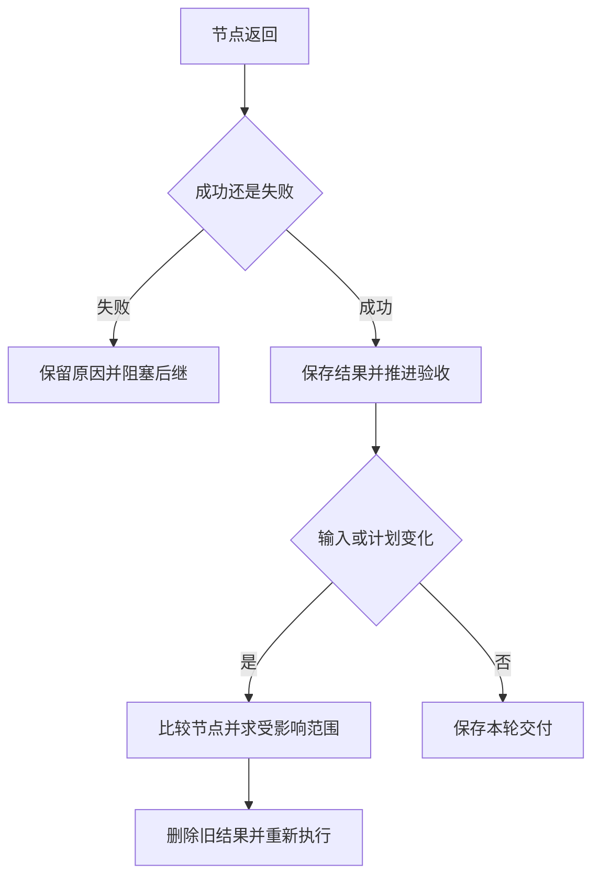

# 03｜结果合并与重规划

[阅读路线](README.md) · [上一篇：02｜任务状态与并发调度](02-scheduling-and-lifecycle.md) · [下一篇：04｜调度实验与标准库源码](04-experiments-and-source.md)

本章总览图如下：



## 1. 结果验收

函数返回了结果，还要核对每项检查是否通过。下面是 [report_workflow.py](code/report_workflow.py) 的分支节选，依赖 `dependencies`，返回验收对象或抛出异常，没有标准输出：

```python
summary, policy = dependencies["summary"], dependencies["policy"]
if not summary["simulation"]["metrics"]["passed"]:
    raise ValueError("simulation acceptance failed")
if summary["passed_checks"] != summary["total_checks"]:
    raise ValueError("check failed")
if summary["passed_checks"] < policy["minimum_passed"]:
    raise ValueError("insufficient checks")
if policy["required_note"] not in summary["notes"]:
    raise ValueError("required note missing")
return {"accepted": True, "summary": deepcopy(summary)}
```

`publish` 只依赖 `review`。任一条件不满足时不会生成成功交付；`save_run` 仍然保存节点状态和错误，报告中的 `accepted` 为 `False`。

## 2. 失败与依赖阻塞

[cases-missing.json](fixtures/cases-missing.json) 中第一个用例缺少 `expected`。使用这一份实际输入，在本章目录运行：

```bash
python code/v2_schedule.py --missing-case --output runs/v2-missing
```

准确标准输出：

```text
accepted=False passed_checks=None
executions=3 peak_active=2
artifacts=runs/v2-missing
```

打开 `result.json`，节点状态应为：

| 节点 | 状态 | 原因 |
|---|---|---|
| `notes`、`policy` | `succeeded` | 与缺失预期值无关，照常完成 |
| `cases` | `failed` | `ValueError: missing expected result` |
| `summary`、`review`、`publish` | `blocked` | 必需的上游结果没有成功 |

`blocked` 没有消耗一次执行；因此总执行次数是 3。调度器每轮检查前驱是否 `failed/blocked/cancelled`，把影响向后传播。失败的节点没有结果，不能用空字典替它凑齐依赖。

修复同一用例文件后重试，与“发现需要加入空列表检查节点”是不同操作。前者保持工作图，重新执行失败及其后继；后者改变计划本身。`replan` 接收新的完整计划，统一处理输入变化和任务图变化；计划内容由调用者决定。

## 3. 结果失效范围

先用版本 1 完成六个节点，再把输入换成 [cases-v2.json](fixtures/cases-v2.json)。新版本增加 `[10] → 10`。仅仅替换 `cases` 的结果会留下旧的 2 项检查报告，所以要沿依赖关系求出所有后继。

以下是 [scheduler.py](code/scheduler.py) 的函数定义。输入是 `task_id → Node` 字典和已改变节点集合，返回需要失效的节点集合；定义本身没有输出：

```python
def affected_closure(plan, seeds):
    affected = set(seeds)
    while True:
        expanded = affected | {key for key, node in plan.items()
                               if affected.intersection(node.dependencies)}
        if expanded == affected:
            return affected
        affected = expanded
```

第一轮从 `cases` 找到 `summary`，第二轮找到 `review`，第三轮找到 `publish`，再无新增节点时停止。`notes` 和 `policy` 没有读取用例，因此可以保留。

在本章目录执行完整入口：

```bash
python code/v3_replan.py
```

准确标准输出：

```text
before_passed=2 after_passed=3
invalidated=cases,publish,review,summary
executions=10 retained=notes,policy
artifacts=runs/v3
```

两轮共执行 `6 + 4 = 10` 个节点。`result.json` 的 `before` 保存第一轮结果，顶层 `results` 保存第二轮；`input.json` 的 `before/after` 是两轮真实输入副本。事件里 `notes` 和 `policy` 的 `start` 各出现一次，其他四个节点各出现两次。这样既能验证新通过数，也能验证无关分支确实没有重跑。

## 4. 任务图变更

现在加入空列表检查。新节点 `empty_check` 依赖 `policy`，`summary` 除了任务说明和用例，还必须等待 `empty_check`。新计划由 `make_plan("2", empty_check=True)` 构造。

| 节点 | 旧前驱 | 新前驱 | 处理 |
|---|---|---|---|
| `cases` | 无 | 无 | 输入版本改为 2，重算 |
| `empty_check` | 不存在 | `policy` | 新增，执行一次 |
| `summary` | `notes, cases` | `notes, cases, empty_check` | 依赖改变，重算 |
| `review, publish` | 不变 | 不变 | 读取受影响结果，重算 |
| `notes, policy` | 不变 | 不变 | 保留已有成功结果 |

`replan` 比较同名 `Node`，把增删或字段变化的节点加入起点；再分别在旧图和新图求闭包，取并集。旧图覆盖被删除的边曾经影响过的结果，新图覆盖新增加的影响。这个方法会按依赖保守失效，不尝试证明“虽然输入变了，结果恰好相同”。

下面是 `replan` 中的关键节选，依赖已经验证过的 `replacement` 和调用者传入的 `changed_inputs`；完整方法还会重置状态、递增计划版本并记录事件：

```python
changed = set(changed_inputs) | {
    key for key in self.plan.keys() | replacement.keys()
    if self.plan.get(key) != replacement.get(key)
}
affected = affected_closure(self.plan, changed) | affected_closure(replacement, changed)
retained = sorted(key for key in self.results if key in replacement and key not in affected)
self.results = {key: self.results[key] for key in retained}
```

这段代码没有标准输出，改变的是可复用结果集合。运行完整场景：

```bash
python code/v3_replan.py --add-empty-check --output runs/v3-empty_check
```

准确标准输出：

```text
before_passed=2 after_passed=4
invalidated=cases,empty_check,publish,review,summary
executions=11 retained=notes,policy
artifacts=runs/v3-empty_check
```

第二轮执行五个节点，三项数值检查加一项空列表检查，最终通过数为 4。

## 5. 输入版本与依赖声明

`replan` 不监控文件变化。调用者必须报告变化的输入节点，或更新它们的 `input_version`。本章中的对应关系是：

| 改了什么 | 应标记哪些输入节点 |
|---|---|
| 用例文件 | `cases` |
| 任务说明文件 | `notes` |
| 最低通过数或任务说明要求 | `policy` |
| `stats.py` 的实现 | `summary`；有空列表检查时还包括 `empty_check` |

遗漏直接读者会使缓存看起来有效而实际上过期。版本号应代表该节点所有直接输入的快照；只有一个孤立的字符串，却没有更新规则，不会自动获得缓存正确性。

本实现要求当前 `run()` 已经结束再调用 `replan`，运行中调用会抛出 `RuntimeError`。这使旧任务没有机会在新计划建立后回写。需要运行中换计划时，还须取消旧任务并等清理，或用尝试编号、输入版本和负责人版本拒绝旧结果。相关实现见[消息重试与结果合并](../05-communication-and-handoff/02-retries-and-late-messages.md)。

试着把 `minimum_passed` 改为 4，再运行只包含三项用例的版本 2。`summary` 成功返回 3 项结果，`review` 因 `insufficient checks` 失败，`publish` 被阻塞。下一篇给出完整片段。

[下一篇：04｜调度实验与标准库源码](04-experiments-and-source.md)
