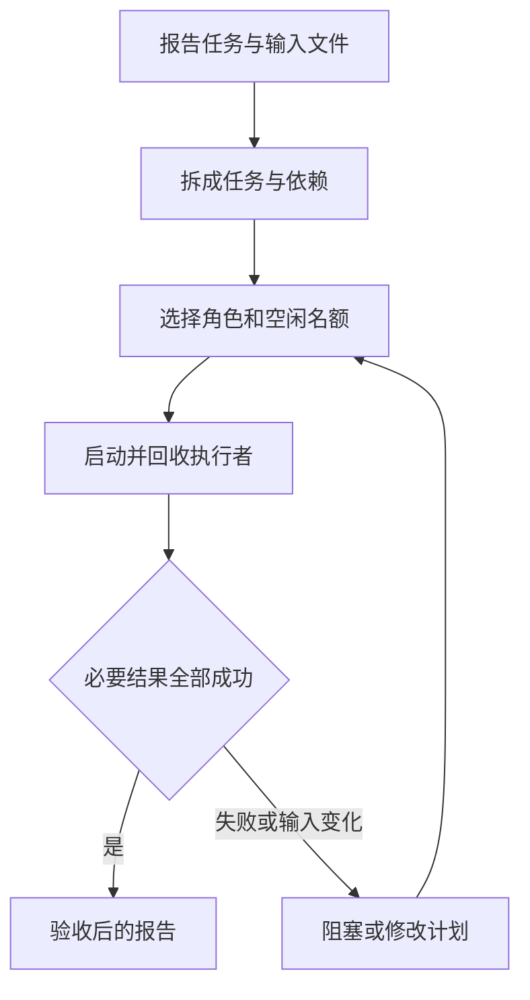

# 04｜编排与调度

本章把读取笔记、运行统计检查和写报告拆成有依赖的任务。

[组件总览](../README.md) · [上一组件：Agent 执行循环](../03-agent-loop/README.md) · [下一组件：通信与交接](../05-communication-and-handoff/README.md)

本章总览图如下：



任务读取 `notes.txt`，检查 `stats.py`，保存报告。初版包含两个均值用例；第二版增加单元素用例；重规划再加入空列表应抛错的检查。

执行者是读取 JSON、计算和检查的确定性函数。接入真实 Agent 循环时，调度器同样负责启动、回收和依赖检查。

## 阅读路线

| 顺序 | 主要内容 | 正文与完整入口 |
|---|---|---|
| 01 | 读取与检查、任务拆分与角色能力 | [任务图与角色选择](01-task-graph-and-roles.md)；[v1_report.py](code/v1_report.py) |
| 02 | 任务状态、并发额度与子任务回收 | [任务状态与并发调度](02-scheduling-and-lifecycle.md)；[v2_schedule.py](code/v2_schedule.py) |
| 03 | 结果验收、失败传播与结果失效 | [结果合并与重规划](03-results-and-replanning.md)；[v3_replan.py](code/v3_replan.py) |
| 04 | 实验记录、依赖检查与标准库源码 | [调度实验与标准库源码](04-experiments-and-source.md)；[experiments.py](code/experiments.py) |

| 版本 | 已实现机制 | 未实现范围 |
|---|---|---|
| v1 | 读取笔记、检查均值、写结果 | 完整验收、依赖与并发 |
| v2 | 六节点 DAG、角色容量、超时、取消、失败阻塞、结果验收 | 修改已经执行过的计划 |
| v3 | 保留无关结果、重算受影响节点、增加空列表检查分支 | 运行中替换计划、进程重启恢复 |

## 环境与输入

使用 Python 3.11 或更新版本，全部主线命令只依赖标准库，不需要安装第三方包或设置 API Key。以下命令的工作目录都是本章目录：

```bash
cd "10-Knowledge/02 Agent Harness/04-orchestration-and-scheduling"
```

这条命令从仓库根目录执行，无标准输出，只改变当前目录。后续 `python` 指向你的 Python 3.11+ 解释器。

| 输入 | 内容 |
|---|---|
| [notes.txt](fixtures/notes.txt) | 工具接入、循环日志与检查待办 |
| [cases-v1.json](fixtures/cases-v1.json) | 两项均值检查 |
| [cases-v2.json](fixtures/cases-v2.json) | 增加单元素检查 |
| [cases-missing.json](fixtures/cases-missing.json) | 缺少预期值的错误输入 |
| [policy.json](fixtures/policy.json) | 至少通过两项检查，笔记包含“工具接入” |
| [stats.py](code/stats.py) | Agent Loop 任务中修正后的均值函数 |

通过数是实际通过的检查项数量。输入文件保留原样；程序将实际输入复制进运行目录。

## 运行命令

在本章目录逐条运行以下完整命令：

```bash
python code/v1_report.py
python code/v2_schedule.py
python code/v2_schedule.py --missing-case --output runs/v2-missing
python code/v3_replan.py
python code/v3_replan.py --add-empty-check --output runs/v3-empty_check
python code/experiments.py
python -m unittest discover -s code -p 'test_*.py' -v
python sources/verify_sources.py
```

各版本的准确标准输出在对应正文中。前五条命令分别留下 `runs/v1/`、`runs/v2/`、`runs/v2-missing/`、`runs/v3/`、`runs/v3-empty_check/`；实验入口写入 `runs/experiments/`。重复运行相同入口会覆盖同名输出目录中的文件，需要保留对照时用 `--output` 指定另一目录。v1 的输出固定为 `runs/v1`。

| 产物 | 内容 |
|---|---|
| `input.json` | 这次实际使用的笔记、用例和检查规则；v1 只写结果 |
| `result.json` | 各节点状态、结果、错误、执行次数、验收结论 |
| `events.jsonl` | `ready/start/cleanup/succeeded/failed/blocked/replan` 的真实顺序 |
| `report.md` | 从同一次结果生成的节点状态与报告 |
| `comparison.json` | 六个实验场景的可比较数值 |

已生成的运行记录：[实验报告](artifacts/reference/report.md)、[局部重算记录](artifacts/reference/cases_changed/result.json)、[新增节点记录](artifacts/reference/plan_changed/result.json)。

本章在 CPython 3.12.14 下按上述路径运行，9 项自动测试通过，六个实验场景均已执行。源码快照取自该运行时，附许可证与 SHA-256 清单；核对范围是本地快照，未将其与远端发布包逐字节比较。模型调用、外部消息服务和进程崩溃恢复不在这些运行记录中。

逐条命令、完整正文片段的标准输出与退出码见[读者走读记录](artifacts/verification.json)。

正文入口：[01｜任务图与角色选择](01-task-graph-and-roles.md)。
