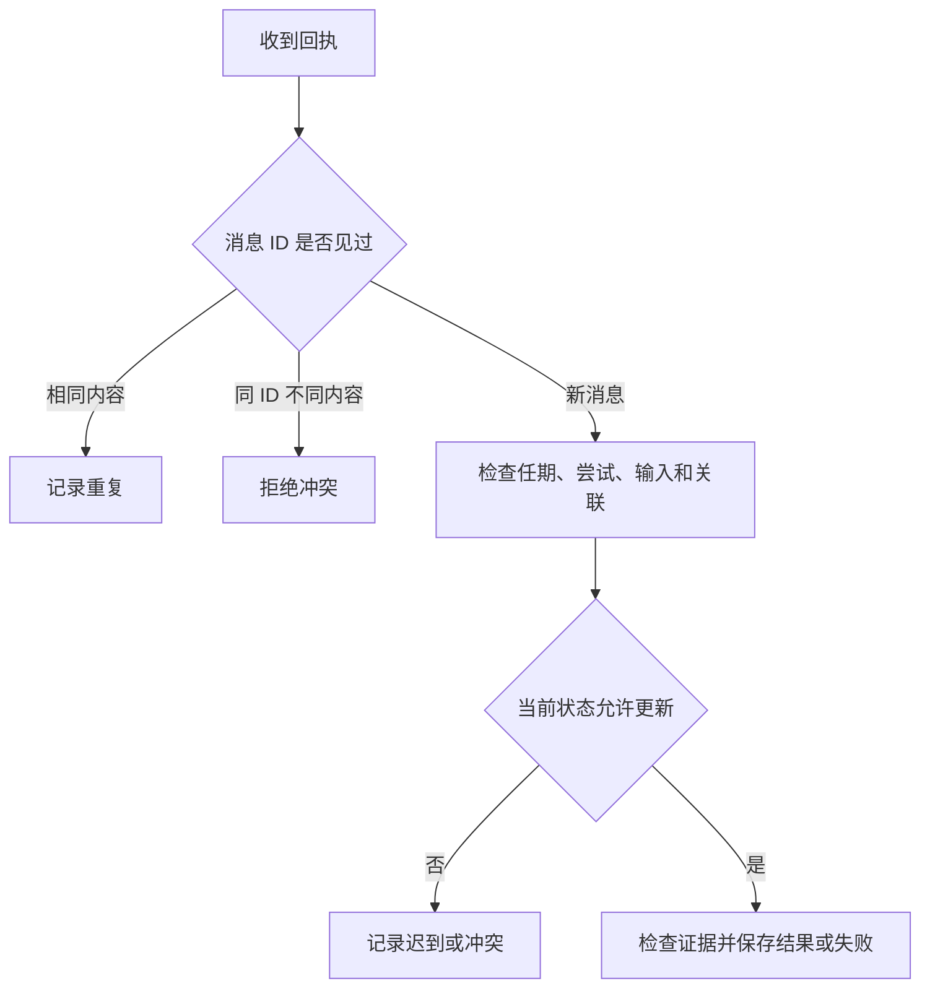

# 02｜消息重试与结果合并

[阅读路线](README.md) · [上一篇：01｜任务委派与消息协议](01-delegation-and-results.md) · [下一篇：03｜控制权交接](03-context-and-ownership.md)

本章总览图如下：



实验使用本地队列注入重发和乱序消息，输入仍是任务 `report-017`。

## 1. 失败回执

[snapshot-unfound.json](fixtures/snapshot-unfound.json) 是一份真实 fixture：`status` 为 `unfound`。执行者读取它之后返回下面的失败正文。这是 `failure.payload` 的格式示例，不是可执行脚本：

```json
{
  "code": "snapshot_unfound",
  "retryable": true,
  "message": "笔记内容快照尚未就绪",
  "evidence": {"file": "snapshot-unfound.json", "version": "notes-1"}
}
```

| 字段 | 接收方据此做什么 |
|---|---|
| `code` | 按稳定类别处理，不解析自然语言猜故障类型 |
| `retryable` | 判断是否允许再次委派 |
| `message` | 向阅读日志的人说明具体问题 |
| `evidence` | 回到本次输入确认故障来自哪一份快照 |

这和“笔记内容为 0”完全不同。笔记内容为 0 是成功检查后的事实；快照不可用表示还不知道笔记内容。把两者都返回 `{}`，协调者就无法选择下一步。

`Case.delegate` 只允许在上次状态为 `failed` 且 `retryable=True` 时再次执行，并把 `attempt` 加一；默认最多两次尝试。成功结果不能因为调用方没看见就再执行一次；重发应返回缓存回执。失败回执格式与发送方会被检查，具体重试策略仍由负责者决定。

## 2. 消息去重

[protocol.py](code/protocol.py) 的 `Inbox` 保存已经收到的消息内容。下面是完整方法定义的节选，依赖 `canonical` 和字典 `self.seen`；调用返回 `new/duplicate/conflicting_message`，没有标准输出：

```python
def register(self, message):
    fingerprint = canonical(message)
    previous = self.seen.get(message["message_id"])
    if previous is not None:
        return "duplicate" if previous == fingerprint else "conflicting_message"
    self.seen[message["message_id"]] = fingerprint
    return "new"
```

如果 ID 与内容均相同，它是重发；如果 ID 相同但数量变了，它是冲突；若 ID 没见过，才继续检查。内容使用规范化 JSON 字符串保存，字典的键顺序不同不会误判为冲突。

执行者也使用同一规则：它先登记委派请求，实际执行一次，把终态回执放入 `worker_cache`；之后收到同一请求，直接返回缓存回执。以下是 `notes_worker` 的控制节选，依赖请求、`case` 与总线 `bus`，位于完整异步函数内部：

```python
async with bus.worker_lock:
    status = bus.worker_inbox.register(request)
    if status == "conflicting_message":
        raise ValueError("request id reused with different content")
    if status == "duplicate":
        response = deepcopy(bus.worker_cache[request["message_id"]])
        await bus.send(response)
        return response
    bus.worker_executions += 1
    # 完整函数随后读取笔记内容、构造回执、缓存并发送。
```

这段节选保留了实际判断，注释处的业务代码见完整文件；不能单独执行。锁覆盖登记、执行与缓存，防止同一事件循环中两个重复投递都穿过“尚未处理”的检查。当前笔记内容检查是只读动作，缓存存在内存里；外部付款、发邮件等副作用需要在操作层另设幂等键和持久事务，不能靠这个进程内字典宣称跨崩溃恰好执行一次。

## 3. 迟到消息

消息顺序与接收决定如下：

| 顺序 | 实际发生什么 | 接收方处理 |
|---:|---|---|
| 1 | attempt 1 读取 notes-1，快照不可用 | 保存 `accepted_failure` |
| 2 | 协调者授权 attempt 2，指定 notes-2 | 新请求、新 correlation_id |
| 3 | attempt 2 返回笔记内容 2、缺口 1 | 保存 `accepted_result` |
| 4 | attempt 1 的新失败通知迟到 | `stale_attempt`，不覆盖成功 |
| 5 | attempt 2 的 started 晚到 | `late_progress`，不退回 running |

这里第 4 条即使带一个从未出现过的 `message_id`，也必须拒绝。去重只回答“这条消息是否见过”，无法回答“这次执行是否仍然有效”。因此接收器依次核对任务、负责人任期、参与者、尝试编号、输入版本与关联请求。

以下为 `Case.receive` 的字段检查节选，依赖已经找到的当前 `request` 和本次 `message`；每条 `return` 都返回决定字符串并记录事件，不打印：

```python
if message["attempt"] != request["attempt"]:
    return self.record("stale_attempt", message)
if message["input_version"] != request["input_version"]:
    return self.record("stale_input", message)
if message["correlation_id"] != request["correlation_id"]:
    return self.record("wrong_correlation", message)
```

字段都匹配以后，还要看当前状态。`completed` 收到 `started` 不得退回 `running`；收到新 ID 但正文相同的终态回执，记为 `duplicate_outcome`；正文不同则记为 `conflicting_outcome`，不采用“最后写入者获胜”。

版本核对还必须覆盖真实输入，不能只比较消息头。请求绑定 notes-2，而文件在执行前变成 notes-3 时，执行者返回 `input_version_changed` 失败，要求重新委派；接收器也独立检查当前文档版本是否等于请求的 `input_version`。即使某个执行者漏掉前一层检查，notes-3 的证据仍会被拒绝为 `stale_input`。这里约定版本标识对应不可变快照，修改内容时必须更新版本。

## 4. 结果合并

假设笔记内容结果成功返回两次，政策结果一次都没来。消息数为 2，仍不代表两项工作都完成。`Case.merge(expected_tasks)` 按逻辑任务名核对：

```python
missing = sorted(set(expected_tasks) - self.results.keys())
return {"complete": not missing, "missing_tasks": missing,
        "results": deepcopy(self.results)}
```

这是方法核心节选，定义无输出，返回合并对象；完整实现还拒绝清单之外的结果。已有 `read-notes` 的情况下，传入 `['read-notes', 'read-policy']` 会返回 `complete=False`、`missing_tasks=['read-policy']`。同一 `task_id` 在结果字典中只有一个经验证的值，重复投递不会给它加权或填补另一个任务。

验证证据也在合并前做。假设回执把 `missing` 改成 0，接收器根据原请求的任务和笔记内容重算得到 1，于是返回 `invalid_evidence`，任务保持未完成。这说明消息格式正确、传输成功、结果达标分别是不同检查。

## 5. 消息实验

在本章目录运行完整实验入口，依赖标准库和原始 fixture：

```bash
python code/experiments.py
```

准确标准输出：

```text
checks=19 passed=19
worker_executions=2 accepted_results=1 missing=1
owner=report-writer epoch=2
artifacts=runs/experiments
```

本篇对应 `delivery/` 子目录：`messages.jsonl` 中包含请求重发、同 ID 改内容、旧 attempt、旧输入版本和错误关联 ID；`result.json` 的 `checks` 保存每条实际决定及预期。两次执行分别是一次快照不可用和一次正常读取，重复请求没有增加第三次执行。有效笔记内容结果只有一份，缺口仍为 1。

`delivery/result.json` 中的负责人仍为 `coordinator`，epoch 为 1；委派没有转移控制权。交接记录保存在 `handoff/` 子目录。

[下一篇：03｜控制权交接](03-context-and-ownership.md)
