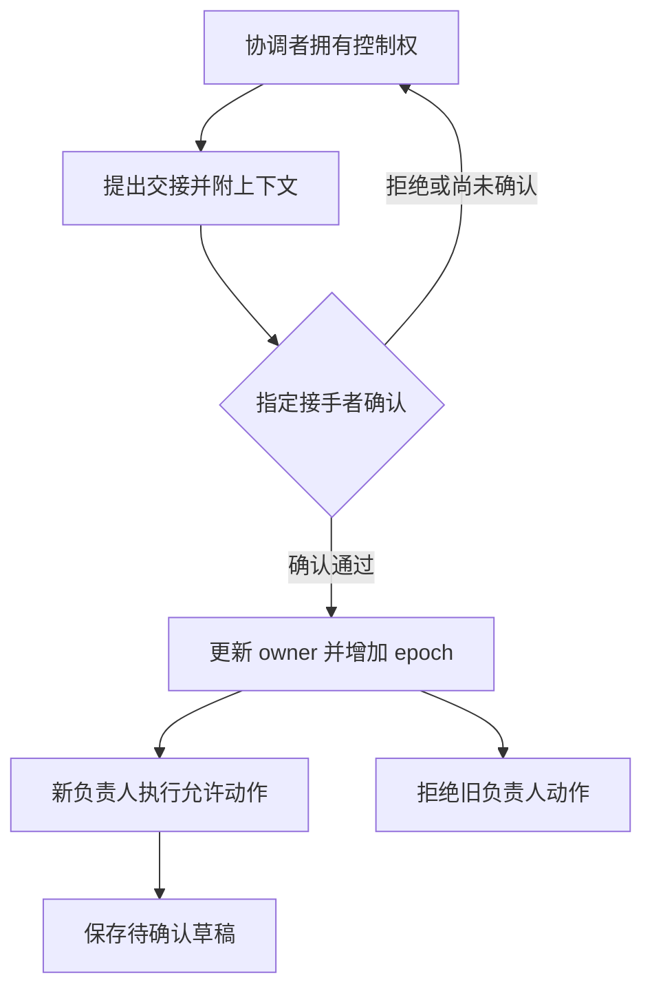

# 03｜控制权交接

[阅读路线](README.md) · [上一篇：02｜消息重试与结果合并](02-retries-and-late-messages.md) · [下一篇：04｜通信实验与队列源码](04-experiments-and-source.md)

本章总览图如下：



笔记内容检查确认缺 1 条事实。委派任务时，原负责人保留决策权；控制权交接则把后续处理的责任转移给指定接手者。

## 1. 负责人状态

本章 `Case` 初始保存两个值：`owner='coordinator'`、`epoch=1`。`owner` 是当前负责人，`epoch` 是这份控制权的版本。每个委派请求携带委派时的 epoch，提交动作也必须带上它。

| 操作 | 谁可以发起 | 完成以后谁仍负责 |
|---|---|---|
| 委派笔记内容检查 | 当前 owner | 原 owner |
| 返回笔记内容结果 | 该请求指定的执行者 | 原 owner |
| 提出交接 | 当前 owner | 确认前仍是原 owner |
| 接受交接 | 被指定的接手者 | 新 owner |
| 生成处理草稿 | 当前 owner 且 epoch 正确 | 当前 owner |

epoch 让同一角色的旧操作也能被区分。即使未来某个流程再次交回同名角色，旧任期的请求也不应自动恢复有效。本章只执行一次协调者到履约专员的交接，并用 epoch 1 与 2 观察这一规则。

## 2. 交接上下文

笔记内容执行者不需要协调者的完整历史。履约专员也不必重新看一遍失败回执和重发消息；它需要知道当前目标、已核对事实、尚未决定的事项，以及允许做什么。

下面是 `offer_handoff` 创建的上下文字典结构示例，省略了已经在结果文件中展开的证据值。这是格式说明，不是可运行脚本；完整交接包见 `runs/v3/result.json` 的 `handoff` 字段：

| context 字段 | 本次内容 | 接手后用处 |
|---|---|---|
| `goal` | 读取笔记，核对必需事实并保存报告 | 保留原始意图 |
| `task` | 任务 ID、笔记路径、必需事实、目标 | 明确作用对象 |
| `evidence` | 笔记内容 2、缺口 1、文件、版本和路径 | 不重新猜事实，可回查来源 |
| `decisions` | 笔记内容不足，尚未承诺处理方式 | 区分已决定与未决定 |
| `unresolved` | 读者是否接受补充缺少的笔记 | 保留需要继续推进的问题 |
| `next_action` | `write_report` | 接手后从哪个动作开始 |
| `allowed_actions` | 仅 `write_report` | 给动作检查器使用 |
| `constraints` | 不承诺错误重试的完成情况、不自动删除输入、草稿待读者确认 | 保留业务责任边界 |

`evidence` 来自前一篇已经接收并验证的结果副本。`constraints` 中的自然语言不会凭自身阻止工具调用；本章真正的动作入口还会检查 `allowed_actions`。因此请求 `delete_source` 会被拒绝，即使调用者是当前负责人。

下面是 [protocol.py](code/protocol.py) 中生成上下文的节选，依赖 `self.task/self.results` 和读取出的 `policy`。创建对象不打印；完整方法把它装进交接包并返回深拷贝：

```python
context = {
    "goal": self.task["instruction"],
    "task": deepcopy(self.task),
    "evidence": deepcopy(self.results),
    "decisions": ["笔记内容不足，尚未承诺处理方式"],
    "unresolved": ["读者是否接受补充缺少的笔记"],
    "next_action": policy["next_action"],
    "allowed_actions": policy["allowed_actions"],
    "constraints": policy["constraints"],
}
```

完整实现将这些字段嵌入 `self.offer['context']`，保存待解决事项、后续动作与责任边界。本地实现仍由 `Case` 保存权威结果，动作入口从该状态读取证据；迁移到跨进程时，应把交接包和证据引用持久化为同一版本，而不是依赖共享内存。

## 3. 交接请求

`offer_handoff(actor, target)` 首先确认 `actor == owner`，再拒绝仍有 `pending/running` 委派的情况，并要求 `read-notes` 已完成。这样不会让正在运行的笔记内容执行者不知道结果该交给谁。

它随后创建 `handoff_id`，记下 `from/to/epoch` 和上下文。此时 `owner`、`epoch` 没变。接手者未确认时，旧负责人仍然明确地负责，不会出现两人都以为对方已接手的空档。

交接未决期间，`delegate` 会拒绝新增委派，避免在检查“没有在途任务”之后又启动一个旧 epoch 的任务。当前实现没有等待接手方的定时器；如果要增加拒绝或撤回交接，应在清掉未决 offer 后再恢复委派。

在本章目录运行以下完整片段。依赖标准库与配套模块，实际输入为 `fixtures/`，只打印状态，无文件产物：

```python
import asyncio
import sys
sys.path.insert(0, "code")
from protocol import Case, LocalBus, exchange

async def inspect_offer():
    case = Case()
    bus = LocalBus(["coordinator", "notes-reader"])
    request = case.delegate("coordinator", "snapshot-ready.json")
    await exchange(case, request, bus)
    offer = case.offer_handoff("coordinator", "report-writer")
    print(case.owner, case.epoch)
    print(offer["context"]["next_action"])

asyncio.run(inspect_offer())
```

准确标准输出：

```text
coordinator 1
write_report
```

交接包已创建，但 `owner` 和 `epoch` 未变，控制权尚未切换。

## 4. 接手确认

`accept_handoff` 检查接手身份、交接编号和旧 epoch。下面是该方法中的核心节选，依赖当前 `offer` 与方法参数；返回决定字符串，事件保存在 `case.events`，不直接打印：

```python
if (offer is None or actor != offer["to"] or handoff_id != offer["handoff_id"]
        or epoch != self.epoch or epoch != offer["epoch"]):
    return self.record("rejected_handoff")
self.owner = actor
self.epoch += 1
self.offer = None
self.record("handoff_accepted", handoff_id=handoff_id)
return "handoff_accepted"
```

本地方法中没有 `await`，一个事件循环内这几步连续执行。清掉 `offer` 后，同一交接再次确认会被拒绝，不会把 epoch 再加一次。若改成多进程数据库，必须把“旧 owner/epoch 仍匹配”和“更新 owner/epoch”放进同一事务或条件更新中。

随后所有推进动作都先经过 `act` 的前两层检查：

```python
if actor != self.owner or epoch != self.epoch:
    return self.record("rejected_stale_owner", actor=actor)
policy = read_fixture("policy.json")
if action not in policy["allowed_actions"]:
    return self.record("rejected_action", actor=actor)
```

这是方法节选，依赖 `read_fixture` 和 `Case` 状态，返回值同样是接收决定。检查通过后，本例只生成一份本地文本草稿，不调用写报告或删除输入工具。

## 5. 控制权校验

在本章目录运行完整入口：

```bash
python code/v3_handoff.py
```

准确标准输出：

```text
before_accept=coordinator epoch=1
after_accept=report-writer epoch=2
old_action=rejected_stale_owner new_action=draft_created
artifacts=runs/v3
```

`result.json` 同时保存交接前状态、交接包、交接后状态和两次动作的结果。`draft.md` 的正文为：

> 任务 report-017 要求 3 条事实，已找到 2 条，缺少 1 条。
> 工具接入：已完成。
> 循环日志：已完成。
> 待确认：错误重试。

笔记内容已经查清，草稿已经生成，但读者是否同意仍未解决。交接包里的 `unresolved` 不会因为生成了一段文字就自动消失，也不应把整个任务标为已履约。接手方的责任止于本次允许的动作，下一步需要读者确认；程序没有代替读者做决定。

尝试让履约专员用 epoch 1 调用 `write_report`，参考结果仍是 `rejected_stale_owner`。再用 epoch 2 调用 `delete_source`，参考结果是 `rejected_action`。前者说明“人对了但任期不对”，后者说明“控制权正确但动作超出了责任范围”。完整检查入口见[通信实验与队列源码](04-experiments-and-source.md)。

[下一篇：04｜通信实验与队列源码](04-experiments-and-source.md)
