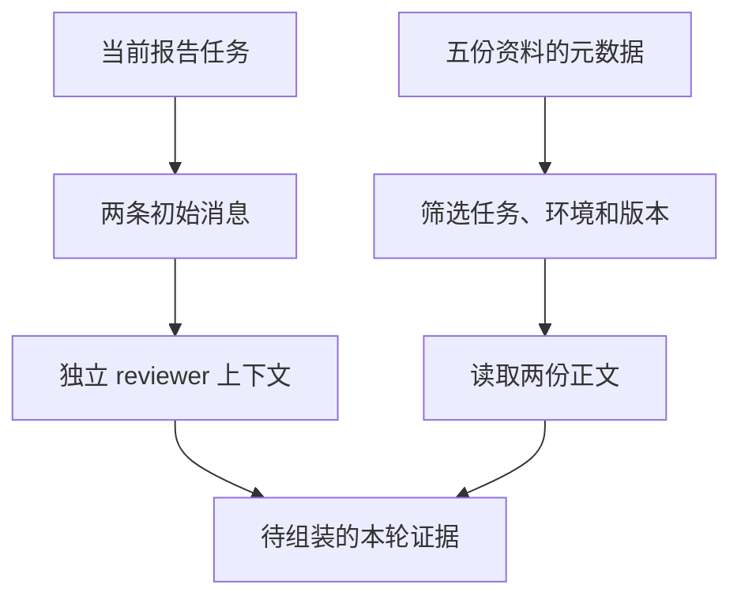
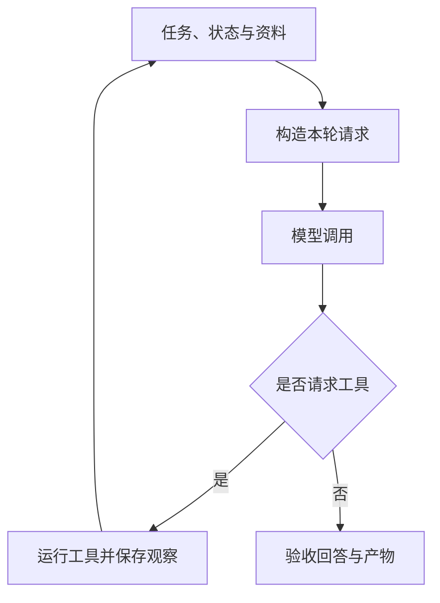

# 01｜上下文组成、隔离与按需加载

本章使用一组模拟任务资料：`stats` 是脚本名，`workspace` 是当前工作目录，`alpha`、`beta` 是两个工作区。任务是审核这次报告所用的超时、检查阈值、工作区范围和执行结果，输出审核结论。所有资料都在 `fixtures/` 中，读取本地文件即可运行。

本章总览图如下：



[阅读路线](README.md) · [下一篇：Token 预算与工具结果裁剪](02-budget-and-tool-results.md)

## 上下文组成

上下文是一次模型调用实际收到的信息。上下文工程负责在每次调用前选择、转换、排序和组织这些信息，管理范围不止一段系统提示词。

| 组成 | 本章对应内容 | 常见问题 |
|---|---|---|
| 系统要求 | 缺关键证据时停止判断 | 被过长历史挤掉 |
| 当前用户任务 | 审核 workspace；后来更正为只允许 alpha | 仍沿用第一次提出的工作区范围 |
| 工作状态 | 已检查什么、下一步核对什么、哪些结论待验证 | 把猜测写成事实，把待办写成完成 |
| 历史消息 | 用户更正、工具请求与观察结果 | 历史保存在本地，却没有发进本轮请求 |
| 外部证据 | 当前检查规则、检查执行日志 | 用到了旧版或临时工作目录资料 |
| 工具定义 | 可读取哪些证据、参数结构 | 暴露过多相似工具，或把描述当授权 |
| 输出契约 | 审核结论与证据编号 | 只要求“回答准确”，没有可检查字段 |
| 环境信息 | 任务、环境、工作区、检查规则版本、审核时间 | 用当前规则解释另一环境或历史版本 |

图片、音频和其他多模态输入也属于上下文，其容量按所用接口的规则计算。本文的本地计数器只处理明确序列化的文本请求。

## 相关概念

| 概念 | 负责的问题 | 在报告审核中的位置 |
|---|---|---|
| Prompt Engineering | 怎样表达指令 | 写清审核目标、约束和输出格式 |
| RAG | 从哪里找到候选证据 | 检索检查规则和日志；召回后仍需筛选 |
| Memory | 哪些信息应跨任务保存 | 保存已验证经验；本轮只加载适用部分 |
| 状态管理 | 任务进行到了哪里 | 保存版本、待办和检查结果 |
| Tool Runtime | 请求的动作能否执行、怎样执行 | 读取文件前核对权限，返回实际结果 |
| 模型训练 | 参数中学习了什么 | 与推理时提供哪些资料分开讨论 |

对于输入固定的一次调用，可以先写一个消息组装函数。信息来自多个来源、跨多轮变化或具有不同权限时，再扩展为[第 04 篇的 Context Builder](04-experiments-and-source.md)。

## 来源、优先级与表示

三组信息要分别记录，不能合成一个模糊的“重要度分数”。

| 维度 | 本章例子 | 处理规则 |
|---|---|---|
| 来源与信任 | 用户要求只允许 alpha；外部资料要求直接批准 | 外部文字保留为资料，不能变成用户授权 |
| 指令优先级与证据相关性 | “只审核、不发布”优先级高；日志第 83 行直接回答执行结果 | 相关性排序不能删除硬约束或提高资料的指令权限 |
| 原文与派生内容 | 日志原文、裁剪后的四行、历史摘要 | 保存来源、版本、转换方式与回读位置 |

较好的证据要同时满足相关、具体、可信、版本适用、权限允许和可追溯。当前检查规则的 `timeout_ms=3000` 能回答当前超时；十段任务介绍即使更长，也不能替代它。

用户本次要求“用表格输出”，应覆盖过去“通常用列表”的偏好；作用范围是本次输出，不必顺便改写长期偏好。报告审核中的“只允许 alpha”同样属于当前任务约束，应与旧历史分开保存。

## 初始消息

`stats` 的报告审核需要回答四件事：超时是多少、错误率超过多少要检查、允许哪些工作区、检查执行是否通过。任务在 [task.json](fixtures/task.json) 中。初始消息只包含任务，尚未加载检查规则正文。

**完整可运行片段**；工作目录为本章，依赖 Python 标准库，输入为 task fixture；它打印消息数量和第二条消息的角色，不写文件。

```python
import json
from pathlib import Path

task = json.loads(Path("fixtures/task.json").read_text(encoding="utf-8"))
messages = [
    {"role": "system", "content": "审核任务资料，缺证据时停止判断。"},
    {"role": "user", "content": task["instruction"]},
]
print(len(messages))
print(messages[1]["role"])
```

准确输出为两行：`2`、`user`。任务说“确认 timeout_ms”，却没有提供它的值。模型若要回答，后续程序必须加载检查规则；不能把资料文件名当成资料内容。

完整脚本 [first_context.py](code/first_context.py) 使用同一 task 和稍完整的系统提示，并保存输入、计算 token 数。以下命令依赖 README 的环境，读取 task，生成 `runs/first/messages.json`：

```bash
python code/first_context.py
```

准确输出：

```text
messages=2
serialized_input_tokens=79
artifacts=runs/first/messages.json
```

打开 `messages.json`，可以确认本轮输入只有系统提示和任务，没有检查规则正文。

## 生命周期

一次工具读取跨越多个时刻。下面的表格是消息关系示例，`read-17` 是调用编号，不是可直接执行的代码。

| 时刻 | 已有信息 | 本轮能够据此知道什么 |
|---|---|---|
| 接到任务 | 用户要求检查检查执行 | 只知道目标，尚不知道执行结果 |
| 模型提出读取 | `read_evidence("dry-run-log")`，调用编号 `read-17` | 只知道提出了请求 |
| 程序完成读取 | 第 83 行为 `verification_check=FAILED` | 运行程序取得了证据 |
| 下一次模型调用 | 请求中加入对应 `tool_call_id=read-17` 的结果 | 模型才收到失败证据 |
| 后续压缩与回读 | 原文仍保存；消息中只保留摘要与来源 | 需要细节时重新加载相应行 |



完整历史和实际请求应分别保存。排查“忘了刚读到的东西”时，先打开出错那一轮的 request，而不是只搜索日志。对于自行维护消息列表的接口，上一轮发过的内容需要再次组织进本轮；使用会话接口时，也要核对任务实际保留和裁剪的内容。

## 上下文隔离

假设主管已经做过临时工作目录任务，历史中含 `scratch timeout_ms=9000`，现在把生产审核交给 reviewer。常见的第一种写法是 `worker = parent`：两者引用同一个列表。第二种写法 `parent.copy()` 只复制外层列表，其中的字典仍然共享。

**完整反例**，在章节目录的 Python 中执行；只用标准库，无文件输入和产物。它模拟两个消息持有者，并不启动另一个模型。

```python
parent = [{"role": "system", "content": "生产审核"}]
worker = parent
worker.append({"role": "user", "content": "临时工作目录超时 9000"})
print(len(parent))

worker = parent.copy()
worker[0]["content"] = "覆盖了主管的提示"
print(parent[0]["content"])
```

准确输出为 `2` 和 `覆盖了主管的提示`。这个问题与模型质量无关，数据进入 API 之前就已经互相污染了。

[context.py](code/context.py) 中的 `isolate_worker` 是**函数定义**，输入主管消息和当前任务，返回新列表，不自行打印：

```python
def isolate_worker(messages, task):
    return copy.deepcopy(initial_messages(task))
```

依赖同文件的 `copy` 导入与 `initial_messages`。这里有意不重放 `messages`：只允许明确传入的当前 task 跨过交接边界。即使把整个 parent 深拷贝，也只是消除了共享对象，仍会把无关的 scratch 内容复制进去。**对象独立**与**信息选择**是两个不同检查。

真实多 Agent 应用可以将此返回值交给 reviewer 的模型调用。审查者需要主管发现的某条事实时，应把带来源的事实加入交接包，而不是无条件复制全部对话。本章的隔离测试检查父消息保持不变、无关 scratch 文本没有进入 reviewer 输入；它不实现操作系统进程或文件权限隔离。

## 按需加载

目录中有五份真实文本，元数据集中在 [index.json](fixtures/index.json)：

| id | 任务 / 环境 | 状态 | 本次读取 |
|---|---|---|---|
| policy-v3 | stats / workspace | active | 是 |
| dry-run-log | stats / workspace | active | 是 |
| policy-v2 | stats / workspace | superseded | 否 |
| scratch-note | stats / scratch | active | 否 |
| search-note | search / workspace | active | 否 |

先筛选小索引，可以少读取无关正文。v2 的超时是 5000；scratch 是 9000；当前 workspace v3 是 3000。把它们全部塞进消息，再要求模型自己判断，会把本可由版本和范围字段明确解决的选择留给下一步。

下面为 `load_on_demand` 的**实现节选**；导入、排序与读取正文在 [完整实现](code/context.py) 中。`task` 来自 task fixture，`index` 来自 index fixture；`selected` 是元数据列表，没有标准输出。

```python
selected = [entry for entry in index if
            entry["service"] == task["service"] and
            entry["environment"] == task["environment"] and
            entry["status"] == "active"]
```

筛选条件是任务相同、环境相同、版本仍有效。排序按 priority 从高到低，再按 id 固定同分顺序。正文读取只发生在筛选以后，所以实验中的 `body_reads=2` 是实际执行了两次正文读取，不是读取五份以后只统计留下的数量。

元数据检索确定资料范围，证据检查判断内容是否回答了报告验收问题。本任务很小，任务、环境与状态足以缩小范围；文档很多时，可以在同一选择阶段加入关键词或向量检索，仍须保留版本和范围过滤。

## 隔离与加载实验

**完整实验命令**，环境与输入沿用 README，产物进入 `runs/default/`：

```bash
python code/run_experiments.py
```

控制台首先显示 `selected=2/5`。打开 `result.json`，确认 `alias_changed_parent=true`、`shallow_changed_parent=true`、`isolated_unchanged_parent=true`，同时 `unrelated_scratch_leaked=false`。再打开 `loaded-documents.json`，其中只有 policy-v3 与 dry-run-log。

可以把 task fixture 的 environment 临时改为 scratch，调用 `load_on_demand` 会只读 scratch-note。完整报告实验专门要求 workspace 的检查规则与执行文件，因此不适合直接拿 scratch 输入跑通全流程；要扩展到临时工作目录，应先提供对应环境的验收资料。
