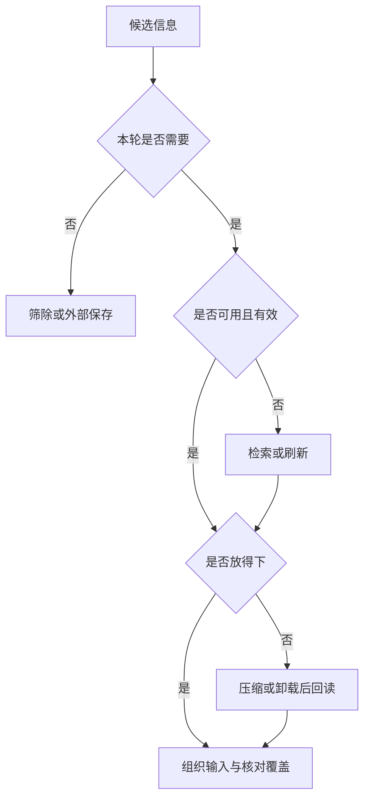

# 06｜上下文优化策略

本篇继续使用 stats 报告审核资料。优化对象是本轮输入、它指向的外部状态，以及下一轮如何重新取得证据。

本章总览图如下：



[阅读路线](README.md) · [上一篇：失败模式与排障](05-failure-modes.md) · [下一篇：评测与回归](07-evaluation-and-regression.md)

## 策略映射

| 策略 | 在本章做什么 | 代价 | 实现位置 |
|---|---|---|---|
| Select，选择 | 去掉错环境、旧版、重复资料 | 可能误删必要证据 | `builder.select_documents` |
| Retrieve，检索 | 按索引读检查规则，按行回读日志 | 查询次数增加、可能漏召回 | `load_on_demand`、`read_back` |
| Reorder，排序 | 当前状态与必要证据保持清楚的职责分区 | 顺序可能依赖模型与任务 | `build_context`、位置探针 |
| Compress，压缩 | 保留最新事实、失败与待办 | 有损，需校验和来源 | `extract_history`、`scoped_summary` |
| Isolate，隔离 | reviewer 只接收当前任务信息 | 交接与汇总成本 | `isolate_worker` |
| Offload，卸载 | 原日志保存到外部文件，只保留引用 | 需要回读、完整性和版本管理 | `offload`、`read_back` |
| Cache，缓存 | 为稳定前缀建立可区分的身份 | 失效不及时会复用旧内容 | `cache_identity`；供应商缓存另配置 |
| Refresh，刷新 | 重新读取明确生效版本，读不到则未知 | 查询开销与更新竞态 | `refresh_policy` |

LangChain 将常见实践概括为 Write、Select、Compress、Isolate；本文按可执行动作细分为上表，便于定位修改代码的位置。[来源](https://www.langchain.com/blog/context-engineering-for-agents)

## 选择与检索

先排除无权、错范围、已撤销或不适用版本，再根据当前步骤选择内容。相关性、来源可信度、时效、具体性、覆盖增益与单位 token 价值都可参与排序，但权限必须是独立的硬条件。

| 检索方式 | 适合的数据 | 报告审核示例 |
|---|---|---|
| 精确字段或数据库查询 | 已知编号、版本、状态 | `service=stats AND environment=workspace` |
| 关键词与符号搜索 | 日志、代码、明确错误 | 找 `verification_check` 或对应处理函数 |
| 向量检索与精排 | 大量自然语言资料 | 按当前问题召回相关检查规则段落 |
| 图与依赖查询 | 任务、模块、调用关系 | 找到失败节点的上游证据 |
| 工具目录检索 | 数量很多的工具定义 | 当前只选读取与检查工具 |
| 长期记忆读取 | 已验证经验与偏好 | 读取相同环境的已确认排障步骤 |

检索结果应带来源、版本、时间、位置以及分数的含义。相似度高不能证明版本适用。更完整的检索流程见[归档 RAG](../../_archive/06-rag-and-knowledge-systems/README.md)，跨任务记忆见[Memory](../13-memory/README.md)。

## 顺序与压缩

可先采用“系统要求 → 当前目标与约束 → 工作状态 → 证据 → 最新观察与待办”的职责顺序，再对具体模型测试。工具与输出格式按接口放在独立字段中；不能假定它们不占窗口。第 07 篇只移动同一组证据来观察位置，避免同时更换数据。

压缩可以逐步增加：精确去重、结构解析去噪、字段抽取、带来源的摘要，最后才是多轮递归摘要。每次有损转换都保留来源、方法、时间或版本以及截断状态；多轮摘要仍指向原始证据，不能只互相引用摘要。

错环境、错版本或无权限时，先过滤。需要继续计算的完整日志保存在外部，不能拿自然语言摘要替代原始数据。当前摘要删除了关键条件时，应回退原文或缩小任务，而不是继续压短。

## 隔离边界

当子任务有不同工具、权限或大量专用资料时，可以为其建立独立工作集。一次函数调用、工作流节点或单独消息列表就能实现信息隔离，不必立即创建多个 Agent。

子任务过小、边界不清或需要不断共享细节时，交接可能比节省的上下文更贵。决定使用子 Agent 前，应定义输入、证据返回格式、失败上报和汇总验收；父 Agent 需要带来源的结论，而不是一句“已完成”。[Anthropic 多 Agent 工程案例](https://www.anthropic.com/engineering/multi-agent-research-system)可作为设计参考，不能直接套用其效果数字。

## 外部卸载与回读

计划、待办、决策日志、大型工具输出和中间文件不必一直驻留在窗口。卸载后，窗口中保留能定位原文的引用；需要精确证据时重新读取。

以下是完整可运行片段，工作目录为本章，依赖 README 环境。它读取执行日志，将原文以内容哈希命名保存到 `runs/readback/objects/`，再回读失败行：

```python
import sys
sys.path.insert(0, "code")
from builder import select_documents
from context import ROOT
from context_strategies import offload, read_back
from engineering_experiments import inputs

task, index, history = inputs()
docs, dropped, reads = select_documents(task, index, "alpha")
log = next(d for d in docs if d["id"] == "dry-run-log")
directory = ROOT / "runs/readback/objects"
reference = offload(directory, log, "alpha")
result = read_back(directory, reference, "alpha", start=83, limit=2)
print(result["lines"][0])
print(result["next_start"])
```

标准输出：

```text
{'line': 83, 'text': 'verification_check=FAILED reason=missing_permission'}
None
```

`None` 表示已到文件末尾；若从第 1 行读取 2 行，`next_start=3`。函数每次最多读 20 行，回读前检查工作区、路径范围和内容哈希。修改已保存文件后再读会报 `source_changed`；换成 beta 主体会报权限错误。

引用记录必须由受信状态存储提供，不能接受模型自行编造的 tenant 或哈希作为授权。实现以临时文件加原子替换写入内容对象；可变计划还需要版本与并发控制，见[状态与产物管理](../07-state-and-artifacts/README.md)。

## 缓存类型

| 类型 | 复用对象 | 关键失效条件 | 是否减少本次窗口占用 |
|---|---|---|---|
| 模型前缀缓存 | 已处理的相同输入前缀 | 前缀或有关配置变化、缓存过期 | 通常仍属于输入上下文 |
| 响应缓存 | 先前的完整答案 | 任务参数、权限、资源版本变化 | 命中时可能不发起模型请求 |
| 工具缓存 | 查询或读取结果 | 查询参数、权限、源版本或有效时间变化 | 取决于结果是否再次注入 |

稳定系统要求、工具定义和固定资料适合组成前缀；任务状态和最新观察放在可变部分。供应商的缓存边界和计费规则需按当前模型核对，不能只凭两个字符串相同就宣称缓存命中。[OpenAI 缓存文档](https://developers.openai.com/api/docs/guides/prompt-caching)

下面完整片段只演示本地缓存身份，在本章执行，打印版本变化是否改变键，不调用供应商缓存、不写文件：

```python
import sys
sys.path.insert(0, "code")
from context_strategies import cache_identity

first = cache_identity("configured-model", "alpha", "v3", "tools-v1", "固定系统要求")
second = cache_identity("configured-model", "alpha", "v4", "tools-v1", "固定系统要求")
print(first != second)
```

标准输出为 `True`。相同模型、主体、检查规则、工具版本和前缀产生相同键；源策略变化就不能继续复用旧结果。真实缓存还要核对权限边界、保留期限以及 usage，不能只看命中率。

## 事实刷新

刷新可由有效期到达、源版本变化或新观察冲突触发，不必每轮重读所有文件。当前配置要求 v3，就重读受权威索引指向的 v3；若改成 v4 而来源不存在，应返回 UNKNOWN，并保留最后确认时间，不能偷偷回退 v3 后称其为现行规则。

以下完整片段在本章执行，读取索引中的正式检查规则，打印正常与缺版本的状态，不写文件：

```python
import sys
sys.path.insert(0, "code")
from context_strategies import refresh_policy
from engineering_experiments import inputs

task, index, history = inputs()
print(refresh_policy(task, index, "alpha")["status"])
print(refresh_policy({**task, "policy_version": "v4"}, index, "alpha")["status"])
```

标准输出为 `CURRENT`、`UNKNOWN`。`checked_as_of` 使用任务冻结的审核时间，表示这份实验快照的有效性检查，不伪装成网络实时查询。比较历史版本时另外保留两版证据，不将旧版当作无用信息删除。

## 策略验证

优化后同时核对结果、硬约束、证据覆盖、调用次数、延迟和费用。当前实验保存“完整授权输入、最小输入、当前策略、关闭去重、关闭日志压缩”五种请求；后三者适合定位单个机制的成本，前两者提供上下限参照。指标与真实模型验证在下一篇展开。
