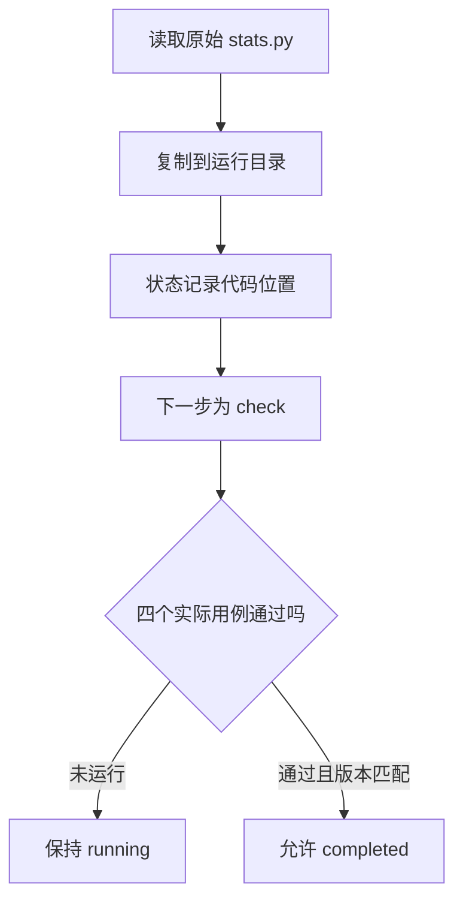

# 01｜任务状态

[阅读路线](README.md) · [下一篇：产物版本](02-versions-and-evidence.md)

本章总览图如下：



最小入口只保存代码路径，状态为 `running`，验收结果为 `not_run`。图中的完成分支要求实际用例通过且产物版本匹配。

## 1. 代码副本

输入 [fixtures/stats.py](fixtures/stats.py) 的完整内容是：

```python
# 以下两行对应输入文件，不是修复答案。
def mean(values):
    return sum(values) / (len(values) + 1)
```

`mean([2, 4])` 得到 `2.0`，但平均值应是 `3`。即使一个模型已经回答“修好了”，程序也需要找到真实文件并运行用例。

先在章节目录运行下面的**完整片段**。输入来自 `fixtures/stats.py`；输出是独立目录中的副本，不修改原始输入：

```python
from pathlib import Path
import shutil

out = Path("runs/first-copy")
out.mkdir(parents=True, exist_ok=False)
shutil.copyfile("fixtures/stats.py", out / "stats.py")
print((out / "stats.py").read_text(), end="")
```

准确标准输出为：

```text
def mean(values):
    return sum(values) / (len(values) + 1)
```

程序没有修复任何错误，只是固定了这一轮使用的输入。如果接下来有人修改 `fixtures/stats.py`，已经复制出的文件仍能告诉我们这一轮从哪份代码开始。

## 2. 状态与产物

以下**接续片段**接在上面的 `out` 定义之后。它写入状态，不运行候选代码：

```python
import json

state = {
    "schema_version": 1,
    "task_id": "repair-mean",
    "status": "running",
    "next_step": "check",
    "budget": 4,
    "refs": {"code_path": "stats.py"},
    "acceptance": "not_run",
}
(out / "state.json").write_text(
    json.dumps(state, ensure_ascii=False, indent=2) + "\n"
)
print(state["status"], state["next_step"], state["acceptance"])
```

标准输出是 `running check not_run`。打开 `runs/first-copy/state.json`，引用 `stats.py` 按该运行目录解析，而不是按调用者的任意当前目录解析。

| 字段 | 类型 | 为什么留下它 |
|---|---|---|
| `schema_version` | 整数 | 读取程序先判断能否理解结构 |
| `task_id` | 字符串 | 标识这次修复目标，不是一次模型调用 ID |
| `status` | 字符串 | 判断任务处于排队、执行还是完成阶段 |
| `next_step` | 字符串或空值 | 让执行器知道下一步做什么 |
| `budget` | 非负整数 | 记录任务剩余预算 |
| `refs` | 字典 | 指向代码、方案、证据等完整内容 |
| `acceptance` | 字符串 | 区分未检查、失败、失效和通过 |

状态不必包含整份代码，也不必包含全部日志。下一步只要知道“读取哪个代码版本、应执行哪一步”即可；真正代码仍在文件里。

再区分三个容易混用的对象：

| 对象 | 本任务中的例子 | 读取它是为了什么 |
|---|---|---|
| 状态 | `next_step=check` | 决定接下来执行什么 |
| 事件 | “第 3 次修改把代码从 A 换成 B” | 追查事情如何发生 |
| 产物 | B 版代码、B 版测试结果 | 检查或交付真实内容 |

事件里出现“检查完成”不代表当前代码已通过。程序可能在检查之后又改了一次代码，因此检查结果必须引用实际执行的代码版本。

## 3. 运行入口

[code/demo.py](code/demo.py) 的 `minimal(out)` 实现了以上操作，并额外生成 `result.json` 和 `report.md`。工作目录仍是章节目录：

```bash
python code/demo.py minimal --out runs/minimal-1
```

准确标准输出：

```text
{"acceptance": "not_run", "code_exists": true, "status": "running"}
artifacts=runs/minimal-1
```

`minimal()` 的返回值就是第一行 JSON 对应的 Python 字典；函数本身不打印，由命令行入口打印。`code_exists=true` 只检验文件存在，不会让 `acceptance` 从 `not_run` 变为 `passed`。

## 4. 状态转移

最小 JSON 文件没有转移约束。[Store.save](code/state.py) 限定以下状态转移：

| 原状态 | 可写入状态 | 本任务中何时发生 |
|---|---|---|
| 尚未创建 | `queued` | 创建第 1 版状态 |
| `queued` | `running` | 取得输入并开始检查 |
| `running` | `running` | 修代码、更新预算、记录失败 |
| `running` | `completed` | `complete()` 已验证当前产物 |
| `completed` | `running` | 明确开始新一轮修改，旧验收应随依赖失效 |

`Store` 检查状态标签和版本号；业务入口负责先调用 `complete()`，让文件验证通过之后再提交完成状态。因此不能把模型输出的字典直接送入 `save()` 当作验收结果。

预算字段用于共享状态示例，不执行调用限额；持久化计数见[持久化与故障恢复](../09-persistence-and-recovery/README.md)。

## 5. 文件修改实验

将副本 `runs/minimal-1/stats.py` 的分母改成 `len(values)`，然后查看 `state.json`。状态仍然是 `acceptance=not_run`，因为文本编辑没有触发任何检查。再去读 `fixtures/cases.json`：空列表要求抛 `ValueError`，只改分母仍未满足全部条件。

同一个 `stats.py` 路径可以代表不同内容。只有将检查结果关联到实际执行的代码版本，才能判断旧证据是否仍然有效。
