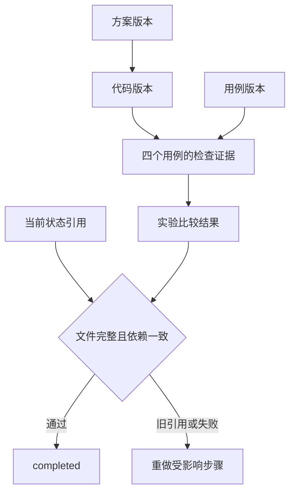

# 02｜产物版本

[阅读路线](README.md) · [上一篇：任务状态](01-state-and-files.md) · [下一篇：并发更新](03-concurrent-updates.md)

本章总览图如下：



箭头表示产物对精确上游版本的依赖。完整入口为 `code/demo.py versions`。

## 1. 内容标识

如果把每次结果都覆盖到 `report.json`，旧状态中的路径仍然有效，内容却已变化。先看**可在章节目录直接运行的完整片段**：

```python
from pathlib import Path
from hashlib import sha256

raw = Path("fixtures/stats.py").read_bytes()
original = sha256(raw).hexdigest()
changed = sha256(raw + b"\n").hexdigest()
print(len(original))
print(original == changed)
```

准确输出为 `64` 和 `False`，各占一行。增加一个换行也会改变哈希。这能识别字节变化，但不能判定两段代码是否行为等价，更不能替代测试。

完整实现 [Artifacts.put](code/artifacts.py) 除了内容哈希，还保存来源关系。下面是**格式示例**，尖括号为占位符，不应直接执行：

```json
{
  "schema_version": 1,
  "kind": "evidence",
  "payload": "payload.json",
  "sha256": "<检查结果字节的 SHA-256>",
  "dependencies": {
    "code": "<实际执行的代码产物 ID>",
    "cases": "<实际使用的用例产物 ID>"
  }
}
```

程序把元数据按固定键序编码，再对元数据求哈希，作为产物 ID。所以即使检查结果文本恰好相同，只要所依赖的代码版本不同，证据产物也会得到不同 ID。

| 字段或位置 | 固定的内容 |
|---|---|
| `sha256` | 实际文件字节 |
| `dependencies.code` | 被检查的精确代码产物 |
| `dependencies.cases` | 执行了哪组用例 |
| `objects/<id>/meta.json` | 内容身份和来源关系 |
| `objects/<id>/payload.*` | 真正供读取、运行或交付的字节 |

## 2. 产物引用

`put()` 先写临时目录中的 `payload.*` 和 `meta.json`，然后把整个目录重命名到最终 ID。相同内容的并发创建者若发现目标已存在，会检查目标内容，再复用同一个 ID。调用者拿到 ID 后才更新 SQLite 状态。

如果写完文件后状态提交失败，留下的是一份未被引用的产物，不会出现“状态说证据已保存，文件其实还没写完”的正常提交结果。无人引用的文件可在以后根据保留策略清理；不能简单删除“当前状态不引用”的目录，因为旧状态快照可能仍然引用它。

下面是 [demo.versions](code/demo.py) 的**源码节选**，`objects` 已经是 `Artifacts` 实例，`plan2` 是第二版方案的 ID，`REPAIRED` 是完整入口内的固定修复代码。节选本身不打印：

```python
code2 = objects.put("code", REPAIRED, ".py", {"plan": plan2})
state["refs"].update(plan=plan2, code=code2)
state["acceptance"] = "stale"
stale = objects.stale(evidence1, state["refs"])
version = store.save(state, version)
```

`stale` 在这次运行中为 `['code']`。旧证据文件仍保留在磁盘，内容也没有损坏，只是它对应的代码已不再是当前代码。

## 3. 依赖与失效

两版方案是实际文件，可以并排打开：

| 方案 | 对空输入的约定 | 代码与证据的变化 |
|---|---|---|
| `plan-v1.json` | 尚未决定 | 保存原始代码，并发现四项仅一项通过 |
| `plan-v2.json` | 抛 `ValueError` | 生成修复代码，再实际运行四项检查 |

方案不是一个会自动执行的承诺。只有代码明确实现相应行为、用例确实观察到结果，才有完成依据。完整入口使用以下**完整函数定义**作为第二版代码，将它写入真实 `payload.py` 和运行目录的 `workspace/stats.py`：

```python
def mean(values):
    if not values:
        raise ValueError("empty input")
    return sum(values) / len(values)
```

定义函数没有标准输出。`mean([2, 4])` 返回 `3.0`；`mean([])` 抛 `ValueError`。实际验收由 [check_code.py](code/check_code.py) 完成，它加载该文件，逐项捕获结果或异常类型，返回含 `passed` 和 `cases` 的字典。

证据和实验结果也分开保存。证据保存每个用例的输入、观察值与通过状态；实验结果保存两版通过数量及它采用的最终证据 ID。一个“4/4”的数字如果没有引用真实证据，就无法追溯究竟测了哪一版。

## 4. 版本对照实验

在章节目录执行：

```bash
python code/demo.py versions --out runs/versions-1
```

准确标准输出：

```text
{"after_passed": 4, "before_passed": 1, "stale_dependencies": ["code"], "state_version": 5, "status": "completed"}
artifacts=runs/versions-1
```

程序以 `sys.executable` 启动子进程，运行当前候选文件，而不是复用主进程里先前导入的旧函数。打开 `comparison.json`，应当看到以下实际结果：

| 输入 | 原始代码观察值 | 修复后观察值 | 验收条件 |
|---|---:|---|---|
| `[2, 4]` | `2.0` | `3.0` | `3` |
| `[-2, 2]` | `0.0` | `0.0` | `0` |
| `[10]` | `5.0` | `10.0` | `10` |
| `[]` | `0.0` | `ValueError` | 抛 `ValueError` |

子进程执行的是仓库中的固定样本，不是对任意来源代码的安全沙箱。`timeout=5` 限制这次运行的等待，执行环境的权限和隔离见第 08 组件。

## 5. 产物验收

[state.complete](code/state.py) 是最终关口。以下是其**源码节选**，定义本身无输出；完整函数返回一份 `status=completed` 的新状态，校验不通过则抛 `ValueError`：

```python
for ident in refs.values():
    artifacts.verify(ident)
for name in ("code", "evidence", "experiment"):
    if artifacts.stale(refs[name], refs):
        raise ValueError(f"stale {name}")
```

第一轮递归检查文件字节和依赖文件存在；第二轮核对每个派生产物是否基于当前上游。随后读取证据与实验结果的 `passed` 值。这里能够信任这些字段，是因为它们由本章检查器根据实际执行生成，并由受控入口写入，不是采用模型自由描述的完成声明。

仅把 `refs.plan` 换成新方案，代码会因旧方案引用而失效；更换代码会使证据失效；更换证据会使实验结果失效。这种保守规则会在“只是方案措辞改变”的情况下多做一些检查，但避免静默复用来源不明的结论。

## 6. 篡改与旧证据

完整自动检查命令是：

```bash
python -m unittest discover -s code -p 'test_state.py' -v
```

`test_tamper_is_detected_even_with_same_path` 会原地修改已登记的 `payload.py`，然后调用 `Artifacts.read()`，得到 `payload mismatch`。

`test_change_invalidates_old_passed_evidence` 则通过 `put()` 创建新代码产物，再把状态中的代码引用换过去，保留原来的通过证据。文件哈希都正确，但 `complete()` 拒绝 `stale evidence`：文件完整，依赖版本不一致。可把测试中的新代码改为行为正确、仅注释不同的版本，仍应失效，因为检查器采用精确版本匹配。
