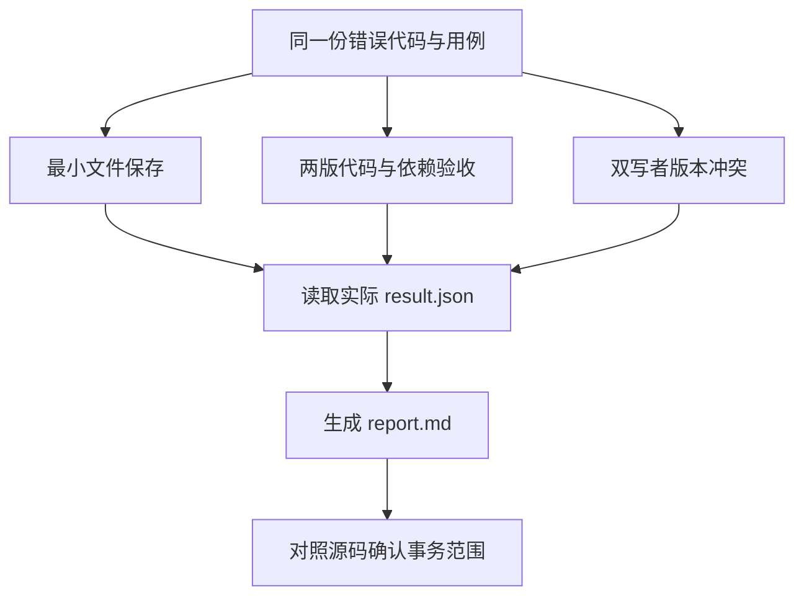

# 04｜实验与事务

[阅读路线](README.md) · [上一篇：并发更新](03-concurrent-updates.md) · [下一组件](../08-tools-and-environment/README.md)

本章总览图如下：



实验比较最小保存、版本验收和并发更新，三个场景分别保存产物。

## 1. 对照实验

在章节目录执行：

```bash
python code/demo.py experiments --out runs/experiments-1
```

输出结构如下；`python` 和 `sqlite` 是当前机器的版本，其他字段由三个真实场景返回：

```text
{"python": "<Python 版本>", "scenarios": {"conflict": {...}, "minimal": {...}, "versions": {...}}, "sqlite": "<SQLite 版本>"}
artifacts=runs/experiments-1
```

完整入口 [experiments(out)](code/demo.py) 依次创建子目录，再调用同一份 `minimal()`、`versions()`、`conflict()`。它没有预填预期结果，也没有把测试中的断言值当成实验数据。

已执行样例在 [examples/verified-run/report.md](examples/verified-run/report.md)。对应结果应为：

| 对照 | 改变的条件 | 观察值 | 可以得出的结论 |
|---|---|---|---|
| 最小版本 | 只有路径与状态 | `acceptance=not_run` | 保存文件并不完成验收 |
| 原始与修复代码 | 分母与空输入处理 | `1/4 → 4/4` | 本组用例覆盖的行为得到修复 |
| 原始证据与新代码 | `refs.code` 改变 | `stale_dependencies=['code']` | 旧证据没有被冒用 |
| 无版本与 CAS | 同一旧快照、同一修改意图 | `inspect → verify` | CAS 合并保住了 A 的进度 |

`4/4` 是这四个明确用例的结果，不是对所有浮点输入、迭代器或任意数值类型的正确性证明。扩大函数需求时，也要版本化对应的用例集。

## 2. 产物定位

下面的**完整片段**在章节目录执行，输入是刚生成的 `runs/experiments-1/versions/state.json`，不写文件：

```python
import json
from pathlib import Path

root = Path("runs/experiments-1/versions")
state = json.loads((root / "state.json").read_text())
code_id = state["refs"]["code"]
meta = json.loads((root / "objects" / code_id / "meta.json").read_text())
code_path = root / "objects" / code_id / meta["payload"]
print(state["status"], state["acceptance"])
print(code_path.read_text(), end="")
```

准确输出：

```text
completed passed
def mean(values):
    if not values:
        raise ValueError('empty input')
    return sum(values) / len(values)
```

注意实际生成文件使用单引号，正文中的等价函数展示使用双引号；哈希对应实际文件字节。这个例子也说明：给读者的产物引用应可解析到文件，不能只展示一个看不见内容的哈希值。

## 3. 回归测试

执行：

```bash
python -m unittest discover -s code -p 'test_*.py' -v
```

当前交付实际运行了 4 项测试，全部通过。它们不调用任何模型服务。

| 测试 | 真正执行的变化 | 要拒绝或保留的结果 |
|---|---|---|
| `test_actual_parallel_conflict_and_merge` | 两线程各自连接、共同读取版本 1 | 拒绝 B 旧写入，最终保留 `verify` 和预算 `3` |
| `test_change_invalidates_old_passed_evidence` | 通过证据形成后换成新代码 | 拒绝 `stale evidence` |
| `test_tamper_is_detected_even_with_same_path` | 原地修改登记文件 | 拒绝 `payload mismatch` |
| `test_reject_invalid_transition_without_new_snapshot` | 从 queued 直接标 completed | 拒绝转移且版本仍为 1 |

改变输入后的检查方法也很明确：在 `fixtures/cases.json` 增加 `{"values": [1, 2, 3], "expected": 2}`，换新输出目录运行。修复后的通过数应由 4 变为 5；用例产物 ID、证据 ID、实验结果 ID 都应改变，原始输入和先前产物仍保留。

## 4. SQLite 事务源码

本章保存的是 CPython `v3.12.10` 的 [Modules/_sqlite/connection.c](https://github.com/python/cpython/blob/v3.12.10/Modules/_sqlite/connection.c)，本地副本为 [sources/connection.c](sources/connection.c)。原文从固定 tag 的 raw 地址取得，文件 SHA-256 与获取日期保存在 [manifest.json](sources/manifest.json)，许可证见 [LICENSE.CPython](sources/LICENSE.CPython)。运行环境可以更新；源码走读固定在该 tag。

先找到 `pysqlite_connection_commit_impl()`。它在 legacy 事务模式下检查底层是否存在事务，然后执行 `COMMIT`；在 `autocommit=False` 模式下提交后重新开启事务。本文通过 `isolation_level=None` 关闭隐式开启，显式发送 `BEGIN IMMEDIATE / COMMIT / ROLLBACK`，使范围直接可见。

再找到 `pysqlite_connection_exit_impl()`。它根据是否存在异常选择提交或回滚；若提交失败，还会尝试回滚并保留异常链。它并不知道 `refs.code` 是什么，也不会验证旧证据。

| 本文步骤 | CPython 中可找到的实现 | 不由这段源码承担的事 |
|---|---|---|
| `Store.save()` 的 COMMIT | `pysqlite_connection_commit_impl` 展示 Python 提交接口如何落到 SQLite | 比较业务版本号 |
| 出错后回滚 | `pysqlite_connection_rollback_impl` | 撤销已写入普通文件的字节 |
| `with connection` 的退出 | `pysqlite_connection_exit_impl` | 创建业务 CAS 条件或自动开启 `BEGIN IMMEDIATE` |
| `complete()` | 本文的业务函数 | 不属于 CPython 数据库连接职责 |

这里是机制对照，不宣称本文调用栈会经过 `Connection.commit()`：本文发送 SQL 字符串，绕过该 Python 方法。两条入口最终都要求 SQLite 提交当前数据库事务。

本地源码完整性检查：

```bash
python sources/verify_sources.py
```

准确输出 `verified=1 tag=v3.12.10`。校验器只检查本地文件是否与已登记哈希相符；固定远端来源已在编写时下载核对，不会在每次运行时联网。

## 5. 外部副作用

设状态已保存 `next_step=publish`，代码接着发布报告。报告已到接收方，但进程在保存回执之前退出。SQLite 事务无法撤销接收方已收到的报告，文件哈希也回答不了报告是否已经送达。

检查点保存恢复所需数据，trace 记录执行顺序。外部副作用的恢复还需要稳定操作身份，见[持久化与故障恢复](../09-persistence-and-recovery/README.md)。
