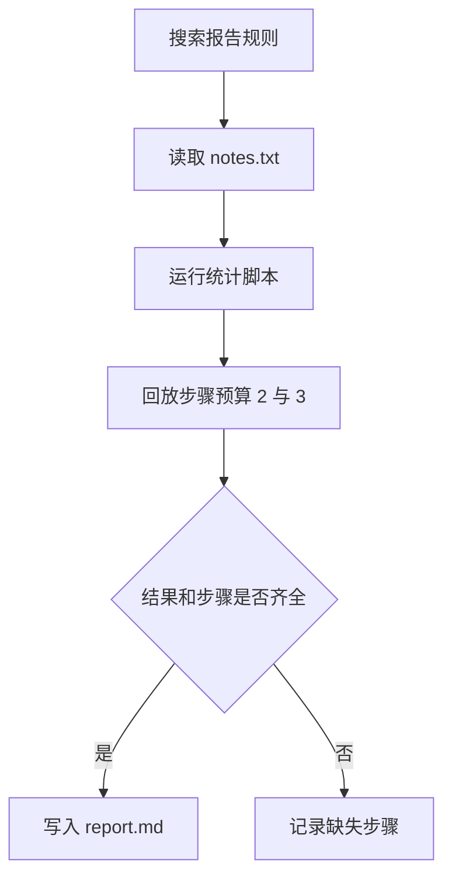

# 02｜搜索、文件、代码与仿真

[阅读路线](README.md) · [上一篇：工具定义与参数校验](01-contract-and-dispatch.md) · [下一篇：执行环境与 MCP](03-environment-and-mcp.md)

本章总览图如下：



输入是笔记、样本 `[2, 4]` 和工具步骤列表。`run_task.py` 将它们复制到本次 `workspace/`，所有文件工具都操作这个副本。

## 文件工具

直接读取的核心仍是一行 `target.read_text(encoding="utf-8")`。增加相对路径检查后，调用者就不能通过这个文件接口读取父目录：

```python
# confined() 的核心节选；root、relative 是函数参数。
root = root.resolve()
target = (root / relative).resolve()
if Path(relative).is_absolute() or not target.is_relative_to(root):
    raise ToolError("path_denied", "relative path must remain inside tool root")
```

完整函数在 [runtime.py](code/runtime.py)。`resolve()` 会处理已存在的符号链接，因此指向工作目录外的链接也会被拒绝。这里的范围控制假设工作目录没有另一个恶意进程同时改换链接；检查与打开之间不是操作系统原子操作。它约束本文件函数，不约束任意 Python 代码。

`read_file` 最多读取 16000 字节；`write_file` 写 UTF-8 文本，返回实际字节数。字符数与 UTF-8 字节数不同，例如“笔记”是 2 个字符、6 个字节。写入成功只说明文件存在，不说明报告符合规则，因此任务末尾还有内容验收。

| 工具 | 输入 | 结果中需要继续使用的字段 |
|---|---|---|
| `search_docs` | query、limit | matches 中的文件、行号、原文 |
| `read_file` | 工作目录内的 path | text |
| `write_file` | path、text | path、bytes |
| `run_python` | script、input_path | exit_code、stdout、stderr |
| `simulate_loop` | input_path、max_steps | executed、remaining、completed、history |

这些是五个注册名称、四类操作；读取和写入属于同一文件类别。

## 代码执行

本章的计算程序 [compute.py](examples/compute.py) 从标准输入读样本列表，计算均值，再输出 JSON。它没有访问工作目录中的其他文件。先独立运行它，可分清“脚本算错”与“工具传参错”：

```bash
python examples/compute.py < examples/samples.json
```

在章节目录执行，标准输出：

```json
{"count": 2, "mean": 3.0}
```

接着工具把输入文本作为 `subprocess.run(input=...)` 送进脚本。这是 [execute_python()](code/runtime.py) 的关键函数调用节选：

```python
result = subprocess.run(
    [sys.executable, "-I", str(script)],
    input=stdin, cwd=cwd,
    env={"PYTHONIOENCODING": "utf-8"},
    capture_output=True, text=True, encoding="utf-8",
    timeout=timeout, check=False,
)
```

命令是参数列表，没有经过 Shell 拼接。`cwd` 决定相对路径起点，`env` 不继承宿主凭证。`-I` 减少 Python 的导入环境干扰；它不会剥夺读文件、联网或创建进程的能力。这里的本机工具只允许执行仓库内已审阅的 `compute.py`，其他 script 名称返回 `script_denied`。运行任意生成代码需要操作系统层面的隔离，见[执行环境与 MCP](03-environment-and-mcp.md)。

子进程退出非零时返回 `process_failed`，超时返回 `timeout`。stdout 长度检查发生在进程返回后；它不是运行中的内存或输出配额，因此不能拿它约束恶意打印程序。本机入口适用于这个小型可信脚本。

## 执行步骤仿真

[steps.json](examples/steps.json) 保存三个名称：`read_file`、`run_python`、`write_file`。仿真只推进步骤计数，观察预算在哪里截断；实际的文件读取、统计计算和写入由其他工具执行。

以下是完整的 `simulate` 函数定义，输入为步骤列表和上限，返回执行记录，无标准输出：

```python
def simulate(steps, max_steps):
    history = [{"step": i, "tool": name} for i, name in enumerate(steps[:max_steps], 1)]
    return {"executed": len(history), "remaining": len(steps) - len(history),
            "completed": len(history) == len(steps), "history": history}
```

| 预算 | 回放到哪一步 | remaining | completed |
|---:|---|---:|---|
| 2 | `run_python` | 1 | False |
| 3 | `write_file` | 0 | True |

`simulate_loop` 先读取步骤文件，检查列表长度和工具名，再调用上述函数。工具参数中的 `max_steps` 必须是 1—100 的整数。这样能区分参数错误、输入文件错误和正常的预算耗尽。

## 工具调用

完整入口为 [run_task.py](code/run_task.py)，在章节目录运行：

```bash
python code/run_task.py --output runs/task
```

标准输出：

```text
mean=3.0 calls=6 acceptance=True
artifacts=runs/task
```

六次调用分别是搜索、读取笔记、运行统计脚本、两次步骤仿真、写报告。程序将子进程 stdout 用 `json.loads()` 解码，把样本数和均值写进报告。

打开 `workspace/report.md`，应看到原笔记、样本数 2、均值 3.0 和两行预算对照。`result.json` 保存数值验收，`trace.jsonl` 保存每次请求和结果。这里的验收条件对应 `[2, 4]` 这份输入。

[下一篇：执行环境与 MCP](03-environment-and-mcp.md)
