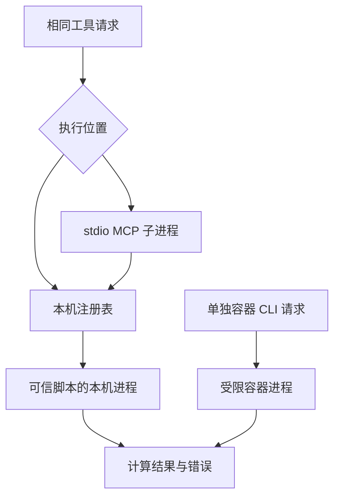

# 03｜执行环境与 MCP

[阅读路线](README.md) · [上一篇：搜索、文件、代码与仿真](02-four-tools.md) · [下一篇：工具实验](04-experiments.md)

本章总览图如下：



工具名称指定操作，执行环境限制操作可访问的文件、网络与进程，MCP 定义工具发现与调用消息。通信协议不授予执行权限。

## 子进程与隔离

`run_python` 工具通过 `subprocess.run()` 启动 Python 进程。Python 3.12 的接口在超时时终止并等待它启动的子进程，再抛 `TimeoutExpired`；进程启动本身可能延迟超时返回。这不是自动终止任意后代进程的通用保证。[Python 3.12 subprocess 文档](https://docs.python.org/3.12/library/subprocess.html)

本机执行仍使用当前操作系统身份。即使 `cwd` 指向 `runs/`，脚本也能尝试读取绝对路径；即使没有 API Key 环境变量，操作系统允许的网络仍可用。`run_python` 因此只开放已审阅脚本。`test_child_timeout_and_nonzero` 使用测试临时文件复现等待与异常，未把生成代码交给本机主线工具。

| 本章措施 | 解决什么 | 仍由谁控制 |
|---|---|---|
| 文件路径限制 | 文件工具请求的目标范围 | 宿主文件系统与并发修改者 |
| `shell=False` 参数列表 | 不让参数被 Shell 当表达式解析 | 被启动程序自身的能力 |
| Python `-I` | 减少导入与用户环境干扰 | 文件、网络、进程权限 |
| `timeout` | 限制等待与清理直接子进程 | 后代进程与外部已发生效果 |
| 容器限制 | 文件挂载、网络、进程及资源范围 | 宿主内核、容器运行时与其配置 |

## 容器配置

[run_container.py](code/run_container.py) 继续执行相同 compute.py、相同 samples.json，结果仍应为样本数 2、均值 3.0。它构造以下容器参数；这是参数说明，完整可运行入口在其后的命令中。

| 参数 | 具体限制 |
|---|---|
| `--network=none` | 不连接容器外部网络 |
| `--read-only` | 根文件系统只读 |
| `/input` 的只读 bind mount | 仅挂载本章 examples；不挂整个工作区 |
| `--user=65534:65534` | 使用非 root 用户 |
| `--cap-drop=ALL`、`no-new-privileges` | 缩减 Linux capabilities，禁止提权 |
| `--memory=128m`、`--cpus=0.5`、`--pids-limit=32` | 内存、CPU、进程数量限制 |
| `/tmp` tmpfs 16m | 提供小型临时写入空间 |

参数语义来自 [Docker 官方运行文档](https://docs.docker.com/engine/containers/run/)。容器共享宿主内核，运行高风险不可信代码时还需要结合更强的虚拟化隔离与宿主治理，不能把这些参数解读为对所有攻击的证明。

在有 Docker 的章节目录运行：

```bash
docker pull python:3.12-slim
python code/run_container.py --image python:3.12-slim --output runs/container
```

预期输出结构为 `container=passed artifacts=runs/container`，真实 stdout、returncode、镜像引用、命令参数保存在 `result.json`。容器全程超过 15 秒时，程序终止等待并在 `finally` 执行 `docker rm -f <唯一名称>`；只终止 Docker 命令行进程不保证容器停止。镜像拉取单列为前置步骤，避免把拉取时间混进计算期限。

验证环境未安装 Docker，容器分支未执行。

## MCP 工具接口

把字典通过 stdin 发到子进程、从 stdout 收回，就有了传输；还需双方约定初始化、方法名和结果。配套 [mcp_stdio.py](code/mcp_stdio.py) 使用固定的 MCP `2025-06-18` 协议路径，按行传输 JSON-RPC 消息，运行一个精简 stdio 服务。它实现 initialize、initialized 通知、tools/list、tools/call，没有 HTTP 传输、分页、通知更新、认证或协议版本回退。[MCP 2025-06-18 工具规范](https://modelcontextprotocol.io/specification/2025-06-18/server/tools)

在章节目录执行：

```bash
python code/mcp_stdio.py --output runs/mcp
```

标准输出：

```text
protocol=2025-06-18 tools=5 valid_call=True invalid_call=True
artifacts=runs/mcp
```

客户端由 `mcp_stdio.py` 中的 `client()` 函数实现。它启动另一个 Python 进程，等待 initialize 响应，再发送 initialized 通知，随后发现五个工具并调用搜索。每个请求都等自己的 id 返回；五秒 watchdog 防止此本地示例子进程无限阻塞。stdout 专用于协议消息，日志不得夹在 JSON 行中。

| MCP 字段 | 本地对应 | 转换 |
|---|---|---|
| JSON-RPC `id` | `call_id` | 保存请求与响应关联；本地转成字符串 |
| `params.name` | `name` | 从注册表查找 |
| `params.arguments` | `arguments` | 已经是 JSON 对象，不再 `json.loads` 字符串 |
| `tools/list` 的 `inputSchema` | `Tool.input_schema` | 描述实际输入限制 |
| `structuredContent` | 成功的 `data` | 保留结构化对象 |
| `content[].text` | data 或 error 的 JSON 文本 | 供文本读取端使用 |
| `isError` | `not ok` | 表示工具执行失败 |

未知工具属于请求错误，本服务返回 JSON-RPC `-32602`。已找到工具但参数上限不符，则返回带 `isError=true` 的工具结果。实验第二次搜索 `limit=200`，客户端收到了规范化错误，服务仍继续运行。

这份实现只覆盖上述 MCP 方法。正式服务可使用支持目标协议版本的 MCP SDK 库处理消息，复用工具的输入、输出和执行边界。SDK 在这里指程序导入的代码库。数据范围、费用与人工批准继续由 [12｜权限与资源控制](../12-permissions-and-resources/README.md)强制执行。

[下一篇：工具实验](04-experiments.md)
