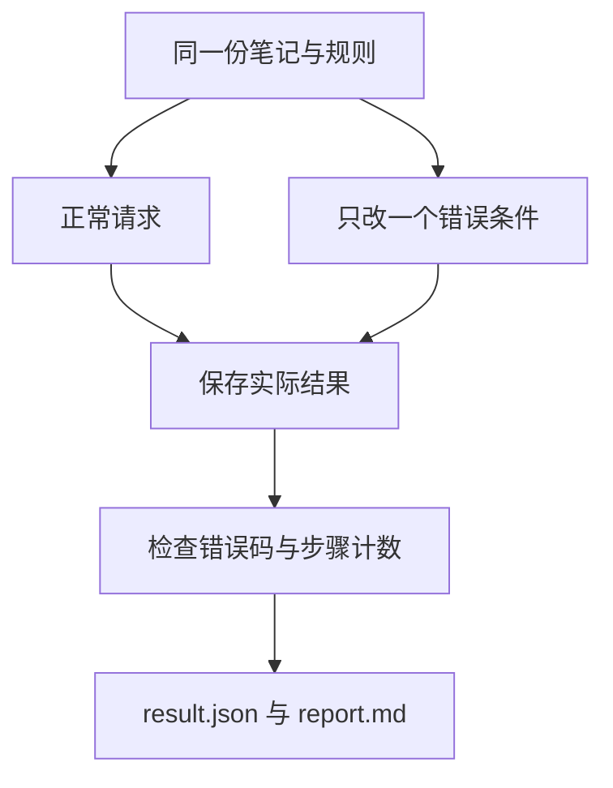

# 04｜工具实验

[阅读路线](README.md) · [上一篇：执行环境与 MCP](03-environment-and-mcp.md)

本章总览图如下：



实验固定输入文件与报告规则，分别改变参数、路径和步骤预算，检查返回结果和错误码。

## 请求实验

在章节目录运行完整实验入口：

```bash
python code/run_experiments.py --output runs/experiments
```

标准输出：`cases=8 passed=8` 和 `artifacts=runs/experiments`。其中 passed 的含义是“结果符合该案例期望”，因此预期的拒绝也应通过。

| 案例 | 唯一关键条件 | 应看到的结果 |
|---|---|---|
| search | 搜索“报告”，limit=1 | 成功，total 大于已返回数量，truncated 为真 |
| bad_limit | limit 改为 200 | `invalid_arguments` |
| bool_limit | limit 改为 True | `invalid_arguments` |
| escape | path 改为 `../outside.txt` | `path_denied`，与文件是否存在无关 |
| missing | 合法目录内的缺失文件 | `not_found` |
| python | 执行 compute.py | stdout 为样本数 2、均值 3.0 |
| budget2 | 最多两步 | remaining=1，completed=False |
| budget3 | 最多三步 | remaining=0，completed=True |

打开 [已执行的 result.json](evidence/experiments/result.json) 查看完整 data 和 error；[report.md](evidence/experiments/report.md) 是从这些实际行生成的摘要。它没有把预期成功值伪装为执行输出。

## 产物验收

以下是章节目录下可独立运行的检查片段，前提是已经生成 `runs/task/result.json`。它不重新调用工具，只读保存的真实仿真历史：

```python
import json
from pathlib import Path
result = json.loads(Path("runs/task/result.json").read_text(encoding="utf-8"))
for budget, simulation in result["alternatives"].items():
    assert simulation["executed"] == len(simulation["history"])
    assert simulation["executed"] + simulation["remaining"] == 3
    assert simulation["completed"] == (simulation["remaining"] == 0)
    print(budget, simulation["executed"], simulation["remaining"], simulation["completed"])
```

标准输出：

```text
2 2 1 False
3 3 0 True
```

这三项检查分别核对记录数量、总步骤数和完成标记，能发现“字段存在但计数错误”的结果。

## 边界测试

```bash
python -m unittest discover -s code -p 'test_*.py' -v
```

[测试代码](code/test_runtime.py) 共 8 项，覆盖布尔数值与额外参数、父目录与符号链接越界、错误输出类型、UTF-8 读写、缺文件与未知工具、子进程超时和非零退出、脚本白名单、步骤计数。文件全部建在临时目录，测试退出自动清理，不触碰真实资料。

第一次运行中曾发现非零退出测试使用 0.05 秒会把 Python 启动延迟误判为 timeout；现在非零分支用 2 秒，超时分支仍执行一个实际等待 1 秒的临时脚本。测试条件要单独暴露目标故障，不能用机器偶然足够快作为前提。

## 输入变更实验

把 `examples/samples.json` 从 `[2, 4]` 改成 `[2, 4, 6]`，先执行 `python examples/compute.py < examples/samples.json`。标准输出变为 `{"count": 3, "mean": 4.0}`。

再用新的输出目录运行任务脚本。工具能够算出新均值，但原任务的固定验收会失败：它仍要求两个样本、均值 3。比较实验结束后恢复原始输入；正式任务应根据当前任务定义传入验收条件。

[trace.jsonl](evidence/task/trace.jsonl) 保存六个请求、对应 call_id、结果和报告写入记录。请求校验、执行状态、仿真规则与交付验收是四项独立检查。

[返回阅读路线](README.md)
