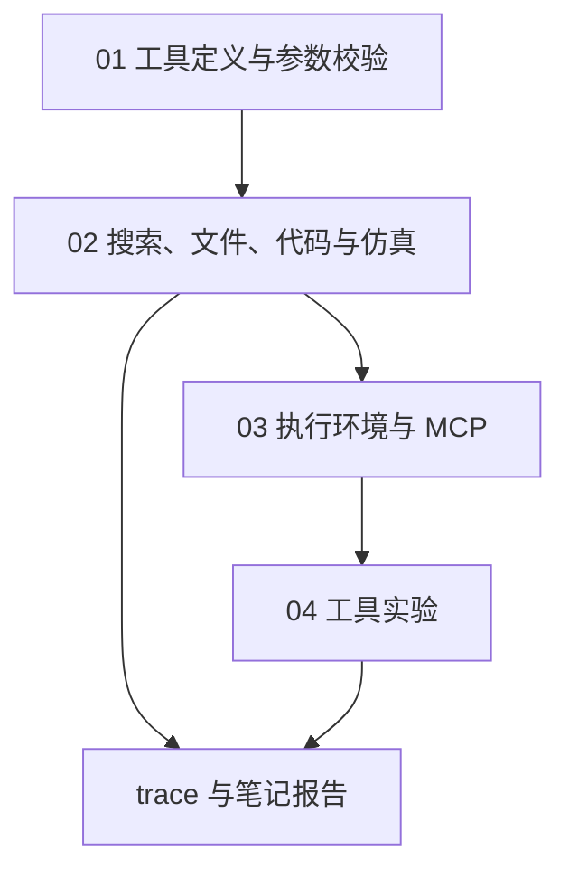

# 08｜工具与执行环境

本章为笔记与统计报告任务注册工具，并检查参数、结果与执行范围。

[组件总览](../README.md) · [上一组件：状态与产物管理](../07-state-and-artifacts/README.md) · [下一组件：持久化与故障恢复](../09-persistence-and-recovery/README.md)

执行层接收工具名称和参数，执行操作并返回结果或错误。任务读取笔记、计算 `[2, 4]` 的均值，并比较两步和三步预算，保存工具记录与报告。

本章总览图如下：



示例只需基础 Python。任务脚本直接提交请求字典，按固定顺序调用工具；接入模型时，可将 [03 的工具派发](../03-agent-loop/02-tools-and-observations.md)指向 `Registry.call()`。

| 顺序 | 阅读文件 | 完整入口 | 新增机制 |
|---|---|---|---|
| 01 | [工具定义与参数校验](01-contract-and-dispatch.md) | `code/run_minimal.py`、`code/runtime.py` | 名称、参数约束、执行函数、结果关联 |
| 02 | [搜索、文件、代码与仿真](02-four-tools.md) | `code/run_task.py` | 文件读写、Python 子进程、执行步骤仿真 |
| 03 | [执行环境与 MCP](03-environment-and-mcp.md) | `code/mcp_stdio.py`、`code/run_container.py` | 本机边界、容器限制、跨进程发现与调用 |
| 04 | [工具实验](04-experiments.md) | `code/run_experiments.py`、`code/test_runtime.py` | 正反例、步骤计数、独立产物核对 |

## 运行环境

工作目录为 `10-Knowledge/02 Agent Harness/08-tools-and-environment/`。本章只用 Python 标准库，Python 3.10+ 可运行；实际验证版本为 3.12.14，无须 API Key。运行命令：

```bash
python code/run_minimal.py
python code/run_task.py --output runs/task
python code/mcp_stdio.py --output runs/mcp
python code/run_experiments.py --output runs/experiments
python -m unittest discover -s code -p 'test_*.py' -v
```

`run_minimal.py` 更新 `runs/minimal.txt`。其他入口要求输出目录尚不存在；重复运行时把 `runs/task` 换成 `runs/task-2`，旧输入副本与记录会保留。路径都相对于上述工作目录。

标准输出中可核对的部分：

```text
policy.md:3: 先读取笔记，再运行统计脚本，最后写入报告。
saved=runs/minimal.txt
mean=3.0 calls=6 acceptance=True
artifacts=runs/task
protocol=2025-06-18 tools=5 valid_call=True invalid_call=True
artifacts=runs/mcp
cases=8 passed=8
artifacts=runs/experiments
```

测试有 8 项；耗时由机器决定。容器入口独立运行，需要已启动的 Docker：

```bash
docker pull python:3.12-slim
python code/run_container.py --image python:3.12-slim --output runs/container
```

镜像标签会变化；需要复现相同运行镜像时，用本机取得的 `python@sha256:…` 传给 `--image`。程序记录实际传入的镜像引用，不虚构摘要。

## 输入与产物

| 文件 | 内容 |
|---|---|
| [examples/corpus/policy.md](examples/corpus/policy.md) | 读取、计算、写入的顺序及报告要求 |
| [examples/corpus/glossary.md](examples/corpus/glossary.md) | 仿真字段的含义 |
| [examples/samples.json](examples/samples.json) | 两个样本：2、4 |
| [examples/compute.py](examples/compute.py) | 已审阅的 JSON 汇总脚本 |
| `runs/task/workspace/` | 本次输入副本与 `report.md` |
| `runs/task/trace.jsonl` | 六次请求及对应结果 |
| `runs/task/schemas.json` | 实际注册的输入与输出约束 |
| `runs/task/result.json` | 两种步骤预算的回放记录和验收结果 |
| `runs/mcp/messages.json` | 初始化、工具发现、合法与非法调用 |

已执行产物保存在 [evidence/task/result.json](evidence/task/result.json)、[笔记报告](evidence/task/workspace/report.md)、[MCP 消息](evidence/mcp/messages.json)、[错误实验](evidence/experiments/report.md)。运行时会产生新的 `runs/`，不会改写这些样本。

## 验证范围

本机五个工具、stdio 子进程、8 个单元测试和全部离线命令已执行。Docker CLI 在编写环境中不存在，容器入口只做代码检查，未运行容器；[验证记录](evidence/validation.json)明确区分这一点。`-I`、目录检查和 Python 子进程均不等于操作系统隔离。接口依据与执行边界见[执行环境与 MCP](03-environment-and-mcp.md)。
