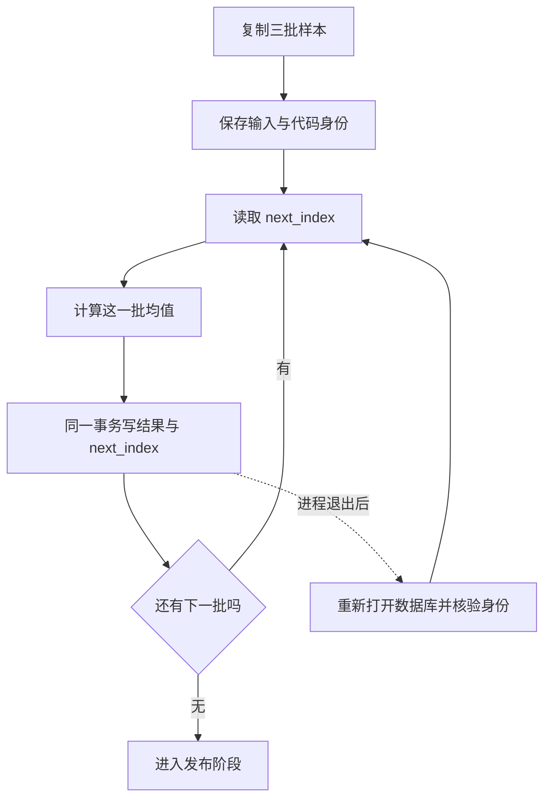

# 01｜检查点

[阅读路线](README.md) · [下一篇：幂等](02-ambiguous-effects-and-idempotency.md)

本章总览图如下：



第一批结果提交后，即使进程退出，恢复时也应从第二批继续。

## 1. 样本计算

[fixtures/batches.json](fixtures/batches.json) 是真实输入：

```json
[
  {"id": "A", "values": [2, 4]},
  {"id": "B", "values": [-2, 2]},
  {"id": "C", "values": [10]}
]
```

下面是**完整可运行片段**，在章节目录执行，不写产物：

```python
import json
from pathlib import Path

batches = json.loads(Path("fixtures/batches.json").read_text())
item = batches[0]
value = sum(item["values"]) / len(item["values"])
print(item["id"], value)
```

准确输出 `A 3.0`。计算本身不需要模型。现在要保存的是这个值和“下次从索引 1 开始”，不是数据库连接对象、线程、文件句柄或者 Python 调用栈。

## 2. 检查点结构

`runtime.sqlite` 使用四张表。表中的字段给出了恢复所需事实：

| 表 | 关键字段 | 在恢复中的用途 |
|---|---|---|
| `task` | `config`、`status`、`next_index`、`cancel_requested` | 固定任务身份并判断是否继续 |
| `results` | `item_index`、`item_id`、`mean` | 保存已提交计算结果 |
| `operation` | `op_key`、`payload`、`status`、`attempts`、`receipt` | 判断发布动作处于哪个阶段 |
| `events` | `seq`、`kind`、`detail` | 解释执行顺序，便于排障 |

这里的检查点是一组可重新加载的数据：配置、当前游标、已完成结果和操作状态。它不是所有历史日志的别名。`trace.jsonl` 是 `events` 表的导出；删除这个导出仍能恢复，因为执行器直接读取前三张表。

`config` 是 JSON 字符串，保存以下结构。它是**格式示例**，占位符由 `init()` 实际计算：

```json
{
  "schema_version": 1,
  "run_id": "batch-1",
  "scope": "tenant-a/reports/v1",
  "input_sha256": "<本次 input.json 的哈希>",
  "code_sha256": "<本次 runtime.py 的哈希>",
  "max_attempts": 3,
  "expires_at": null
}
```

输入被复制到运行目录后，后续只读副本。重启时 `validate()` 检查结构版本、输入哈希和代码哈希；修改它们后不能直接沿用旧进度。更成熟的执行器可以做经过验证的状态迁移，本例选择明确拒绝，以免新代码悄悄改变旧任务含义。

## 3. 原子提交

假如先把 `next_index` 改成 1，再写 A 的结果，中间退出会永久跳过 A。反过来只写结果、不保存游标，重启后可能再次执行 A。虽然本次算术计算可重复，后一种做法在写操作上会出问题。

[runtime.checkpoint_item](code/runtime.py) 是以下**完整函数定义**，依赖同文件的 `transaction()` 与 `event()`；定义本身无标准输出，调用后返回 `None`，数据库中多一条结果和事件：

```python
def checkpoint_item(db, index, item):
    value = sum(item["values"]) / len(item["values"])
    with transaction(db):
        db.execute("INSERT INTO results VALUES (?,?,?)",
                   (index, item["id"], value))
        db.execute("UPDATE task SET next_index=? WHERE id=1", (index + 1,))
        event(db, "item_completed", {"index": index, "mean": value})
```

`transaction()` 在进入时执行 `BEGIN IMMEDIATE`，正常退出 `COMMIT`，异常时 `ROLLBACK`。结果、游标、该次完成事件属于同一个数据库事务，外部只能看到全部已提交的新值或者原来的旧值。未提交事务关闭时回滚的行为也有针对性测试。

连接显式使用 `isolation_level=None`，所以所有关键事务边界都在代码中。`PRAGMA synchronous=FULL` 指示 SQLite 使用相应同步策略，但操作系统、文件系统和硬件仍影响断电保证。本章验证的是进程退出恢复。

## 4. 中断恢复实验

在章节目录分别执行以下命令，输出目录必须不存在：

```bash
python code/runtime.py init --root runs/resume-1
python code/runtime.py run --root runs/resume-1 --crash after_item
python code/runtime.py inspect --root runs/resume-1
```

第一条打印 `initialized`。第二条在 A 的事务提交后调用 `os._exit(71)`，没有标准输出，进程退出码为 71；这是指定的故障位置。第三条由新进程读取数据库，准确输出：

```text
{"acceptance":false,"attempts":0,"effect_count":0,"item_commits":1,"next_index":1,"operation_status":null,"status":"running"}
```

这时 `checkpoint.json` 中只有 A 的结果；`trace.jsonl` 中有 `created` 和一条 `item_completed`。`result.json` 是这次 `inspect` 生成的观察值，不是崩溃进程临终写出的成功报告。

继续执行：

```bash
python code/runtime.py run --root runs/resume-1
```

准确输出：

```text
{"acceptance":true,"attempts":1,"effect_count":1,"item_commits":3,"next_index":3,"operation_status":"confirmed","status":"completed"}
```

`item_commits=3` 说明累计只提交了三批，A 没有重复提交。不能只看 `next_index=3`，因为即使重复执行，最终游标也可能是 3。

## 5. 恢复条件

恢复循环先读 `task.next_index`，再执行 `range(next_index, len(batches))`。它不扫描日志寻找“看起来最近完成的步骤”。事件顺序采用数据库自增 `seq`，不依赖机器时钟恰好严格递增；但程序并未实现从事件完整重建任意旧状态的 event sourcing 系统。

| 现象 | 本程序的判断 | 下一步 |
|---|---|---|
| 结果与游标已提交 | 这一批已确认完成 | 从下一批继续 |
| 两者都未提交 | 这一批尚无完成事实 | 重新计算 |
| 输入或代码哈希变化 | 恢复条件已变化 | 拒绝运行，检查变更或新建任务 |
| 日志导出缺失 | 只是阅读文件缺失 | 由数据库重新导出 |

可以把 `runs/resume-1/input.json` 中 A 的一个数字改掉，再调用 `run`。程序应抛出 `input changed since checkpoint`，不会重用旧均值。若确实要处理新样本，应新建运行目录，并明确新的任务身份。
