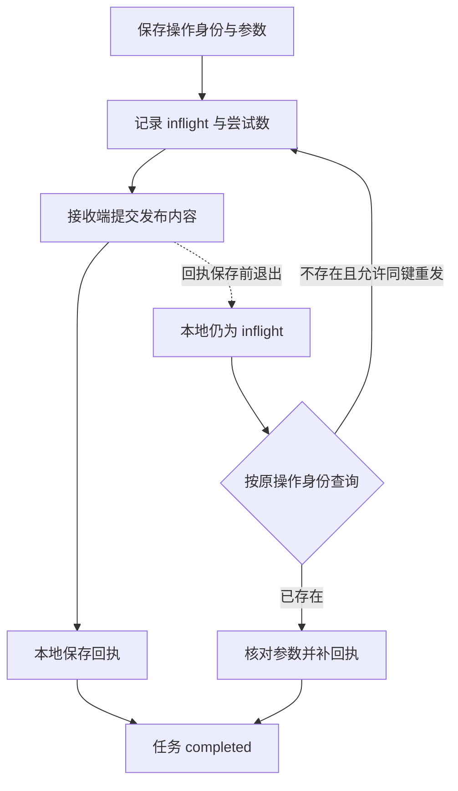

# 02｜幂等

[阅读路线](README.md) · [上一篇：检查点](01-checkpoints-and-resume.md) · [下一篇：超时与取消](03-retries-timeouts-cancellation.md)

本章总览图如下：



接收端提交发布内容、本地保存成功回执是两个提交点。两次提交之间退出，可能留下结果未知状态。

## 1. 接收端事务

三个计算结果作为一个整体发布，内容来自 `results` 表：

```json
[
  {"item_index": 0, "item_id": "A", "mean": 3.0},
  {"item_index": 1, "item_id": "B", "mean": 0.0},
  {"item_index": 2, "item_id": "C", "mean": 10.0}
]
```

这是**本例实际参数结构**，不是模型回答。`runtime.sqlite` 保存工作进度；`recipient.sqlite` 保存接收内容。两份数据库分别建立连接、分别提交，本地 `ROLLBACK` 不会撤销另一份数据库中已经提交的发布。

`Recipient` 是本例的本地接收服务。它提供 `publish(key, payload)` 和 `lookup(key)` 两个方法：前者可能新增一条发布，返回回执字典；后者只读，返回已保存记录或 `None`。函数定义与实际事务见 [code/runtime.py](code/runtime.py)。

## 2. 操作身份

同一个发布动作可以有多次尝试。第 1 次调用已发出但中断，第 2 次查询补回执，不能因此变成另一项业务意图。

实际操作键通过固定顺序的 JSON 数组构造：

```python
# run() 的源码节选。config 来自持久化任务；canonical() 在同文件定义。
key = canonical([config["scope"], config["run_id"], "publish", 1])
```

默认值对应下列**实际字符串内容**：

```text
["tenant-a/reports/v1","batch-1","publish",1]
```

| 组成部分 | 示例 | 为什么影响作用域 |
|---|---|---|
| 接收业务范围 | `tenant-a/reports/v1` | 区分租户、业务接口或目标收件箱 |
| 运行身份 | `batch-1` | 区分两次用户明确要求的发布任务 |
| 逻辑步骤 | `publish` | 同一任务内的不同动作不能共用身份 |
| 意图修订号 | `1` | 新内容被明确视作新发布时才改变 |

接收端数据库本身也是作用域边界。复制数据库以外的任务状态到一个全新接收服务，不会自动带来过去的去重记录。真实系统还应约定键保留多久、在哪个账户生效，以及旧键过期后的处理。本例接收表永久保留记录。

不能把每次重试的随机 ID 当幂等键：那会让接收方认为每次都是新发布。也不能只对参数求哈希：用户可能要求两次合法发布完全相同的内容。参数摘要用于检测“同一个身份是否被用于另一份内容”，不是替代业务身份。

## 3. 幂等键与参数

`Recipient.publish()` 在一个接收端事务里完成查询与插入。以下是**源码节选**，`previous` 由同一事务中的 `lookup(key)` 读取，`request_hash` 已按规范编码后的参数计算；节选本身无输出：

```python
if previous:
    if previous["request_hash"] != request_hash:
        raise ValueError("idempotency key reused with changed payload")
    return json.loads(previous["receipt"])
```

如果没有旧记录，就把 `op_key`、参数摘要、真实内容和回执放进同一条 `publications` 记录。`op_key` 是主键，写入又受到事务保护；因此“效果已经写入、去重标识还没写入”的另一个窗口不会被引入。

本例发布效果就是新增这一条记录。如果真实服务的效果是发送邮件，那么“写一条去重表”与“发送邮件”不自然属于同一个数据库事务，需要接收服务自身提供可靠契约。调用端独自记一张表不能代替它。

## 4. 发布故障窗口

先看三个故障点各自留下的事实：

| 故障参数 | 已提交的本地操作状态 | 接收记录数 | 恢复时处理 |
|---|---|---:|---|
| `after_prepare` | `prepared`，尝试 0 次 | 0 | 使用原身份发起第 1 次请求 |
| `after_effect` | `inflight`，尝试 1 次 | 1 | 查询并补存原回执 |
| `after_receipt` | `confirmed`，尝试 1 次 | 1 | 直接将任务收尾为完成 |

现在复现中间一行。在章节目录逐条执行：

```bash
python code/runtime.py init --root runs/ambiguous-1
python code/runtime.py run --root runs/ambiguous-1 --crash after_effect
python code/runtime.py inspect --root runs/ambiguous-1
```

`init` 打印 `initialized`；故障命令无输出并以退出码 72 退出；`inspect` 的准确输出是：

```text
{"acceptance":false,"attempts":1,"effect_count":1,"item_commits":3,"next_index":3,"operation_status":"inflight","status":"running"}
```

打开 `checkpoint.json`：操作 `receipt` 是空值。再打开 `publications.json`：内容和回执都已经存在。因此 `inflight` 的含义是“本地尚未保存确认”，不能推断“外部没有执行”。网络响应丢失或客户端等待超时也可能留下同类不确定性。

恢复：

```bash
python code/runtime.py run --root runs/ambiguous-1
```

准确输出：

```text
{"acceptance":true,"attempts":1,"effect_count":1,"item_commits":3,"next_index":3,"operation_status":"confirmed","status":"completed"}
```

尝试数仍是 1，因为恢复走了只读查询路径，没有再调用 `publish()`。`effect_count=1` 则独立证明确实只有一条发布，而不是两条记录恰好返回相同值。

## 5. 查询与重发

`run()` 看到 `inflight` 后先调用 `lookup(op_key)`。找到记录时先检查参数摘要一致，再调用 `save_receipt()`。查询为空且尝试预算尚未耗尽时，才用原键重发。

这个“空则可重发”结论有两个具体前提：本章旧子进程已经退出，接收端查询又能立即看到所有已提交记录；即使重发，接收端仍按同键去重。生产服务若存在迟到请求、最终一致查询或没有幂等承诺，查询为空不能自动证明没有执行。

| 实际接收服务能力 | 结果未知时可采取的操作 |
|---|---|
| 可靠按键查询，同时支持幂等写 | 先查；必要时同键同参重发 |
| 没有查询，但明确支持可靠幂等 | 在其保留期与作用域内同键同参重发 |
| 只有最终一致查询 | 等待或继续对账，空查询仍可能是未知 |
| 没有查询也没有幂等 | 保留待核对状态，由业务流程确认 |

这张表是接入真实服务时的决策规则；本程序只实现第一行，不将不支持的服务静默当作第一行处理。

## 6. 幂等作用域实验

汇总实验中的 `key_scope` 场景用同一个接收端连续调用：同键同参、同键异参、换新 `run_id`。实际得到：

```json
{
  "same_key_same_receipt": true,
  "changed_payload_rejected": true,
  "effects_after_new_run_id": 2
}
```

完整命令是 `python code/experiments.py --out runs/experiments-1`。打开汇总 `result.json` 的 `key_scope`，再查看 `key-scope.sqlite` 中的两条记录。新身份产生第二次效果说明作用域确实生效；如果恢复时误改 `run_id`，这会成为重复发布错误。
