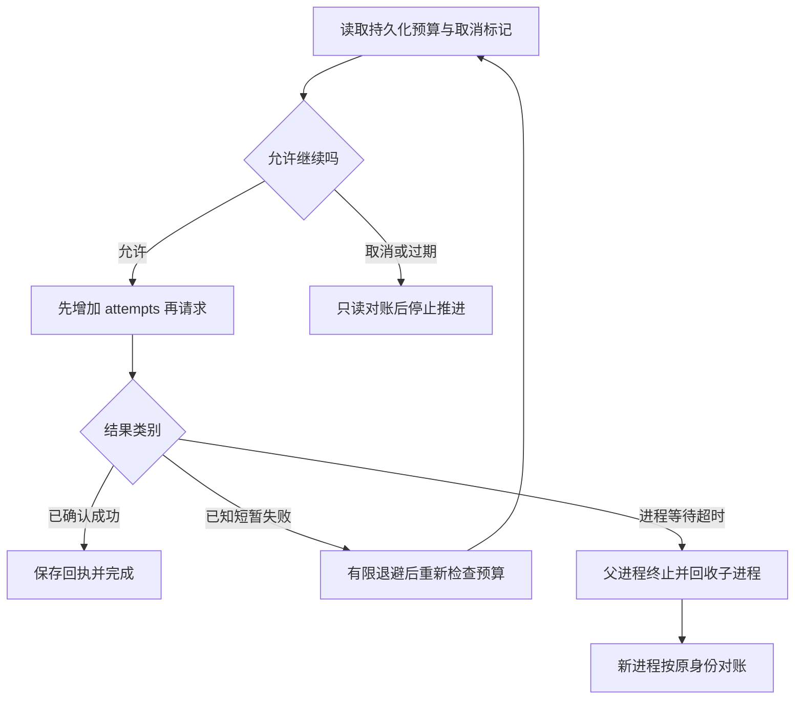

# 03｜超时与取消

[阅读路线](README.md) · [上一篇：幂等](02-ambiguous-effects-and-idempotency.md) · [下一篇：故障实验与源码](04-experiments-and-source.md)

本章总览图如下：



尝试次数、截止时间与取消标记保存在检查点中，重启后继续生效。等待超时和终止执行分别处理。

## 1. 失败分类

[run()](code/runtime.py) 的 `--fail-until` 是显式故障注入：前 N 次尝试在调用接收端之前返回短暂失败。这里知道副作用没有开始，适合在预算内重试。`after_effect` 则已经写入接收端，必须先对账。参数错误如空样本、同键异参应修正意图，原样重试不会变好。

| 情况 | 本地记录 | 下一步 |
|---|---|---|
| 注入的调用前短暂失败 | `retryable` | 检查预算、退避、重试 |
| 参数或输入身份不合法 | 抛 `ValueError` | 停止并检查输入，不增加相同错误请求 |
| 回执保存前退出 | `inflight` | 查询接收端，不假定未执行 |
| 有限次数已用完 | 任务 `failed` | 返回停止状态，普通重启不清零 |

本例不会把任意异常捕获后都当成可重试。数据库故障、结构不兼容等异常会显式向调用者返回，便于检查原因。

## 2. 重试预算

以下为 [run()](code/runtime.py) 的**源码节选**，`op` 是本轮从数据库读出的操作，`config` 是持久配置。返回前会生成可检查的结果文件：

```python
if op["attempts"] >= config["max_attempts"]:
    finish_status(db, "failed")
    return inspect(root)
with transaction(db):
    db.execute("UPDATE operation SET status='inflight',attempts=attempts+1 WHERE id=1")
    event(db, "attempt", {"number": op["attempts"] + 1})
```

先扣尝试预算再发请求，即使紧接着进程退出，这次尝试也会被记住。代价是“已记尝试但还没真正调用”的窗口会保守消耗一次预算；它防止每次在同一位置退出都获得无限免费重试。

`max_attempts=3` 表示初次调用加最多两次重试，合计三次。章节目录执行：

```bash
python code/runtime.py init --root runs/retry-1 --max-attempts 3
python code/runtime.py run --root runs/retry-1 --fail-until 2
```

准确第二行输出：

```text
{"acceptance":true,"attempts":3,"effect_count":1,"item_commits":3,"next_index":3,"operation_status":"confirmed","status":"completed"}
```

每次已知短暂失败后的退避为 `min(0.01 * 2**(attempt-1), 0.1)` 秒。前两次分别等约 0.01、0.02 秒；实际调度耗时不是确定值。这组短时间用于快速实验，真实服务应依据接口限制设置退避，通常还需抖动避免多个执行器同时重试。

改用新目录和 `--fail-until 5`，三次都失败后输出 `status=failed, attempts=3, effect_count=0`。再次 `run` 即使不带故障参数，也保持失败和尝试数 3。修改命令行并不能给旧操作偷偷增加预算；需要明确的管理决策或新业务意图。

## 3. 截止时间

初始化 `--ttl 30` 会把 `expires_at` 写为当前 Unix 时间加 30 秒。重启读取原值，不重新给 30 秒。操作边界用 `time.time()` 检查它。下面**完整命令序列**故意创建已经过期的任务：

```bash
python code/runtime.py init --root runs/expired-1 --ttl -1
python code/runtime.py run --root runs/expired-1
```

准确第二行输出：

```text
{"acceptance":false,"attempts":0,"effect_count":0,"item_commits":0,"next_index":0,"operation_status":null,"status":"timed_out"}
```

持久截止时间使用墙上时间，是为了跨进程重启仍可解释；在一次父进程等待内部则用 `time.monotonic()` 衡量经过时间，避免墙上时钟调整影响等待。多机部署需要额外考虑时钟差，本例不实现它。

边界检查不是强制中断：如果一个操作正在阻塞，下一次检查可能迟迟不到。阻塞操作需要独立的终止机制。

## 4. 超时与终止

`Future.result(timeout=...)` 超时，只表示等待者不再等结果。运行中的线程可以继续执行，`Future.cancel()` 也不能强制杀死它。不要把线程包装加一个 timeout 就宣称副作用被取消。对应分支见[故障实验与源码](04-experiments-and-source.md)。

本章的硬超时使用单独子进程。实验先等到子进程已经保存 `inflight` 并写出 `ready` 标记，再让它在真正发布之前阻塞。以下是 [hard_timeout()](code/experiments.py) 的**源码节选**，依赖先前创建的 `Popen` 对象 `process`：

```python
try:
    process.communicate(timeout=0.05)
    raise AssertionError("worker unexpectedly returned")
except subprocess.TimeoutExpired:
    process.kill()
    process.communicate(timeout=5)
```

`kill()` 要求操作系统终止这个直接子进程；后一次 `communicate()` 等待退出并收集管道，确认旧执行器已经结束，才启动恢复。这里没有孙进程树，真实工具若再派生进程，需按平台管理进程组或容器。源码使用显式监督，避免把普通线程等待误当作隔离和终止。

运行汇总实验后，`timeout` 场景中断时是 `inflight, attempts=1, effect_count=0`；恢复时先查接收端为空，再同键发起第 2 次尝试，最终只有一条发布。`termination.returncode` 在 POSIX 上通常为 `-9`，Windows 数值可能不同；确定性的判断是子进程已经退出且回收成功。

## 5. 取消与对账

取消命令只在数据库中设置 `cancel_requested=1`。执行器在计算下一批和发起下一次尝试前读它，因此这是合作式取消；标志设置与一个刚要发出的请求之间仍存在竞争窗口。

取消发生时，`boundary()` 只允许读接收端。如果操作是 `inflight` 且查到记录，则补存回执，然后把任务标为 `cancelled`；如果未找到记录，也直接停止，不通过 `publish()`“顺便完成一下再取消”。

完整复现命令，工作目录为章节目录：

```bash
python code/runtime.py init --root runs/cancel-1
python code/runtime.py run --root runs/cancel-1 --crash after_effect
python code/runtime.py cancel --root runs/cancel-1
python code/runtime.py run --root runs/cancel-1
```

第二条以退出码 72 结束；第三条打印 `cancel_requested`；第四条准确输出：

```text
{"acceptance":false,"attempts":1,"effect_count":1,"item_commits":3,"next_index":3,"operation_status":"confirmed","status":"cancelled"}
```

`confirmed` 说明已对账确认原效果；`cancelled` 说明不继续推进任务；`acceptance=false` 表示取消状态不算正常完成。三者同时成立，并不矛盾。

| 取消时机 | 已计算样本数 | 已发布数 | 处理后状态 |
|---|---:|---:|---|
| 开始计算前 | 0 | 0 | cancelled |
| A 提交后退出，再取消 | 1 | 0 | cancelled |
| 发布已写入、回执未保存 | 3 | 1 | cancelled，操作 confirmed |

想撤销已发布记录属于新业务动作，例如撤回或另发更正，并非删除本地状态就能完成。本章没有自动补偿功能；保留原效果与取消事实，使后续业务处理有据可查。
