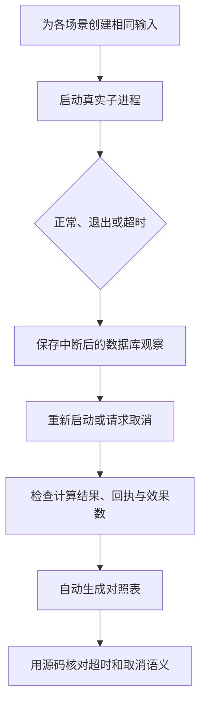

# 04｜故障实验与源码

[阅读路线](README.md) · [上一篇：超时与取消](03-retries-timeouts-cancellation.md) · [下一组件：评估与验收](../10-evaluation-and-acceptance/README.md)

本章总览图如下：



[experiments.py](code/experiments.py) 为每个场景初始化三个样本和一个接收端，只改变故障点、预算或取消时机。中断后与恢复后的观察值分别保存。

## 1. 故障矩阵

工作目录为本章目录，输出目录必须尚不存在：

```bash
python code/experiments.py --out runs/experiments-1
```

准确标准输出：

```text
scenarios=12 key_scope_checks=3
artifacts=runs/experiments-1
```

`run_all(out)` 返回包含环境版本、12 个场景和幂等键检查的字典；命令行仅打印数量和路径，详情已写入 `result.json` 与 `report.md`。所有故障进程的退出码由父进程核对，退出位置不符合预期就抛异常，不会继续生成成功结果。

已执行样例可直接打开：[报告](examples/verified-run/report.md)、[完整 JSON](examples/verified-run/result.json)。

## 2. 停止结果

真实运行得到下面的确定性结果。超时的子进程返回码按平台变化，已单独保存在 JSON 中，不作为通用固定值。

| 场景 | 中断后操作 | 恢复后任务 | 总尝试数 | 发布数 | 样本提交数 | 验收 |
|---|---|---|---:|---:|---:|---|
| normal | confirmed | completed | 1 | 1 | 3 | true |
| after_item | 无 | completed | 1 | 1 | 3 | true |
| after_prepare | prepared | completed | 1 | 1 | 3 | true |
| after_effect | inflight | completed | 1 | 1 | 3 | true |
| after_receipt | confirmed | completed | 1 | 1 | 3 | true |
| retry_success | confirmed | completed | 3 | 1 | 3 | true |
| retry_exhausted | retryable | failed | 3 | 0 | 3 | false |
| timeout | inflight | completed | 2 | 1 | 3 | true |
| expired | 无 | timed_out | 0 | 0 | 0 | false |
| cancel_before | 无 | cancelled | 0 | 0 | 0 | false |
| cancel_after_item | 无 | cancelled | 0 | 0 | 1 | false |
| cancel_after_effect | inflight | cancelled | 1 | 1 | 3 | false |

`retry_exhausted` 的样本已经计算完成，任务仍失败，因为整份结果尚未发布。`cancel_after_effect` 确实留下了发布，但任务按取消要求停止。不能用“进程退出码是 0”或“已经有结果文件”替代任务验收。

其中 `after_effect` 与 `timeout` 最值得并排查看：中断时本地都为 `inflight`，前者接收端有一条记录，后者没有。因此单凭这个本地状态无法选择恢复动作；先查询真实接收事实才会得到不同路径。

## 3. 发布验收

`inspect(root)` 从数据库重新读取三个结果和接收内容，按输入重新计算预期值。它只有在任务 `completed`、三个结果一致、接收端恰好一条发布、发布内容一致且本地回执与接收回执一致时，才把 `acceptance` 写为 `true`。

下面是**完整可运行片段**，输入为前面汇总实验中的 `after_effect` 数据库，不写文件；章节目录执行：

```python
import json
import sqlite3
from pathlib import Path

root = Path("runs/experiments-1/after_effect")
with sqlite3.connect(root / "recipient.sqlite") as db:
    rows = db.execute("SELECT payload FROM publications").fetchall()
print(len(rows))
print([row["mean"] for row in json.loads(rows[0][0])])
```

准确输出：

```text
1
[3.0, 0.0, 10.0]
```

再打开汇总 `result.json` 中 `after_effect.before`，那里仍保留中断时的 `operation_status=inflight` 和 `acceptance=false`。每个子目录里的 `result.json` 是最后一次观察，因此需要汇总里的 `before` 才能看到先前窗口。

## 4. 回归测试

在章节目录执行：

```bash
python -m unittest discover -s code -p 'test_*.py' -v
```

当前交付实际运行了 9 项测试，全部通过：

| 机制 | 对应测试及观测 |
|---|---|
| 检查点跨进程恢复 | `test_process_exit_resumes_after_committed_item`：A 提交后退出，最终只提交三项 |
| 回执窗口 | `test_effect_exists_before_receipt_then_is_adopted`：先看到 inflight/1 条，再确认尝试数仍为 1 |
| 预算跨重启 | `test_attempt_limit_survives_restart`：第二次启动仍为 failed/3 次/0 条 |
| 硬超时 | `test_hard_timeout_reaps_worker_and_recovery_is_safe`：旧子进程回收后才恢复 |
| 取消后对账 | `test_cancel_reconciles_without_creating_new_effect`：cancelled/confirmed/1 条 |
| 开始前取消 | `test_cancel_before_work_has_no_effect`：零计算、零发布 |
| 身份漂移 | `test_input_drift_is_rejected_before_more_work`：恢复前拒绝被修改的输入 |
| 键作用域 | `test_key_parameter_conflict_and_new_identity`：异参拒绝，新身份新增效果 |
| 事务原子性 | `test_uncommitted_cursor_and_result_roll_back_together`：未提交连接关闭后游标和结果都未保留 |

最后一项检查本地未提交事务，并非模拟存储硬件断电；真实进程中断由前四项和实验中的退出点覆盖。

可以把 `--max-attempts` 从 3 改成 2，再用新目录运行 `--fail-until 2`。预计三批仍已计算，但没有发布、状态为 failed、尝试数为 2。改变一个参数就能验证次数究竟包含初次调用，还是仅包含重试次数。

## 5. Future 源码

源码固定为 CPython `v3.12.10`，从固定 tag 下载并保留许可证。具体来源、哈希与本地文件在 [sources/manifest.json](sources/manifest.json)。

打开本地 [futures_base.py](sources/futures_base.py)，对应上游 [Lib/concurrent/futures/_base.py](https://github.com/python/cpython/blob/v3.12.10/Lib/concurrent/futures/_base.py)，找到 `Future.result()`。其核心流程是取得条件锁、等待指定时长、再次检查 Future 状态，仍未完成则抛 `TimeoutError`。这里没有终止工作线程的动作。

再找到 `Future.cancel()`：已经处于 `RUNNING` 或 `FINISHED` 时返回 `False`。如果还未开始，才转换为取消状态并通知等待者。它解释了为什么“主线程看到 timeout 后再 cancel”并不保证已经开始的工具停止。

| 本文需要的语义 | 源码中的实际机制 | 实践结论 |
|---|---|---|
| 等待至某时限 | `Future.result` 的条件等待 | 超时是等待结果，不是终止执行 |
| 取消尚未开始的任务 | `Future.cancel` 的状态判断 | 运行中的线程不能被它强制杀死 |
| 强制结束直接子进程 | `Popen.kill` | 要求操作系统结束对应进程 |
| 清理退出资源 | `communicate` / `wait` | 启动新执行器前确认旧进程已回收 |

## 6. subprocess 源码

本地 [subprocess.py](sources/subprocess.py) 对应 [Lib/subprocess.py](https://github.com/python/cpython/blob/v3.12.10/Lib/subprocess.py)。找到 `run()` 中捕获 `TimeoutExpired` 的分支；下面是来自该分支的**原始源码节选**，不能独立执行：

```python
except TimeoutExpired as exc:
    process.kill()
```

其后的平台分支在 Windows 再调用 `communicate()` 收集输出，在 POSIX 调用 `wait()`，然后重新抛出超时异常。本文 `hard_timeout()` 使用 `Popen`，为了在受控 `ready` 点开始计时，所以显式写出 kill 后 communicate 的清理过程。[Python subprocess 文档](https://docs.python.org/3.11/library/subprocess.html)也区分了 `run(timeout=...)` 与单独调用 `Popen.communicate(timeout=...)` 的清理责任。

固定源码版本和本次运行时版本是两件事：源码用于核实这条机制，当前样例在 `result.json` 记录实际 Python 与 SQLite 版本。不要为了匹配走读 tag 擅自声称实验使用了另一个解释器。

本地来源检查命令：

```bash
python sources/verify_sources.py
```

准确输出 `verified=2 tag=v3.12.10`。校验器不联网，也不会把“本地哈希通过”说成每次重新查过远端源码。

## 7. Agent 恢复

模型调用、文件生成和工具发布都可以接在这些状态边界前后。恢复时先固定输入和代码身份，再读取已确认结果；有副作用的工具要保留逻辑操作身份和原参数，不能重启一次就生成新幂等键。

如果模型在恢复后给出另一个计划，应当创建新的方案版本，检查哪些旧结果失效。若旧工具请求处于结果未知状态，先处理该动作的对账，不要让新计划把旧动作身份覆盖掉。第 07 组件的版本关系与本章的执行事实在这里相接：前者判断“证据属于哪一版”，后者判断“这一版的动作究竟发生了没有”。
