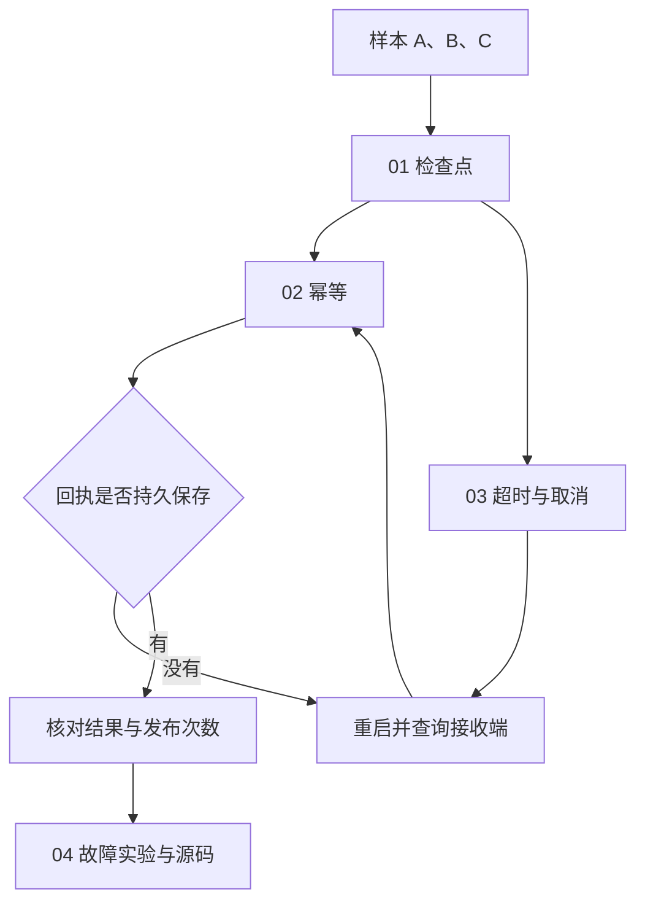

# 09｜持久化与故障恢复

本章继续计算 Agent Loop 中的三组均值，保存检查点并恢复报告提交。

[组件总览](../README.md) · [上一组件：工具与执行环境](../08-tools-and-environment/README.md) · [下一组件：评估与验收](../10-evaluation-and-acceptance/README.md)

本章总览图如下：



示例任务计算 A、B、C 三批样本的均值（3、0、10），再向独立接收端发布整份结果。

## 阅读路线

| 阅读文件 | 新增问题与机制 | 入口 |
|---|---|---|
| [01｜检查点](01-checkpoints-and-resume.md) | 检查点、输入与代码身份、真实中断恢复 | `runtime.py init/run/inspect` |
| [02｜幂等](02-ambiguous-effects-and-idempotency.md) | 模糊状态、操作身份、幂等、查询对账 | `--crash after_effect` |
| [03｜超时与取消](03-retries-timeouts-cancellation.md) | 持久次数、截止时间、终止子进程、合作式取消 | `--fail-until`、`cancel`、实验监督器 |
| [04｜故障实验与源码](04-experiments-and-source.md) | 12 个真实场景、产物验收、Future 与 subprocess 对照 | `experiments.py` |

只需要 Python 3.10 以上版本的标准库；不请求模型、不发送消息、不连接外部业务系统。接收端是单独提交的 `recipient.sqlite`，专门让本地检查点与接收结果可能暂时不一致。任务是单个执行器处理同一运行；多写者状态冲突见[第 07 组件](../07-state-and-artifacts/README.md)。

## 运行命令

下面命令均从章节目录运行，输入文件为 [fixtures/batches.json](fixtures/batches.json)：

```bash
cd "10-Knowledge/02 Agent Harness/09-persistence-and-recovery"
python code/runtime.py init --root runs/normal-1
python code/runtime.py run --root runs/normal-1
python code/runtime.py inspect --root runs/normal-1
python code/experiments.py --out runs/experiments-1
python -m unittest discover -s code -p 'test_*.py' -v
python sources/verify_sources.py
```

`init` 和实验的输出目录必须尚不存在，重复实验时换一个目录编号。`run` 可重复调用已有运行；完成状态返回已保存的结果，不新增发布。正常 `run` 与 `inspect` 的准确标准输出为：

```text
{"acceptance":true,"attempts":1,"effect_count":1,"item_commits":3,"next_index":3,"operation_status":"confirmed","status":"completed"}
```

主程序 [runtime.py](code/runtime.py) 包含检查点、接收端、恢复与验收函数；[experiments.py](code/experiments.py) 使用 `subprocess` 启动真实进程，在明确位置调用 `os._exit` 或由父进程终止子进程，保存每个场景中断前后观察值。

## 存储与导出

| 文件 | 作用 | 恢复时是否依赖它 |
|---|---|---|
| `input.json` | 本次使用的不可变输入副本 | 是，先核对哈希 |
| `runtime.sqlite` | 配置、下一项索引、结果、操作与回执、事件 | 是，恢复依据 |
| `recipient.sqlite` | 接收端已发布内容与幂等记录 | 是，用于只读对账或同键请求 |
| `checkpoint.json` | 当前检查点的人类可读导出 | 否，不替代数据库事务 |
| `trace.jsonl` | 按数据库序号导出的事件 | 否，不依赖日志猜下一步 |
| `publications.json` | 实际接收记录的导出 | 否，便于核查发布内容与次数 |
| `result.json`、`report.md` | 从实际数据库生成的验收结果 | 否，随 `inspect` 重新生成 |

已执行记录见 [examples/verified-run/report.md](examples/verified-run/report.md) 与 [result.json](examples/verified-run/result.json)。每个子目录保留数据库、输入、当前导出文件，汇总 JSON 还保留中断后的观察值。

## 验证范围

全部 12 个实验场景与 9 项针对性测试已经离线执行，包括三个发布故障窗口、计算后恢复、输入漂移拒绝、重试耗尽、超时后回收、取消前后对账。样例记录包含实际 Python、SQLite 版本。

这些实验保证的范围是：本地单执行器、可信输入、独立 SQLite 接收端及其永久幂等记录。没有租约、防旧执行器写入的 fencing、跨机器时钟校准或幂等键过期机制。真实接收服务若既不支持按操作身份查询，也不保证幂等，恢复程序应保留待核对状态，不能把本例的安全重发结论套过去。进程终止实验覆盖进程退出，并不模拟磁盘损坏或断电硬件故障。

从 [01｜检查点](01-checkpoints-and-resume.md) 开始。

## 仿真任务入口

[notes.txt](notes.txt) 是交给 Agent 的任务提示词，包含执行命令、输入参数、检查项和产物路径。本章以均值函数修复为检查点任务，展示中断后如何恢复，以及如何避免重复提交产物。

在本章目录执行，使用 Python 3.10+ 标准库：

```bash
python simulate.py --config simulation.json --output runs/simulation
```

标准输出：

```text
samples=64 window=3
input_mse=0.090000 output_mse=0.010082
improvement_db=9.507 passed=True
artifacts=runs/simulation
```

| 文件 | 内容 |
|---|---|
| [simulation.json](simulation.json) | 采样点数、周期数、噪声幅度与滤波窗口 |
| `runs/simulation/metrics.json` | 输入与输出 MSE、改善量和配置摘要 |
| `runs/simulation/samples.csv` | 每个采样点的原始、加噪与滤波数值 |
| `runs/simulation/report.md` | 引用实际指标的仿真报告 |

再次运行时换一个 `--output` 目录。算法、参数对照和参考产物见[统一仿真说明](../_shared/README.md)。
