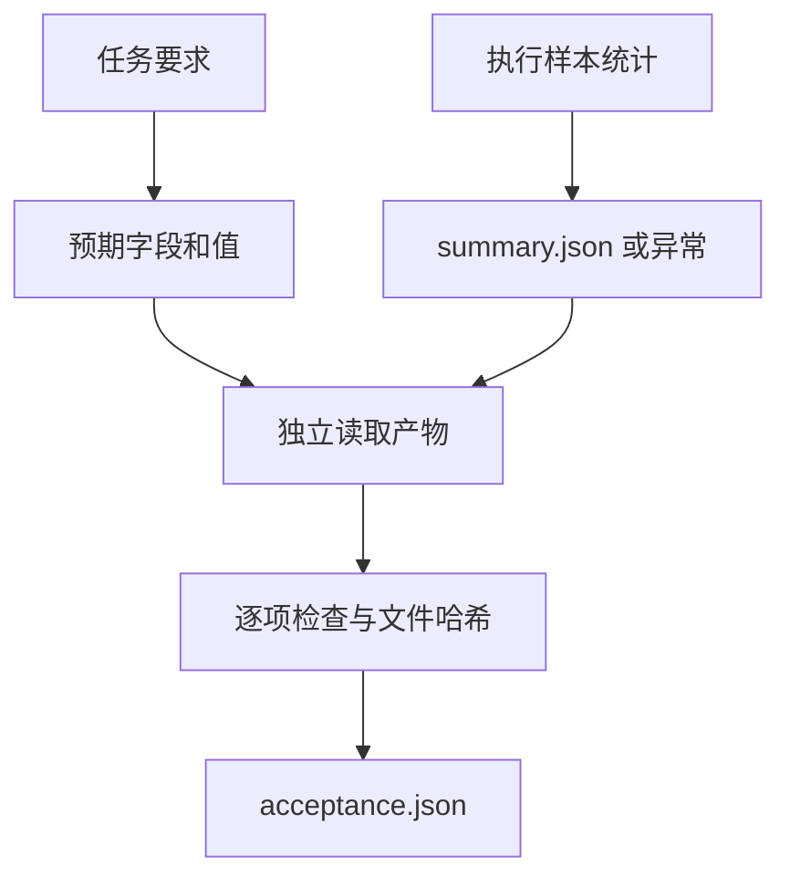

# 01｜产物验收

[阅读路线](README.md) · [下一篇：02｜离线任务集与配对评测](02-offline-paired-evaluation.md)

本章总览图如下：



## 0. 样本输入

输入 [fixtures/whitespace.csv](fixtures/whitespace.csv) 只有一条样本，状态是带空格的 ` valid `，数值为 `4`。任务约定是：状态去掉首尾空白并忽略大小写后等于 `valid`，才参与汇总；数值必须是有限整数；无效数值不计入总和，但要保留样本编号。负数也是合法样本，参与汇总。

下面是完整 Python 片段。在章节目录执行，输入就是这份 CSV，只打印原始字段，不写文件：

```python
import csv
from pathlib import Path

with Path("fixtures/whitespace.csv").open(encoding="utf-8", newline="") as handle:
    row = next(csv.DictReader(handle))
print(repr(row["status"]))
print(row["value"])
```

标准输出：

```text
' valid '
4
```

这时已能看到一个故障来源：`row["status"] == "valid"` 为假。没有抛异常，并不代表这条样本被正确计入。

## 1. 产物契约

输出文件的格式示例如下。它是 `whitespace` 任务的正确内容，不是待执行的代码：

```json
{"total": 4, "valid_rows": 1, "rejected_rows": []}
```

| 字段 | 类型与验收条件 | 为什么检查 |
|---|---|---|
| `total` | `int`，本题必须等于 4 | 逐项相加得到样本总和 |
| `valid_rows` | `int`，本题必须等于 1 | 总和碰巧正确时，仍可能漏计与重复计数相抵 |
| `rejected_rows` | `list[str]`，本题必须为空 | 坏数据不能被静默吞掉 |
| 全部键 | 恰好是上述三个键 | 写错键名或多写无关字段也应暴露 |

预期值保存在 [cases.json](fixtures/cases.json)。例如无效数值题的正确结果为总和 2、有效样本行 1、拒绝列表 `['o2']`。当前两个版本在该题上均因无效数值抛异常，未通过验收。

这里的严格字段比较适合机器可读样本报表。长文本任务应换成能检查引用、必要事实和约束的检查器；不能把字符串完全相等套到所有任务上。若用模型评分，还要保存评分提示词、模型版本、原始判定和人工抽查结果，否则评分器变化也会被误认为系统进步。

## 2. 文件检查器

下面是函数定义节选，完整实现是 [evaluation.py](code/evaluation.py) 的 `accept`。传入产物路径和预期字典，返回包含布尔验收项的字典；定义函数本身不打印内容。

```python
def accept(artifact, expected):
    path = Path(artifact)
    # 完整函数先检查文件存在、JSON 可解析、根值为对象。
    actual = read_json(path)
    checks = {"exact_fields": set(actual) == set(expected)}
    for key, wanted in expected.items():
        checks[key] = type(actual.get(key)) is type(wanted) and actual.get(key) == wanted
    return {"accepted": all(checks.values()), "checks": checks}
```

`type` 检查是必要的：Python 中 `True == 1` 为真，但 JSON 布尔值不是本契约要求的整数。完整函数还保存被检查文件的 SHA-256，便于确认后续看到的文件是否已被修改。

在章节目录运行以下完整终端命令。它执行基线处理器，真实生成 `runs/one-baseline/summary.json`，然后由检查器重新打开该文件：

```bash
python code/run_one.py --case whitespace --variant baseline --out runs/one-baseline
```

标准输出：

```text
exit_reason=completed accepted=False
artifacts=runs/one-baseline
```

打开文件可以看到总和 0、样本行 0。执行器的 `completed` 只说明处理函数返回了；验收器的 `False` 说明它返回了错误的业务结果。这两个字段要同时保留，才能区分“算错”和“没能运行”。

## 3. 异常记录

`run_one` 中的以下节选展示异常边界。`case`、`variant`、`target` 由完整函数参数提供；`aggregate` 读取 CSV，`accept` 再读输出路径。节选不是独立脚本。

```python
try:
    value = aggregate(target / "input.csv", normalize=variant == "candidate")
    write_json(target / "summary.json", value)
    exit_reason = "completed"
except (ValueError, KeyError) as exc:
    exit_reason = "exception"
    error = {"type": type(exc).__name__, "message": str(exc)}
check = accept(target / "summary.json", case["expected"])
```

函数失败后仍调用验收器，因为“没有产物”也是一个明确的验收结果。每次运行使用不存在的新目录，避免误读上次成功留下的旧文件。

同一章节目录运行下面完整命令，实际输入为 `fixtures/invalid.csv`，标准输出首行是 `exit_reason=exception accepted=False`：

```bash
python code/run_one.py --case invalid --variant candidate --out runs/one-invalid
```

`result.json` 中能看到 `ValueError` 与 `invalid_value: sample=o2`；`acceptance.json` 中能看到 `file_exists=false`；目录中没有 `summary.json`。

## 4. 产物复验

完整命令如下，在章节目录执行，输入为第一轮已有产物：

```bash
python code/check_artifact.py --case whitespace --artifact runs/one-baseline/summary.json
```

它打印检查字典，不修改文件。`accepted=false`，其中 `total` 与 `valid_rows` 为假。现在只把该文件的两个数字改为 4 和 1，再执行相同命令，`accepted` 会变为 `true`，文件哈希也会改变。原来的 `result.json` 不会随手动修改自动更新，它记录的是当时那一次检查。

文件哈希标识验收时的内容；交付前重验当前文件，可以发现验收后发生的修改。
