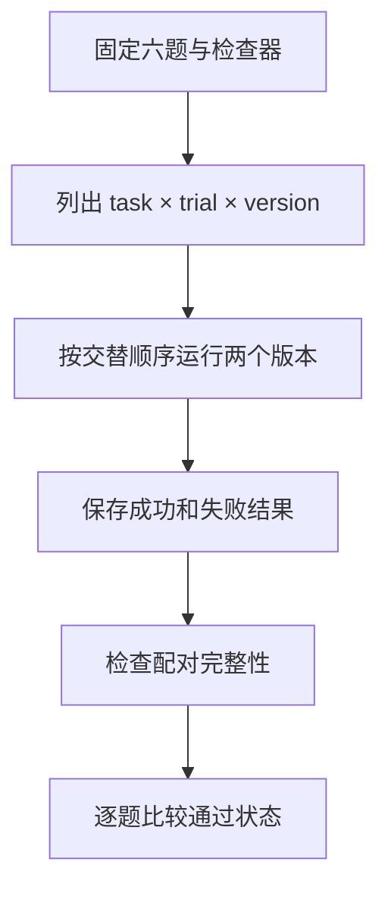

# 02｜离线任务集与配对评测

[上一篇：01｜产物验收](01-artifact-acceptance.md) · [阅读路线](README.md) · [下一篇：03｜回归、成本与发布门禁](03-regression-cost-and-experiments.md)

本章总览图如下：



## 0. 任务集

只测带空格状态，加入 `strip()` 就像修好了全部问题。但是大写状态、负数和无效数值会走不同分支。离线任务集的作用是保留这些具体差异，让以后每一次修改都接受相同问题的检查。

任务集包含以下六个输入文件：

| 任务 ID | 输入里的变化 | 预期总和 / 有效行 / 拒绝 ID |
|---|---|---|
| `plain` | 有效样本与待检查样本混合 | 6 / 2 / 空 |
| `whitespace` | 状态有首尾空格 | 4 / 1 / 空 |
| `uppercase` | 状态为 `VALID` | 6 / 1 / 空 |
| `negative` | 一个样本为 `-2` | 8 / 2 / 空 |
| `empty` | 只有表头 | 0 / 0 / 空 |
| `invalid` | 第二个样本为 `oops` | 2 / 1 / `o2` |

`cases.json` 将输入文件名与人工核算的预期放在一起。人工预期没有调用被评测的 `aggregate` 生成，避免执行器和检查器共享同一个错误。当前列表很小，适合逐行走读；新线上失败可以补成独立输入，并在审核预期后成为回归任务。

## 1. 对照版本

候选版本只改变状态匹配规则。下面是 [aggregate](code/evaluation.py) 中的实际节选，`row` 来自 CSV，`normalize` 来自当前版本。它只赋值，不打印或落盘：

```python
status = row["status"].strip().casefold() if normalize else row["status"]
if status != "valid":
    continue
```

基线传 `False`，候选传 `True`。解析数值、输出文件和验收器完全相同，所以对空格与大小写任务的差异可以追到这一步。候选仍会在 `oops` 上抛异常，评测应如实保留这个失败。

可以先在章节目录运行单题候选。输入是已有的 `whitespace.csv`，产物为独立目录：

```bash
python code/run_one.py --case whitespace --variant candidate --out runs/one-candidate
```

标准输出首行是 `exit_reason=completed accepted=True`。打开新旧两份 `summary.json`，就能在进入全套统计前核对机制是否发生了预想变化。

## 2. 评测分母

本次实验有六道任务，每个版本重复三次，因此每个版本的分母是 `6 × 3 = 18` 次尝试，总共执行 36 次。失败、异常和缺文件都在这 18 次中，不能在汇总前过滤。

以下节选来自 [summarize](code/evaluation.py)。`task_ids` 是固定六题，`trials=3`，`rows` 是从保存的结果文件读取的列表。该函数在缺行或重复行时抛 `ValueError`，没有标准输出：

```python
expected_keys = {
    (task, trial, variant)
    for task in task_ids
    for trial in range(trials)
    for variant in ("baseline", "candidate")
}
actual_keys = [(r["task_id"], r["trial"], r["variant"]) for r in rows]
if len(actual_keys) != len(set(actual_keys)) or set(actual_keys) != expected_keys:
    raise ValueError("missing, extra or duplicate task/trial/variant rows")
```

分母不是 `len(成功文件)`。如果某个运行器连 `result.json` 都没保存，当前报告会拒绝生成，而不是偷偷缩小分母。生产系统可以进一步由调度器为丢失任务写入 `infrastructure_failure`，但应显式区分基础设施故障和业务不通过。

## 3. 配对条件

配对键是 `(task_id, trial)`。每个键下必须同时存在基线与候选，而且 `input_sha256`、`checker_version` 必须一致。报告逐对计算：

$$
\Delta_i = I(\text{候选通过}_i) - I(\text{基线通过}_i)
$$

其中 `I` 在通过时为 1，否则为 0。因此 `+1` 是修复，`0` 是持平，`-1` 是回归。例如 `whitespace` 的三次配对都是 `+1`，`invalid` 的三次都是 `0`，因为两个版本都失败。

| 保留字段 | 回答的问题 |
|---|---|
| `task_id`、`trial` | 两个结果是否属于同一次配对 |
| `variant` | 执行的是哪个版本 |
| `input_sha256` | 输入内容是否真的一样 |
| `checker_version` | “通过”的含义有没有改变 |
| `exit_reason`、`error` | 是算错还是执行异常 |
| `accepted` | 实际文件是否达标 |
| `elapsed_ms`、`tool_calls` | 为这次结果做了多少本地工作 |

主循环在奇数次试验先执行候选、偶数次先执行基线，降低“某个版本永远先启动”的顺序影响。对于模型系统，还应固定任务、模型配置、最大调用数和工具边界，记录随机种子（如果服务支持）；相同种子也不保证远程服务完全确定。

## 4. 重复试验

章节目录运行以下完整命令，输入为六份 CSV 与固定任务表。输出目录中保存输入副本、检查器输出和报告：

```bash
python code/evaluation.py --trials 3 --out runs/comparison
```

标准输出见 README。实际参考运行的成功数为基线 9/18、候选 15/18，配对 6 胜、12 平、0 回归。

这不意味着有 18 道独立任务。现在的函数是确定性的，三次重复只是重跑相同计算，主要观察执行记录与耗时；题目层面仍是六道。模型评测重复试验可以观察同题波动，应先报告每题通过比例，再汇总到任务层面。需要区间估计时，以题目为分组重采样，不能把同一题的重复样本当作完全独立的新题。

练习：在章节目录运行 `python code/evaluation.py --trials 1 --out runs/one-trial`。成功数应变成 3/6 与 5/6，成功率保持 50% 与 83.3%，配对胜数变成 2。如果成功率也因为少跑两轮而改变，应检查是否混入了随机行为、旧产物或漏掉的失败行。
