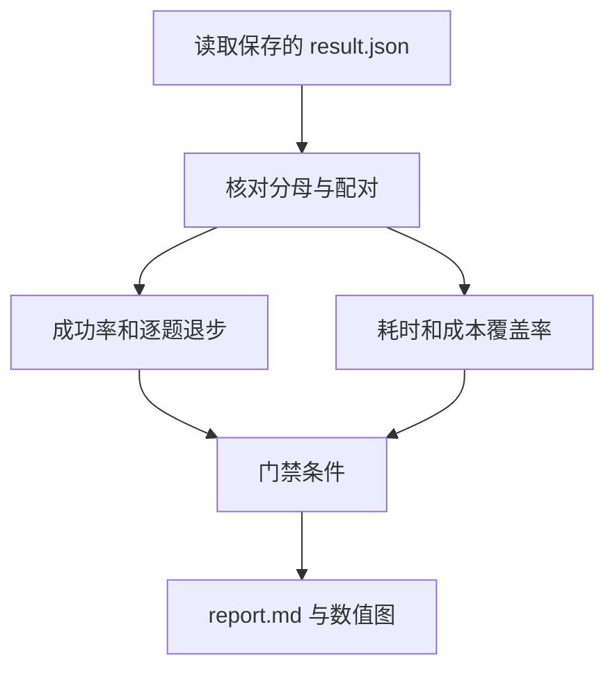

# 03｜回归、成本与发布门禁

[上一篇：02｜离线任务集与配对评测](02-offline-paired-evaluation.md) · [阅读路线](README.md)

本章总览图如下：



## 0. 结果汇总

`build_report` 重新读取输出目录的全部 `result.json`，再调用 `summarize`。单次结果中的 `accepted` 来自运行当时的文件验收，并且对应文件哈希已存入 `acceptance.json`。

下面是完整 Python 片段。在章节目录执行，读取已交付的真实参考产物，只打印分子与分母：

```python
import json
from pathlib import Path

data = json.loads(Path("artifacts/reference/comparison.json").read_text())
for name, value in data["variants"].items():
    print(name, value["successes"], value["denominator"])
```

标准输出：

```text
baseline 9 18
candidate 15 18
```


图中数据来自同一汇总文件对应的运行结果。33.3 个百分点的提升由两道状态题贡献；无效数值题没有被修好。仅看均值会遗漏这个持续存在的缺口。

## 1. 回归与发布门禁

更高成功率不一定意味着没有退步。例如修复三题同时破坏一题，总分仍上升，但被破坏的题可能正是已有关键功能。因此报告保留每个配对的 `baseline`、`candidate` 和 `delta`，再计数胜、平、回归。

本次发布门禁是一个明确的业务选择：这组六题必须全部通过，并且不能有回归。以下是 [summarize](code/evaluation.py) 中的条件节选；`counts[-1]` 是回归数，返回布尔值，不自行打印：

```python
passed = (
    counts[-1] == 0
    and variants["candidate"]["success_rate"] == 1.0
)
```

本次候选的 `passed=false`，所以报告写 `hold`。这和候选的确改进了两类输入并不矛盾：改进证据成立，发布条件还没满足。门禁阈值应先定义再实验，不能看到结果后临时降低到刚好通过。

任务集与门禁也需要版本。若删掉无效数值题再宣布 100%，那是评测条件改变，不是原任务性能变好。本章 `manifest.json` 固定任务表哈希、执行器哈希、检查器版本和重复次数，具体输入哈希还保存在每次结果里。

## 2. 成本覆盖率

本章没有外部模型调用，但评测记录仍明确将未接入账单采集的 `model_cost_usd` 写为 `null`，来源写为 `not_instrumented`。`null` 表示该指标没有被测量；它不是“总运行成本为 0”，也不包括本机 CPU、存储或人工维护成本。

| 指标 | 本次值 | 合法解释 |
|---|---:|---|
| `cost_known_rows` | 每版 0 | 没有采到模型成本的记录 |
| `cost_coverage` | 0% | 0/18 行有已知模型成本 |
| `known_cost_subtotal_usd` | `null` | 连已知部分也为空 |
| `total_cost_usd` | `null` | 不具备计算完整总和的条件 |
| `tool_calls` | 每版 18 | 每次尝试调用一次汇总工具，含失败 |

下面是统计代码节选，`subset` 是某一版本的全部结果。返回值放进比较字典，没有单独的标准输出：

```python
known = [r["model_cost_usd"] for r in subset if r["model_cost_usd"] is not None]
total = sum(known) if len(known) == len(subset) else None
coverage = len(known) / len(subset)
```

假设以后 18 次中只有 17 次取得费用，17 次之和可以标成“已知成本小计”，但不能标成“总成本”。按成功任务计算平均成本时，分子应包含为失败尝试花掉的费用；否则越频繁失败的版本越容易显得便宜。遇到零个成功任务，该比率也应该不可用。

## 3. 时延边界

`elapsed_ms` 从准备好的输入开始计时，到汇总返回或异常结束，包含本次产物写入，不包含离线验收和画图。它回答的是“这个本地工具执行花了多久”。它不是端到端服务响应时间，也不是模型 token 生成速度。

本例每题很小，文件系统缓存与启动环境足以显著影响时延；因此报告保留原始毫秒值，但门禁没有用它宣称性能优势。真正比较端到端体验，应统一计时边界，记录排队、模型、工具、重试和总墙钟时间，并对明显长尾单独检查。并行区间的统计见 [11｜Trace 与可观测性](../11-trace-and-observability/README.md)。

## 4. 验证实验

本章测试覆盖真正会改变结论的行为。在章节目录运行完整命令；输入为临时目录中由测试创建的产物，测试结束后清理，不修改参考结果：

```bash
python -m unittest discover -s code -p 'test_*.py' -v
```

标准结果为 `Ran 6 tests`、`OK`。其中包括修改已存在产物后的重新验收、缺文件、错误 JSON 根类型、布尔值冒充整数、失败保留在分母、未知成本为 `null`、缺配对或重复配对拒绝、输入不一致拒绝。

进一步实验不需要外部 API：复制一份 `fixtures/whitespace.csv` 的原内容备用，将状态改成 `pending`，并同步把该题预期改为总和 0、样本行 0，再跑新目录。两版在该题应持平，通过率差缩小。若只改输入不改契约，检查器报错才是正确现象。实验结束恢复原文件，不要覆盖已有参考产物。

失败记录保留输入副本、版本、检查器、结果及分母位置，可用于故障追踪和候选修改。
