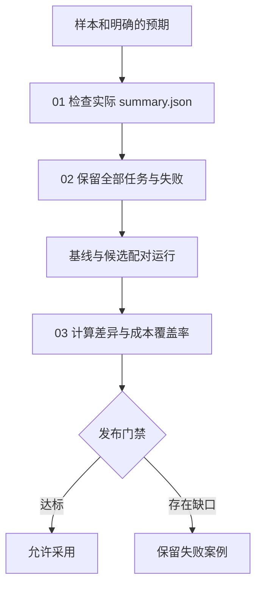

# 10｜评估与验收

本章验收统计脚本生成的文件，再用固定样本集比较两个版本。

[组件总览](../README.md) · [上一章：持久化与故障恢复](../09-persistence-and-recovery/README.md) · [下一章：Trace 与可观测性](../11-trace-and-observability/README.md)

样本统计任务读取 CSV，将有效样本的数值写入 `summary.json`。验收器检查文件是否满足契约，离线评测在固定任务集上比较基线与候选。

本章总览图如下：



| 阅读顺序 | 本篇解决的问题 | 完整入口 |
|---|---|---|
| [01｜产物验收](01-artifact-acceptance.md) | 正常退出和产物达标怎样分开；字段、值、类型怎样检查 | [run_one.py](code/run_one.py)、[check_artifact.py](code/check_artifact.py) |
| [02｜离线任务集与配对评测](02-offline-paired-evaluation.md) | 固定任务、重复试验、保留失败、同题配对 | [evaluation.py](code/evaluation.py) |
| [03｜回归、成本与发布门禁](03-regression-cost-and-experiments.md) | 回归、分母、成本缺失、实验反馈怎样一起看 | `evaluation.py` 中的 `build_report` |

## 环境与输入

使用 Python 3.10+。本章执行本地 CSV 处理，没有模型调用或密钥配置。章节目录是以下全部命令的工作目录：

```bash
cd "10-Knowledge/02 Agent Harness/10-evaluation-and-acceptance"
python -m pip install -r requirements.txt
```

`matplotlib` 只负责从结果画图。评测器与检查器使用 Python 标准库。

| 文件 | 实际用途 |
|---|---|
| [fixtures/cases.json](fixtures/cases.json) | 六题的固定输入路径与人工核对预期 |
| `fixtures/*.csv` | 普通、空格、大写、负数、空表和无效数值输入 |
| [artifacts/reference/report.md](artifacts/reference/report.md) | 已实际执行的 36 次运行汇总 |
| [artifacts/reference/comparison.json](artifacts/reference/comparison.json) | 配对行、成功率、成本覆盖率和门禁 |
| `artifacts/reference/runs/` | 每次输入副本、实际文件、检查结果和运行结果 |

## 运行命令

以下命令与正文中的命令相同，无需重复执行。`--out` 目录必须尚不存在，重复实验请换目录名；默认不传 `--out` 时会使用新的时间戳目录。

```bash
python code/run_one.py --case whitespace --variant baseline --out runs/one-baseline
python code/run_one.py --case whitespace --variant candidate --out runs/one-candidate
python code/evaluation.py --out runs/comparison
python -m unittest discover -s code -p 'test_*.py' -v
```

前两条分别输出 `exit_reason=completed accepted=False` 与 `exit_reason=completed accepted=True`。全套实验的标准输出为：

```text
baseline: accepted=9/18
candidate: accepted=15/18
paired wins/ties/regressions=6/12/0
release_gate=hold
artifacts=runs/comparison
```

成功率来自磁盘上的 `result.json`，单次 `accepted` 来自实际 `summary.json` 的验收结果。时延由每次本地运行测量，因此会变化。

本次运行了全部本地实验和 6 项关键行为测试，生成了上述参考产物；未请求外部模型。策略候选生成见 [15｜自进化](../15-self-improvement/README.md)。
