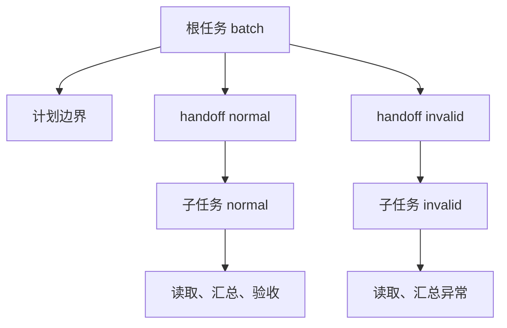

# 01｜Trace、Span 与任务关联

[阅读路线](README.md) · [下一篇：02｜时间、用量与版本](02-time-usage-and-versions.md)

本章总览图如下：



## 0. 操作计时

在章节目录执行以下完整 Python 片段，输入为真实的正常样本组样本；只打印行数和实际耗时，不写文件：

```python
import time
from pathlib import Path

started = time.perf_counter_ns()
text = Path("fixtures/normal.csv").read_text(encoding="utf-8")
elapsed_ms = (time.perf_counter_ns() - started) / 1_000_000
print("rows=", len(text.splitlines()) - 1, sep="")
print(f"elapsed_ms={elapsed_ms:.3f}")
```

标准输出第一行是 `rows=2`，第二行是本次实际耗时。耗时无法区分两条并发 `read_csv` 日志的归属，记录还需要运行 ID、任务 ID 和触发关系。

## 1. Trace 与 Span

`trace_id` 连接一次根任务中的全部操作；`span_id` 标识其中一次有起止时间的操作；`parent_span_id` 指向直接包住它的操作。工具重试时，每次尝试应该分配新的 span，而不是覆盖原 span。

下面是本章记录的格式示例，数值和 ID 用于说明结构；真实数据在 [trace.jsonl](artifacts/reference/trace.jsonl)：

```json
{
  "trace_id": "一轮运行的32位标识",
  "span_id": "s0005",
  "parent_span_id": "s0004",
  "task_id": "normal",
  "parent_task_id": "batch",
  "kind": "tool",
  "name": "tool.read_csv",
  "start_ms": 2.0,
  "end_ms": 62.0,
  "duration_ms": 60.0,
  "status": "ok"
}
```

| 字段 | 关联对象 | 为什么不能合并 |
|---|---|---|
| `trace_id` | 一次根运行 | 同一任务重跑仍应产生新运行 |
| `span_id` | 一次操作 | 同一工具可被多次调用 |
| `parent_span_id` | 直接调用或包裹关系 | 同一任务中的模型与工具仍有层级 |
| `task_id` | 业务工作单元 | 一个任务可能包含很多 span |
| `parent_task_id` | 分配该任务的上级任务 | 子任务可以转移到别的工作进程 |
| `caused_by_span_id` | 触发子任务的交接 | 区分任务归属与此次触发来源 |

这些是本程序保存的字段，不自动构成某个遥测平台的上传协议。迁移到平台时要显式做字段映射，尤其不要把一个业务 `task_id` 当作每次调用独有的 span ID。

## 2. 结束记录

完整实现使用上下文管理器。以下是 [Recorder.span](code/trace_demo.py) 的核心节选；`record` 已在进入时分配 ID 和起点，`self.path` 为 trace 路径。节选解释结构，不是独立脚本：

```python
try:
    yield record
except Exception as exc:
    record["status"] = "error"
    raise
finally:
    record["end_ms"] = (time.perf_counter_ns() - self.zero) / 1e6
    record["duration_ms"] = record["end_ms"] - record["start_ms"]
    with self.lock:
        with self.path.open("a", encoding="utf-8") as handle:
            handle.write(json.dumps(record, ensure_ascii=False) + "\n")
```

`finally` 确保普通 Python 异常也留下结束记录，`raise` 保留原控制流；trace 不负责把失败变成成功。锁只保护 ID 分配与文件追加，真实工具工作仍可并行。

下面是最小嵌套实验的完整终端片段，在章节目录执行，产物为 `runs/minimal/trace.jsonl`。目录应为空；若此前已运行，请换目录名，避免同一文件追加两次根运行：

```bash
python - <<'PY'
import sys
from pathlib import Path
sys.path.insert(0, "code")
from trace_demo import Recorder

out = Path("runs/minimal")
out.mkdir(parents=True, exist_ok=False)
rec = Recorder(out / "trace.jsonl")
with rec.span("task.batch", "task", "batch") as root:
    with rec.span("tool.read_csv", "tool", "batch", root) as child:
        child["attributes"]["bytes"] = len(Path("fixtures/normal.csv").read_bytes())
print("spans=2")
PY
```

标准输出为 `spans=2`。文件先出现工具行、后出现根任务行，因为当前格式在操作结束时落盘；不要把 JSONL 行顺序误当作开始顺序。报告会按 `start_ms` 排序。

## 3. 父子任务与交接

完整并行实验的根任务是 `batch`。它先读取明确选择的计划样本，然后提交两个线程。每次提交形成一个 `handoff`，保存来源任务、目标任务和输入文件。

`handoff-normal.json` 是实际交接文件，包含 `trace_id`、父 span、`from_task_id=batch`、`to_task_id=normal` 和 `input=normal.csv`。子任务 `task.normal` 的 `parent_span_id` 指向交接 span，`parent_task_id` 指向 `batch`。子任务内部的读取工具仍使用 `task_id=normal`。

这种区分在多 Agent 情况下更有用：一个父 Agent 可能分配两个子任务，子任务各自包含模型、工具和验收。只记录“worker-2”无法说明它处理的是哪一个业务任务；只记录任务 ID 又无法区分它的两次工具尝试。

这里的 `handoff` span 覆盖交接到子任务完成的整个等待区间，因此不能把它的时长解释成网络传输时间。真实跨进程交接应把 trace 和父关系放入队列消息，接收端继续记录，而不是依赖 Python 内存对象。

## 4. 关联校验

[validate](code/trace_demo.py) 接收解析后的 span 列表，返回以 ID 为键的索引；发现坏关系会抛 `ValueError`。它检查 ID 唯一、单个 trace、单个根、父记录存在、子区间包含于父区间、跨任务时父任务正确，并沿父链检测循环。

这是当前单进程嵌套模型的契约。异步后台任务可能在父请求结束后继续执行，此时应该使用独立运行和因果链接，不能强迫它满足“子区间包含于父区间”。跨机器也不能直接比较本机的单调时钟值。
