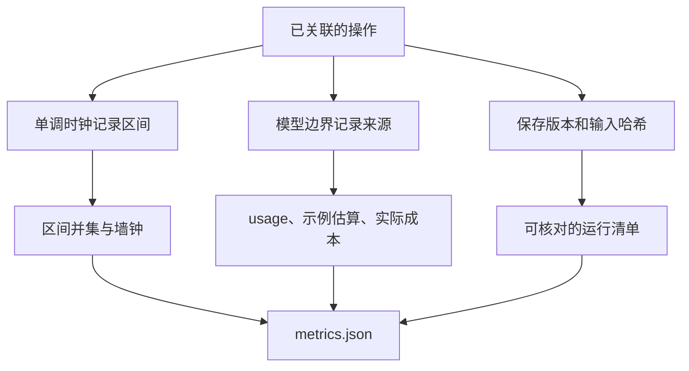

# 02｜时间、用量与版本

[上一篇：01｜Trace、Span 与任务关联](01-linked-spans.md) · [阅读路线](README.md) · [下一篇：03｜失败定位](03-failure-investigation.md)

本章总览图如下：



## 0. 并行区间

假设工具 A 从第 0ms 工作到第 10ms，工具 B 从第 5ms 工作到第 12ms。工作时长之和为 `10 + 7 = 17ms`，但从开始到最后一个完成只经过 12ms。重叠的 5ms 被加了两次。

下面是完整 Python 片段，在章节目录执行，调用配套函数，输入是明确的两个区间，不写文件：

```python
import sys
sys.path.insert(0, "code")
from trace_demo import union_ms

intervals = [(0, 10), (5, 12)]
print(sum(end - start for start, end in intervals))
print(union_ms(intervals))
```

标准输出为两行 `17` 和 `12`。`union_ms` 将重叠区间合并后再求长度。本章并行任务的实际结果使用同一个算法，输入来自保存的 trace。

## 1. 并行读取实验

以下完整命令在章节目录执行，输入为东、西 CSV；两个线程在屏障汇合后各等待 60ms，再读取文件。等待是显式注入的观察条件，不是测出来的生产服务时延：

```bash
python code/trace_demo.py --out runs/parallel --delay-ms 60
```

两条读取 span 都保存 `injected_delay_ms=60`。屏障让两个子任务先就绪，再进入等待；线程调度与文件操作仍有实际差异。参考产物的毫秒数可以在 [metrics.json](artifacts/reference/metrics.json) 中核对，重跑不要求相同。

| 指标 | 从什么计算 | 应怎样解释 |
|---|---|---|
| `root_wall_ms` | 根任务结束减开始 | 本轮根任务实际经过的时间 |
| `child_duration_sum_ms` | 两个子任务各自时长相加 | 累计子任务占用时间，会重复计算重叠 |
| `child_interval_union_ms` | 两个子任务区间并集 | 至少一个子任务活动的时间 |
| `child_overlap_ms` | 子任务和减区间并集 | 本例两个子任务的重叠时长 |

这些层级不能混加。根任务本来就包含交接与子任务；再把它和所有工具 span 相加，会把同一段时间重复计算好几遍。线程等待也不是 CPU 忙碌时间，span 时长测到的是经过时间。

本机起止间隔用 `perf_counter_ns`，避免系统时钟校准影响区间。`start_utc` 另存可读时间，便于人工定位和跨系统大致关联；不能用不同机器的单调起点计算跨进程时差。

## 2. 用量来源与费用

本实验回放 [provider-response.json](fixtures/provider-response.json)，记录模型边界的用量字段。该文件开头写明是手写协议样本，包含 `input_tokens=36`、`output_tokens=18` 和两组样本计划。

模型 span 记录以下字段：

| 字段 | 本次值 | 含义 |
|---|---|---|
| `execution_mode` | `fixture_replay` | 实际执行的是读样本文件 |
| `usage_source` | `fixtures/provider-response.json` | 数值来自哪里 |
| `usage_provenance` | `handwritten_protocol_example` | 不是捕获的真实 API 流量 |
| `model` | `fixture-model-v1` | 样本标识，不是真实供应商模型 |
| `response_sha256` | 实际文件哈希 | 能核对本次读取的样本版本 |
| `usage` | 36 输入 / 18 输出 | 原样记录样本值 |

接真实模型时，应在 SDK 返回响应的边界读取供应商 usage，同时保存 request ID、实际模型标识和重试尝试；不要对消息做字符计数后冒充供应商返回的 token 数。若响应未带 usage，就写缺失并保留原因，不在汇总时补零。

费用也一样。样例费率文件明确标为任意演示值，输入每百万 token 为 1、输出为 2，因此公式给出：

$$
(36\times1+18\times2)/1{,}000{,}000=0.000072
$$

`illustrative_cost_usd=0.000072` 只用于演示计算；`cost_usd=null`、`cost_source=no_live_invoice` 才是本次实际费用字段。两者分开，避免图表将协议样本变成虚假的账单。

## 3. 费用汇总

假设真实远程调用已提供用量，子模型 span 可以负责保存 token 和费用；父任务聚合时读取这些叶子 span。不要让父任务再复制一份同样的 token 后一起求和。

当前报告只遍历 `kind=model` 的 span。模型 span 总数为 1，费用已知数为 0，所以总模型费用保持 `null`。如果将来有三次调用、只有两次有账单，可以展示那两次的已知小计和 `2/3` 覆盖率，却不能宣称它们就是完整总和。

使用缓存 token、推理 token 或分层费率的供应商时，应按返回字段和实际价格规则单独处理。这里的两项公式只覆盖样本定义的输入、输出两类计价，不宜直接套到所有供应商账单。

## 4. 版本与输入哈希

每条 span 都带本次代码定义的 `engine`、`tool`、`policy`、`prompt` 版本；根目录的 `manifest.json` 还保存运行脚本和全部输入文件的 SHA-256。版本名回答“我们给它起了什么名字”，哈希回答“当时的内容是什么”。两者配合可以发现名字未变、内容却改了的情况。

本例的 `prompt=fixture-plan-v1` 指向回放计划版本，没有真实提示词调用。实际系统应保存提示词模板、工具 schema、技能内容、策略配置与模型标识，必要时保留脱敏后的实际请求。不要把密钥、认证头或未经选择的大段私密文档全部写入 trace；记录对象应以定位本任务所需的字段为准。

实验：换目录运行 `python code/trace_demo.py --out runs/no-delay --delay-ms 0`。两次结果都应为一个子任务成功、一个失败，但区间图会明显缩短，重叠比例可能变化。这个变化来自实验配置，而非算法进步；`manifest.json` 中的延迟参数能解释它。
