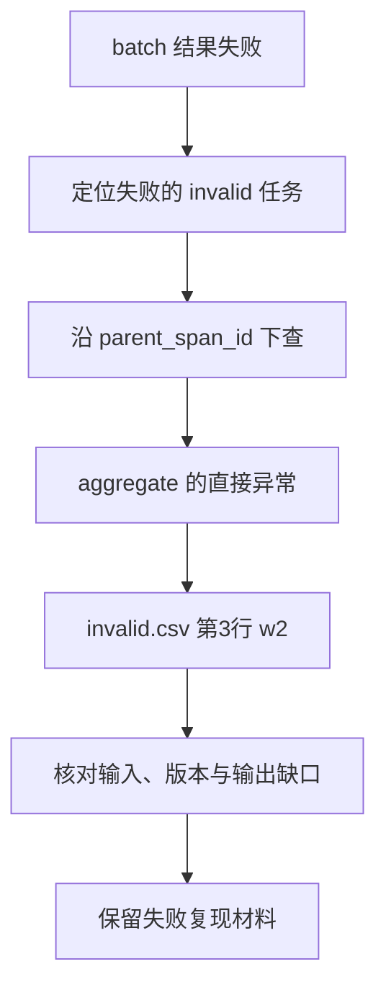

# 03｜失败定位

[上一篇：02｜时间、用量与版本](02-time-usage-and-versions.md) · [阅读路线](README.md)

本章总览图如下：



## 0. 任务结果

完整运行的 [results.json](artifacts/reference/results.json) 有两个子任务：正常样本组通过，异常样本组失败。异常样本组错误消息是 `invalid_value: file=invalid.csv row=3 sample=w2`。此时可以知道结果失败，但还要确认它是读取失败、解析失败、交接错误，还是最终验收没通过。

仅搜索 `status=error` 会找到多条：汇总工具、异常样本组任务、异常样本组交接和根任务都可能失败。它们不是四个独立故障，而是同一异常影响了几层工作。

## 1. 异常来源

下面是 [Recorder.span](code/trace_demo.py) 的实际函数节选。`span_id` 是当前操作 ID，捕获的 `exc` 继续向外抛出；片段不独立执行，也不打印内容：

```python
except Exception as exc:
    if not hasattr(exc, "origin_span_id"):
        exc.origin_span_id = span_id
    record["status"] = "error"
    record["error"] = {
        "type": type(exc).__name__,
        "message": str(exc),
        "origin_span_id": exc.origin_span_id,
        "is_origin": exc.origin_span_id == span_id,
    }
    raise
```

最内层汇总工具先设置 `origin_span_id`，外层任务和交接看到的是同一个异常对象，所以保留这个 ID。根任务汇集失败列表后将自己标为错误，但不再编造一个新的工具异常。跨进程时不能依赖异常对象属性，需要把错误类型、来源 ID 和因果关系显式放进传递消息。

“最早直接异常”只表示日志中最早观察到的异常位置。错误设计、错误输入来源或漏掉的数据校验可能发生得更早；如果此前没有记录，trace 不能凭空证明根因。本例能直接核对的事实是：读取完成，随后在数值转换处遇到了字符串 `oops`。

## 2. 父任务回溯

在章节目录执行以下完整 Python 片段，输入为已生成的参考 trace，只打印直接错误，不写文件：

```python
import json
from pathlib import Path

rows = [json.loads(line) for line in Path("artifacts/reference/trace.jsonl").read_text().splitlines()]
for row in rows:
    if row["error"] and row["error"]["is_origin"]:
        print(row["name"])
        print(row["error"]["message"])
```

标准输出：

```text
tool.aggregate
invalid_value: file=invalid.csv row=3 sample=w2
```

在同一条记录查看 `attributes.failed_row=3`、`sample_id=w2`、`input_file=invalid.csv`；沿 `parent_span_id` 找到 `task.invalid`，再找到 `handoff.invalid` 和 `task.batch`。[实际报告](artifacts/reference/report.md) 已保存这条 ID 链，重跑时 ID 分配顺序可能受线程调度影响，但父子关系应保持正确。

| 观察顺序 | 具体证据 | 可以得出的判断 |
|---|---|---|
| `tool.read_csv` | 正常完成、2 行、输入哈希 | 文件已成功读入 |
| `tool.aggregate` | 第3行的直接 `ValueError` | 失败发生于数值处理 |
| `task.invalid`、`handoff.invalid` | 相同 `origin_span_id` | 外层失败由该异常传播 |
| `results.json` | 异常样本组无通过产物 | 批处理不能宣称两组样本都完成 |
| 正常样本组验收 span | 重新读文件后 `accepted=true` | 正常样本组产物已单独达标 |

保留的 `invalid.csv` 是本次读取的副本，不依赖以后会不会修改根输入。这样失败复现有确定的材料，而不只是一个不稳定的线上文件路径。

## 3. 时间图


图中横轴来自每条 span 的实际起止时间；红色表示该操作状态失败。父级红条覆盖子级红条，是嵌套关系，不表示父层持续在产生另一个错误。两条读取工具大幅重叠，是明确注入的并行等待条件。

图只把太短的条形显示成至少 0.15ms，便于看见；原始 `duration_ms` 和报告中的数值未被放大。要比较精确耗时，应读取 `metrics.json` 与原始区间，不能从像素长度反算微小操作时间。

本次根任务墙钟小于两个子任务时长之和，正是重叠的直接证据。根时间也包含模型样本读取、任务提交、结果保存和线程收尾，因此通常略大于子任务区间并集。若根时间反而小于它，首先检查跨进程时钟或父子包含关系是否用错。

## 4. 故障实验

在章节目录运行完整命令。测试用临时文件构造真实嵌套与异常，结束后自动清理：

```bash
python -m unittest discover -s code -p 'test_*.py' -v
```

标准结果是 `Ran 4 tests`、`OK`。关键行为包括父子任务关联、孤立 span 拒绝、错误区间拒绝、区间并集合并，以及同一异常逐层传播后仍只有一个直接来源。

可以进一步将异常样本组输入的 `oops` 改为 `4`，同时将 `expected.json` 中异常样本组预期改为总和 7、有效行 2，再以新目录运行。预期变为两个任务成功，没有直接异常，且出现 `summary-invalid.json`。如果只改 CSV，不改独立验收预期，则新的直接失败应该出现在 `acceptance.summary`，而不是数值解析。这项实验区分工具执行成功与产物验收通过。

当前记录器在 span 结束时写入一行，适合解释已经完成的嵌套操作。若进程被强制终止，尚未结束的操作不会落盘；需要定位这类中断时，应增加开始事件、定期刷新和恢复时的未闭合记录检查，而不是把当前格式描述成已经具备持久恢复能力。
