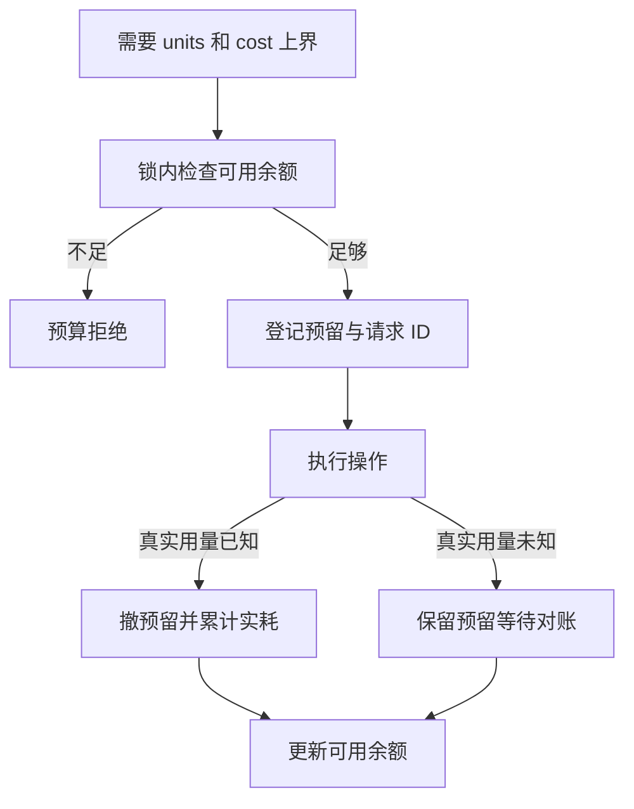

# 02｜预算预留与结算

[阅读路线](README.md) · [上一篇：工具与数据权限](01-permissions-and-data.md) · [下一篇：并发、截止与取消](03-concurrency-deadline-cancel.md)

本章总览图如下：



Alice 同时提交两个合法任务：A 需要预留 8 个计算单位，B 需要 6 个，总额为 10。若两个任务各自读到余额 10 后启动，获准用量会达到 14，因此余额检查与额度预留必须是同一个原子操作。

## 可用额度

账本同时记录计算单位和费用。每完成 1 个计算单位，本地服务按固定规则收取 3 微积分。预算上限可以分别设置，所以计算量足够、费用不足时仍要拒绝。

| 账本字段 | 含义 |
|---|---|
| `limit_units`、`limit_cost` | 本次任务的总上限 |
| `spent_units`、`spent_cost` | 已有准确回执的实际消耗 |
| `reservations[id]` | 尚未结算的 units、cost_micros 上界 |
| `calls` | 已经成功预留的累计调用次数 |
| `seen` | 防止同一请求 ID 再次预留 |
| `settled` | 防止相同回执结算两遍 |

对两个数量都使用 `可用 = 上限 - 已用 - 所有预留`。费用用整数微积分，避免浮点货币累计误差。这里是可验证的本地计费规则，没有套用实际模型价格。

下面是 `Budget.reserve()` 的函数节选，完整代码在 [control.py](code/control.py)：

```python
async with self.lock:
    if request_id in self.seen:
        raise Denied("duplicate_request")
    state = self.snapshot()
    if units > state["available_units"] or cost_micros > state["available_cost_micros"]:
        raise Denied("budget_exhausted")
    self.reservations[request_id] = {
        "units": units, "cost_micros": cost_micros, "unknown": False}
    self.seen.add(request_id)
    self.calls += 1
```

完整函数还检查正数、费用非负、调用次数上限。所有余额读写共用同一把 `asyncio.Lock`；两个协程不会同时通过旧余额。此锁用于一个进程的协程，不协调不同机器或进程的账本。[Python 3.12 同步原语文档](https://docs.python.org/3.12/library/asyncio-sync.html)

## 预留与结算

在章节目录运行下面完整片段，无输入文件，无文件产物；它打印内存账本的确定性余额：

```python
import asyncio
import sys
from pathlib import Path
sys.path.insert(0, str(Path("code").resolve()))
from control import Budget, Denied

async def main():
    budget = Budget(units=10, cost_micros=30)
    await budget.reserve("A", 8, 24)
    print("after_A", budget.snapshot()["available_units"])
    try:
        await budget.reserve("B", 6, 18)
    except Denied as error:
        print("B", error.code)
    await budget.settle("A", 3, 9)
    print("after_settle_A", budget.snapshot()["available_units"])
    await budget.reserve("B", 6, 18)
    await budget.settle("B", 4, 12)
    print("spent", budget.spent_units, "available", budget.snapshot()["available_units"])

asyncio.run(main())
```

标准输出：

```text
after_A 2
B budget_exhausted
after_settle_A 7
spent 7 available 3
```

B 第一次被拒绝，不进入 seen；A 结算后 B 可以再次尝试。A 成功预留了 8，只消耗 3，多出的 5 被释放；不能把 8 和 3 一起计入已用，否则会重复扣款。`run_experiments.py` 保存了这四步的事件与快照。

## 回执校验

`settle()` 在锁内确认请求仍有预留、没有已结算记录，并检查实际用量介于 0 与预留之间。回执越界时抛 `receipt_exceeds_reservation`，原预留保留，等待核查；系统不能凭一个超出上界的回执假装仍在硬预算以内。

`Runtime.execute()` 使用 steps 作为本次最大计算量，执行前要求 upper_units 至少覆盖 steps，费用上界为 `upper_units * 3`。每个完成的循环只增加 1 和 3，因此这里的预算上界由代码保证。任意外部服务若无法给出可靠最大消耗，就不能直接沿用这个硬上界承诺；需要按其协议控制最大输出与费用，或者明确使用软预算。

## 未知用量

A 向远端发出请求后超时，可能已经产生费用。把预留 8 全退回，再批准 B 8，会再次暴露超额风险。程序提供 `mark_unknown("A")`，只将记录标记为未知，不删除预留：

```python
# 在已导入 Budget 的协程内创建独立账户；这是接续片段。
budget = Budget(units=10, cost_micros=30)
await budget.reserve("remote", 8, 24)
await budget.mark_unknown("remote")
```

本例中 unknown_usage 场景使用一个独立的 10 单位账户，结果为 reserved_units=8、available_units=2、unknown=["remote"]。以后取得可信回执再 settle；不能因为调用方未收到响应就推断用量为零。

单元测试还验证：费用先耗尽时拒绝、调用次数到顶时拒绝、负数预留被拒绝、重复结算不增加已用、未知预留阻止后续超额请求。

[下一篇：并发、截止与取消](03-concurrency-deadline-cancel.md)
