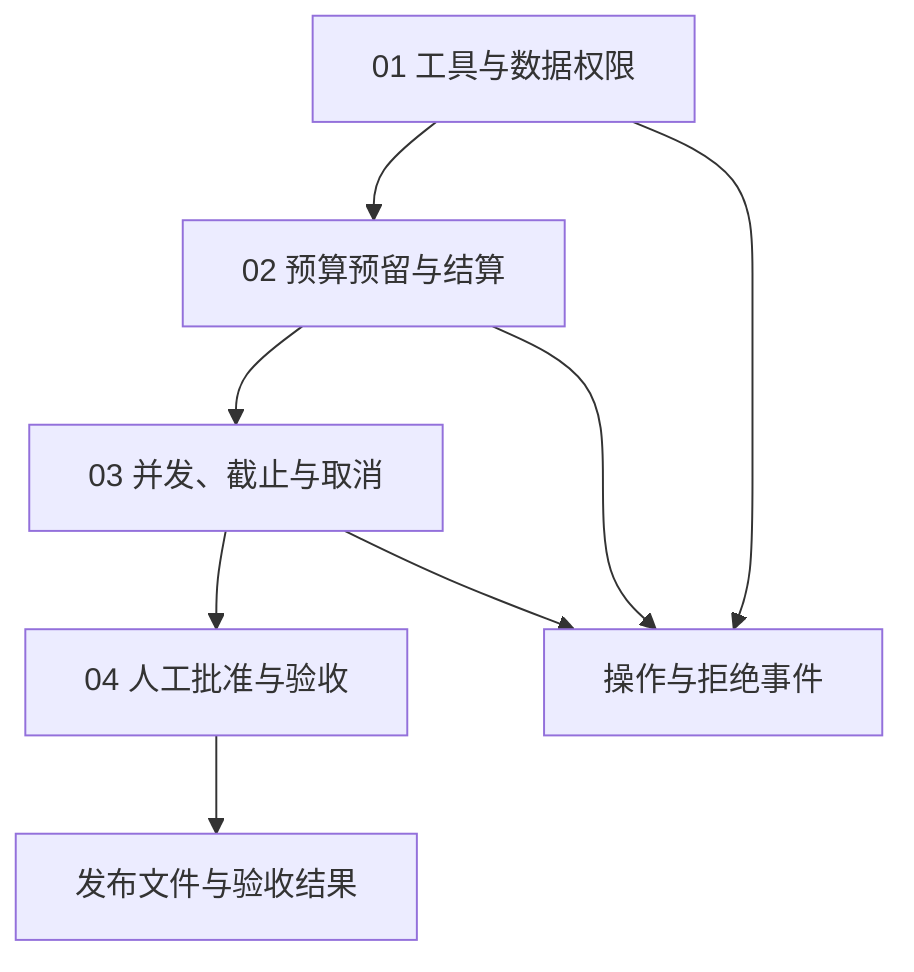

# 12｜权限与资源控制

本章为本地报告设置读取范围、写入批准与执行预算。

[组件总览](../README.md) · [上一组件：Trace 与可观测性](../11-trace-and-observability/README.md) · [下一组件：长期记忆 Memory](../13-memory/README.md)

示例记录分属 A、B 两个工作区。Alice 可读取 A 组结果，发布需要批准。执行入口检查工具和数据权限，并控制并发名额、调用次数、时间和费用。

本章总览图如下：



权限和额度由程序检查；模型请求中的“已批准”或“我是管理员”不会改变宿主提供的 `Principal` 与批准记录。

| 顺序 | 正文 | 入口与主要观察 |
|---|---|---|
| 01 | [工具与数据权限](01-permissions-and-data.md) | `run_minimal.py`：a1 允许、b1 拒绝，返回字段受限 |
| 02 | [预算预留与结算](02-reservation-and-settlement.md) | `control.py` 的 `Budget`：并发预留、费用、未知用量 |
| 03 | [并发、截止与取消](03-concurrency-deadline-cancel.md) | `Runtime.execute()`：等待也计时、取消后释放 |
| 04 | [人工批准与验收](04-approval-and-experiments.md) | `approval_cli.py`、`run_experiments.py`：绑定具体动作与真实文件 |

## 运行环境

工作目录为 `10-Knowledge/02 Agent Harness/12-permissions-and-resources/`。使用 Python 3.11+，因为代码使用 `asyncio.timeout_at()`；已验证 Python 3.12.14。只依赖标准库，无模型配置。

```bash
python code/run_minimal.py
python code/run_experiments.py --output runs/experiments
python -m unittest discover -s code -p 'test_*.py' -v
```

确定性的标准输出为：

```text
a1=allowed
b1=resource_denied
artifacts=runs/minimal
checks=12 passed=12
artifacts=runs/experiments
```

测试共 10 项。实验目录要求尚不存在，重复运行改用 `runs/experiments-2`。单个最小例子会更新 `runs/minimal/result.json`。

人工批准入口单独运行：

```bash
python code/approval_cli.py --output runs/approval
```

先查看屏幕上的主体、租户、具体动作、指纹和文件效果。输入 `APPROVE` 才签发一次性批准；输入其他内容得到 `approval_required`，不会生成 a1.json。这里“发布”只指把本地 JSON 写到指定输出目录，未连接邮件、聊天或外部发布服务。

## 输入与产物

| 位置 | 内容 |
|---|---|
| [examples/records.json](examples/records.json) | a1 属于 A，b1 属于 B，各含可公开字段和 private_note |
| [code/control.py](code/control.py) | 权限、批准、预算账本、并发和执行入口 |
| `runs/experiments/events.json` | 预留、开始、释放、结算、拒绝与批准事件 |
| `runs/experiments/result.json` | 12 个验收项及各场景状态 |
| `runs/experiments/permissions/a1.json` | 获得批准后实际写出的字段投影 |
| `runs/experiments/report.md` | 从本次结果生成的检查表 |
| `runs/approval/` | 人工入口的决定、事件以及可能写出的文件 |

可先打开 [已执行报告](evidence/experiments/report.md)、[完整结果](evidence/experiments/result.json)、[事件](evidence/experiments/events.json)和[发布文件](evidence/experiments/permissions/a1.json)。其中自动实验的批准来源是 `experiment_fixture`；标准输入测试记为 `stdin_fixture`，没有声称真人已经批准。

## 验证范围

最小入口、12 项集成检查、10 项单元测试、批准 CLI 的接受与拒绝输入均已执行，见 [validation.json](evidence/validation.json)。程序是单进程协程实现，使用内存身份、批准和账本；跨进程部署需要共享事务存储。费用采用本地服务的“每完成 1 单位收 3 微积分”规则，微积分是本例计费单位，与任何供应商价格无关。调用额度按成功预留计数，哪怕随后取消也不返还次数。
