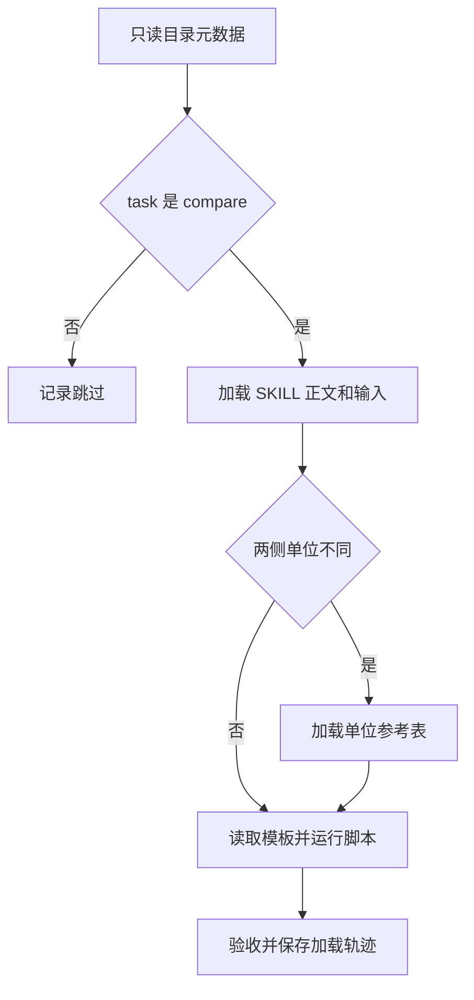

# 03｜渐进加载

[阅读路线](README.md) · [上一篇：技能结构与脚本](02-package-and-script.md) · [下一篇：技能验收与版本管理](04-validation-and-versioning.md)

本章总览图如下：



宿主先读取技能元数据，选中后读取方法正文，需要单位换算时再加载参考表，避免将无关内容加入上下文。

## 元数据加载

[host.py](code/host.py) 的 `header()` 打开 SKILL.md，从开头读取到第二个 `---` 就停止。它提取 name、description、version，不读取后面的方法正文。

下面是可在章节目录运行的完整片段，仅展示目录项，不创建产物：

```python
import sys
from pathlib import Path
sys.path.insert(0, str(Path("code").resolve()))
from host import header
metadata = header(Path("examples/skills/notes-comparison/SKILL.md"))
print(metadata["name"], metadata["version"])
```

标准输出：`notes-comparison 1.1.0`。本例解析器只支持随章包实际使用的简单 YAML 头部；正式宿主需要完整 YAML 支持和包格式校验，不能把这个函数当通用 YAML 解析器。

目录项用于选择，但不会执行包。当前选择规则很直接：task=compare 选择 notes-comparison；task=polish 跳过。这个显式标签隔离了加载机制，未让一个预设字符串选择器伪装成模型语义判断。

## 方法加载

`run()` 选中包后读取 SKILL.md 的 Markdown 正文。随后载入本次两份输入，保留 old.json、new.json 副本。记录同时保存文件内容的 SHA-256 与上下文字节数：

```python
# host.py 的 loaded() 函数节选；text 是真正加载的字符串。
trace.append({
    "event": "loaded", "kind": kind, "path": path,
    "context_bytes": len(text.encode("utf-8")),
    "sha256": hashlib.sha256(text.encode("utf-8")).hexdigest(),
})
```

context_bytes 是 UTF-8 大小，不是 tokenizer 的 token 数。哈希用于确认一次运行实际使用的内容；只记录“选中了 notes-comparison”不足以区分同名方法后续被改写的情况。

输入副本属于任务资料，方法属于可复用包。两者同时进入 trace，但 kind 分别为 input 与 method，便于检查哪一部分发生变化。

## 附件加载

宿主对比三个字段的 unit，只要有一处不同，就尝试加载 references/units.json 并把路径传给脚本。若旧包没有参考表，不会悄悄从新包借用；脚本随后返回 unit_conversion_required。这保证对比两个版本时实际使用的是各自完整的包。

模板总要用于输出，所以每个 compare 任务都会读取。脚本则通过普通 Python 子进程执行。trace 记录 executed 事件和脚本 SHA-256，但不把整段脚本源码计入上下文加载量；读取文件计算哈希与把源码发送给模型是两件不同的事。

实现中先根据单位差异决定是否读取参考表，再读取模板并执行。trace 中可以直接检查这个顺序，判断某个附件是否真的进入本次运行。

## 任务路由

章节目录下的完整命令：

```bash
python code/host.py --task compare --output runs/host
python code/host.py --task polish --output runs/polish
```

标准输出分别为 completed/True 与 skipped/None。打开两份 trace.json：

| 记录项 | compare | polish |
|---|---|---|
| catalog | 读取包元数据 | 读取包元数据 |
| method | 读取 SKILL 正文 | 无 |
| input | 读取旧、新资料并保存副本 | 无 |
| template | 读取模板 | 无 |
| reference | 本题 s 与 ms 不同，读取单位表 | 无 |
| executed | 实际运行 compare.py | 无 |
| acceptance | 验收实际报告 | 不适用 |

polish 没有生成比较报告，是正确的跳过，而非任务失败。宿主在真实程序里还应把这一任务交给其他方法；本章的入口仅负责判断本技能是否加载。

## 加载条件实验

复制 v2.json 到新的输入文件，把 body 中的 `10000 ms` 改成 `10 s`，同时把 timeout 的 value、unit、quote 改成 10、s、`timeout = 10 s`。保存为 `runs/v2-seconds.json` 后执行：

```bash
python code/host.py --new runs/v2-seconds.json --output runs/same-units
```

标准结果仍为 completed、acceptance=True，但 loaded_files 不再包含 references/units.json。数值结果应完全相同。`test_unchanged_units_skip_reference` 已在临时目录实际执行这个实验。

相同单位不需要参考表，因此本次未加载该附件。加载字节数由 trace 统计，不能直接当作 token 数。

[下一篇：技能验收与版本管理](04-validation-and-versioning.md)
