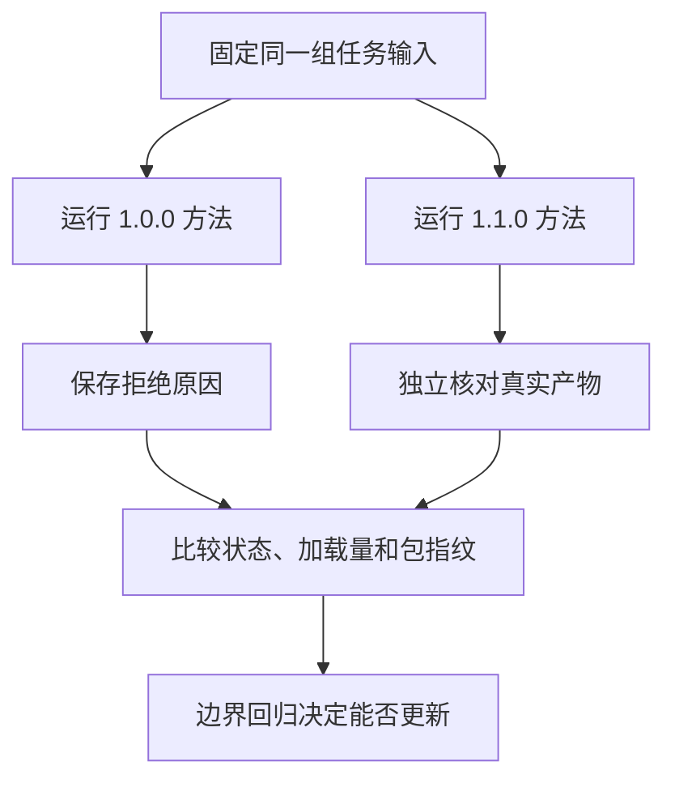

# 04｜技能验收与版本管理

[阅读路线](README.md) · [上一篇：渐进加载](03-progressive-loading.md)

本章总览图如下：



1.0.0 版本遇到秒与毫秒会拒绝比较；1.1.0 增加单位表和加载步骤。实验使用相同输入，比较执行状态、产物和加载记录。

## 产物验收

`compare.py` 退出 0 后，宿主调用 [validate_output.py](code/validate_output.py)。验收器重新读取 comparison.json、report.md 与两份输入，不复用 compare() 的返回对象；因此能发现文件后来被改坏，或渲染过程丢了字段。

在章节目录执行下面完整命令，输入是已生成的 runs/direct：

```bash
python code/validate_output.py --output runs/direct --old examples/inputs/v1.json --new examples/inputs/v2.json
```

标准输出为 `acceptance=True checks=23`，写出 `runs/direct/acceptance.json`。

| 检查组 | 实际核对的内容 |
|---|---|
| 版本与程序 | old/new 版本匹配，程序一致，两侧 stable |
| 字段集合 | 三项字段齐全，顺序符合输出约定 |
| 双侧证据 | source、version、value、unit、quote 与原输入一致 |
| 引文支持 | 完整原文行存在且 key/value/unit 一致 |
| 数值转换 | 独立换算结果与报告值相等 |
| changed | 与换算后数值差异一致 |
| 人可读报告 | 实际 Markdown 的标题程序与版本正确，并包含正确行、数字与双侧证据 |

缺文件、坏 JSON、错误形状或缺字段会变成 passed=false 与 invalid_artifact 记录；宿主仍写出 acceptance.json、trace.json、result.json。不能让验收器自己抛 KeyError 后丢掉失败证据。

该验收器包含本题支持的单位关系，独立于包内参考表。因此如果错误地把包中 ms 的倍率写成 0.01，脚本能生成文件，但验收会失败。更新单位种类时，也应先明确外部验收规则，而不是让被测程序自己声明正确。

## 版本目录

包名始终为 notes-comparison，目录名与 SKILL name 一致；两个版本分别放在 examples/skills-v1 和 examples/skills 下。无需覆盖旧包，也无需安装到个人技能目录。

| 内容 | 1.0.0 | 1.1.0 |
|---|---|---|
| 主方法 | 单位不同就拒绝 | 单位不同加载参考表 |
| 单位附件 | 无 | s、ms、attempts、items 的转换关系 |
| 比较脚本 | 支持可选单位参数 | 复用相同脚本 |
| 同题结果 | unit_conversion_required | 30 s 与 10 s，验收通过 |

本次更新改变的是方法与领域附件，脚本内容未变。代码复用并不意味着技能版本不能更新：调用脚本的条件、传入参数与领域规则也会改变最终行为。

## 版本对照实验

```bash
python code/run_experiments.py --output runs/experiments
```

标准摘要为 `checks=4 passed=4`。实际 [对照报告](evidence/experiments/report.md)由每次 host 返回的状态与 loaded_bytes 生成。

| 场景 | 与基准相比改变什么 | 期望行为 |
|---|---|---|
| v1_units | 包换成 1.0.0 | 拒绝单位差异，不伪造比较结果 |
| v11_units | 包换成 1.1.0 | 生成三项对照并通过 23 项验收 |
| polish | 任务改为仅润色 | 只加载目录，跳过本技能 |
| preview | 新版资料换成预览稿 | release_mismatch，拒绝交付 |

compare 的加载字节可能比旧包更多，因为新增方法和附件。评估更新时同时检查任务验收结果和额外加载量。

## 版本与内容指纹

```bash
python code/package_manifest.py --output runs/package-manifest.json
```

标准输出为 `packages=2 artifacts=runs/package-manifest.json`。清单保存相对路径、声明版本以及包内每个实际文件的 SHA-256。只改文件不改版本时，清单仍能显示内容变动；重放时应同时核对版本与哈希。

本章的 trace 记录方法、参考表、模板和执行脚本的内容指纹，完整清单补齐未加载文件。目录发现、task 路由、哈希策略和验收器是本章宿主约定；官方格式规定的是 SKILL.md 的结构及可选资源组织，没有规定这套 Python API 或 notes-comparison 的业务步骤。[Agent Skills 格式规范](https://agentskills.io/specification)

## 回归测试

```bash
python -m unittest discover -s code -p 'test_*.py' -v
```

10 项测试覆盖跨单位正确转换、30 s 与 30000 ms 应判为无变化、预览稿拒绝、伪造引文与缺字段、量纲不符、润色不加载正文、产物被改坏后的验收失败，同单位跳过参考表、报告标题被改为其他程序版本、坏文件与缺字段，以及验收失败时宿主仍保存完整记录。多个边界放在同一项测试中，因此场景数不等于测试方法数。

你可以复制一份已经生成的 comparison.json，把 timeout.new 从 10 改成 10000，再运行 validate_output.py。预期 acceptance=False，退出码 1；即使 report.md 仍写得漂亮，结构化结果也无法通过。若同时把报告数字改成 10000，独立数值检查仍应拒绝。

验证记录见 [validation.json](evidence/validation.json)。若增加模型选择技能的功能，还需检查名称、描述与真实任务的匹配结果，并保存模型输入与输出；当前显式路由实验不包含这项评测。

[返回阅读路线](README.md)
