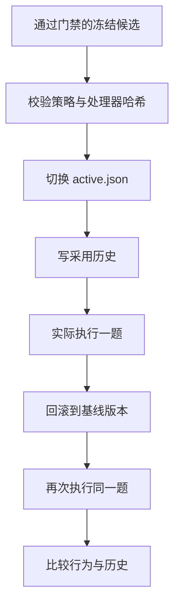

# 03｜版本、采用与回滚

[上一篇：02｜同题评测与采用门禁](02-paired-gates.md) · [阅读路线](README.md)

本章总览图如下：



## 0. 版本目录与当前指针

如果每次修改都覆盖 `policy.json`，出问题时就无法确认旧版内容。这里保存两个不可变的版本目录，再用很小的 `active.json` 指向当前版本。

| 文件 | 实际职责 |
|---|---|
| `versions/<version>/policy.json` | 冻结的策略内容 |
| `versions/<version>/policy_engine.py` | 与该策略配套的处理器源文件快照 |
| `versions/<version>/manifest.json` | 策略与处理器哈希、证据、创建时间 |
| `active.json` | 当前内容版本 ID |
| `decision.json` | 哪个候选在哪次评测下获准采用 |
| `history.jsonl` | 从哪版切到哪版、动作、原因与时间 |

版本 ID 由规范化策略 JSON 和处理器哈希计算，并截取 SHA-256 的前 16 位作为本实验目录名。完整文件哈希仍写入清单；更大规模系统可以使用完整摘要避免短标识碰撞。本章没有复用已存在目录，版本内容被改过后也不会静默接受。

## 1. 内容校验

[load_version](code/cycle.py) 的下列节选展示关键检查。`target` 指向版本目录，`ENGINE` 指向当前实际执行的处理器文件；校验通过后返回策略字典，不产生标准输出：

```python
manifest = read_json(target / "manifest.json")
if manifest["policy_sha256"] != sha(target / "policy.json"):
    raise ValueError("version policy hash mismatch")
if manifest["engine_sha256"] != sha(ENGINE):
    raise ValueError("version engine hash mismatch")
```

完整函数还比较保存的处理器快照，并重新计算内容版本 ID。这样不能只保留 `version=v2` 的名字，背后却悄悄运行另一份代码。

当前回滚覆盖策略变更，且要求处理器版本与评测时一致。如果要回滚工具代码、依赖或数据库迁移，应将它们纳入完整部署版本和兼容性检查；仅移动这个策略指针不能自动恢复外部数据副作用。

## 2. 指针切换

[run_cycle](code/cycle.py) 先保存 `decision.json`，只有 `decision['passed']` 为真才调用 `set_active`。切换函数先校验目标版本，再把新指针写到临时文件，用 `os.replace` 替换当前文件，最后追加变更历史。

下列是 `set_active` 的节选，输入由上一步门禁分支提供；没有额外的控制台输出：

```python
load_version(run, version)
write_json(run / "active.tmp", {"version": version})
os.replace(run / "active.tmp", run / "active.json")
```

文件替换避免读者看到只写了一半的 JSON。当前实现面向一个本地控制进程；指针替换和历史追加不是同一个事务，进程在两者之间中断时仍可能缺少一条历史。多写者或必须抗中断的控制面需要事务、锁和恢复协议，不能把这几行代码当作已经实现分布式部署。

## 3. 采用验证

如果你在第一篇创建了 `runs/manual-cycle`，现在在章节目录执行以下完整命令。输入为同一个 `whitespace` 任务，执行器先从当前指针加载策略，输出到新的 `runs/manual-adopted`：

```bash
python code/cycle.py active --run runs/manual-cycle --task whitespace --out runs/manual-adopted
```

输出结构为 `version=<候选内容标识> accepted=True`。这里的 `True` 来自重新读取 `runs/manual-adopted/summary.json` 并独立核对，文件应包含总和 4、有效行 1。

如果只看 `decision.json`，只能知道评测允许采用；看 `active.json` 才知道当前选择；再次跑实际输入，才能检查调用路径是否真的使用了这个选择。三种证据各有用途，不能相互替代。

## 4. 回滚验证

接着在同一工作目录执行完整命令。回滚先检查当前确实指向本次候选，再校验基线文件，切换指针并记录原因：

```bash
python code/cycle.py rollback --run runs/manual-cycle --reason demonstration
python code/cycle.py active --run runs/manual-cycle --task whitespace --out runs/manual-rolled-back
```

第一条输出 `rolled_back_to=<基线内容标识>`；第二条输出 `version=<基线内容标识> accepted=False`。这个失败是本实验预期观察：旧策略不识别带空格的 `valid`，所以总和再次为 0。它证明回滚改变了实际执行路径，而不是只改了日志中的版本文字。

重复回滚会被拒绝，因为当前版本已经不是该候选。回滚原因在实际部署时可以是新发现的回归、资源异常或监控告警；本次写的是主动演示，不声称发生了线上事故。

## 5. 完整实验

在章节目录执行 README 中的完整实验命令：

```bash
python code/experiment.py --out runs/cycle
```

它顺序完成基线运行、候选生成、两组评测、采用、重跑、回滚和再次重跑。标准输出见 README。已保存的参考证据可直接打开：

| 观察 | 实际参考路径 | 预期关系 |
|---|---|---|
| 候选得到采用 | [decision.json](artifacts/reference/decision.json) | `adopted=true` |
| 采用后重跑 | [after-adopt/result.json](artifacts/reference/after-adopt/result.json) | `accepted=true`，版本为候选 |
| 回滚后重跑 | [after-rollback/result.json](artifacts/reference/after-rollback/result.json) | `accepted=false`，版本为基线 |
| 当前指针 | [active.json](artifacts/reference/active.json) | 与决定中的基线 ID 相同 |
| 历史 | [history.jsonl](artifacts/reference/history.jsonl) | initialize → adopt → rollback |

最终指针回到基线，历史和两次运行产物仍保留采用及回滚的证据。候选目录与评测文件保留，可以再次研究为什么改进成立，也可以在新的门禁下重新决定是否采用。

## 6. 行为测试

在章节目录运行完整测试命令，输入为临时目录中的实际版本和任务，测试结束后清理：

```bash
python -m unittest discover -s code -p 'test_*.py' -v
```

标准结果为 `Ran 8 tests`、`OK`。测试验证未知失败不产生无根据修改、采用与回滚确实改变输出、总分提升仍可能因回归被拒绝、版本文件被篡改后拒绝加载、缺配对不缩小分母、预算超限可以阻止采用，以及缺输入仍保留全部失败记录但阻止比较与采用。

修改提示词、工具或技能时，也可以用同样的检查方式：候选是否真的生成了可查看的差异，原始失败是否改善，已有任务是否退步，运行是否加载获准的内容版本，回滚是否恢复已知行为。
