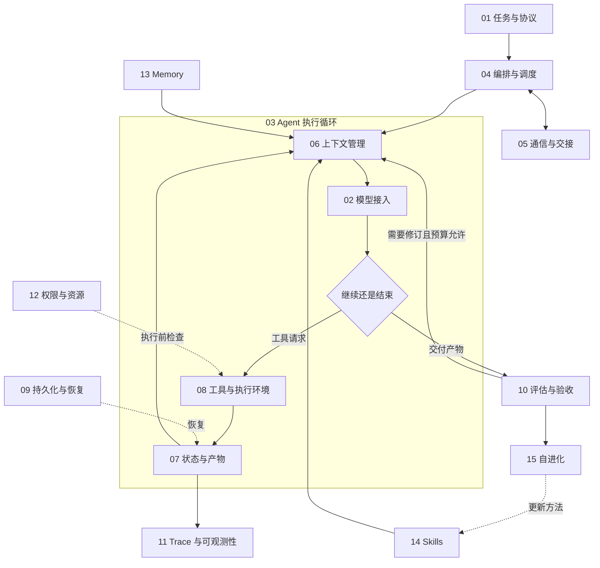

# 02｜Agent Harness

[知识库总览](../README.md)

Agent Harness 包含模型周围的任务、执行、工具、上下文、状态与控制机制。这里按 12 个核心组件与 3 个增强能力展开，各章提供正文、输入文件、代码与实验产物。

示例围绕同一条本地任务展开：读取笔记，处理统计数据或修复 `stats.py`，检查结果并保存报告。各章只增加本组件所需的输入、状态或控制规则。

组件总览图如下：



## 运行入口

进入 [03-agent-loop](03-agent-loop/README.md)，按 01—06 阅读：一次模型调用 → 工具与观察 → 历史与停止 → 错误与重试 → 实验对照 → OpenHands 源码。

在仓库根目录运行：

```bash
cd "10-Knowledge/02 Agent Harness/03-agent-loop"
python code/inspect_input.py
```

标准输出：

```text
本周完成了工具接入与循环日志。
saved=runs/input-preview.txt
```

程序还会保存 `runs/input-preview.txt`。模型配置与后续命令见[API 配置](03-agent-loop/README.md#api-配置)。

## 12 个核心组件

| 编号 | 组件目录 | 内容 | 任务与产物 |
|---|---|---|---|
| 01 | [任务与协议](01-task-contracts/README.md) | 把目标、输入、约束和验收条件写成可检查的任务约定。 | 给统计任务定义协议，检查输入、结果文件与验收证据 |
| 02 | [模型接入](02-model-adapters/README.md) | 用统一配置发送请求，接回文本、工具调用、错误与用量。 | 调用真实 API，保存文本、工具请求、流式片段与用量 |
| 03 | [Agent 执行循环](03-agent-loop/README.md) | 把模型决策、工具执行和观察结果连成循环，并设置退出条件。 | 读取笔记并修复函数，保存请求、差异与检查报告 |
| 04 | [编排与调度](04-orchestration-and-scheduling/README.md) | 按依赖安排任务，管理串并行执行、等待、失败与重规划。 | 将读取笔记和代码检查拆成依赖任务，比较串并行与重规划 |
| 05 | [通信与交接](05-communication-and-handoff/README.md) | 让执行者传递任务、证据与结果，并明确下一步由谁负责。 | 读取笔记并交接报告责任，追踪消息与失败回报 |
| 06 | [上下文工程与管理](06-context-management/README.md) | 管理本轮输入的来源、信任、版本、预算与生命周期，诊断失败并评测策略。 | 报告上下文：八类失败、八种策略、构建器与对照实验 |
| 07 | [状态与产物管理](07-state-and-artifacts/README.md) | 保存当前进度和实际成果，关联任务、版本与依赖。 | 保存代码修复的状态、版本、证据与并发冲突记录 |
| 08 | [工具与执行环境](08-tools-and-environment/README.md) | 将工具请求转换成可执行操作，返回可关联的结果与错误。 | 读取笔记、计算均值、回放步骤预算并保存工具结果 |
| 09 | [持久化与故障恢复](09-persistence-and-recovery/README.md) | 在进程退出或动作结果不明时，恢复进度并避免重复副作用。 | 中断后恢复统计报告任务，核对检查点、重试与幂等结果 |
| 10 | [评估与验收](10-evaluation-and-acceptance/README.md) | 检查当前产物是否达标，并用同一组任务比较系统版本。 | 验收样本统计文件，对同一任务集生成配对评测报告 |
| 11 | [Trace 与可观测性](11-trace-and-observability/README.md) | 关联模型、工具、上下文和验收记录，定位最早可见的错误。 | 串联父子任务和工具事件，生成可追踪的运行记录 |
| 12 | [权限与资源控制](12-permissions-and-resources/README.md) | 在动作执行前检查权限，并控制调用次数、并发、时间和费用。 | 执行权限与资源限制，核对拒绝、预留、结算和审批 |

## 3 个增强能力

| 编号 | 组件目录 | 内容 | 任务与产物 |
|---|---|---|---|
| 13 | [长期记忆 Memory](13-memory/README.md) | 跨任务保存并检索有来源、适用范围与有效期的信息。 | 跨进程保存与检索脚本检查经验，检查来源、冲突和有效期 |
| 14 | [技能库 Skills](14-skills/README.md) | 把可复用的方法整理成技能包，在适合的任务中按需加载。 | 制作并运行技能包，比较加载内容、版本与验收结果 |
| 15 | [自进化](15-self-improvement/README.md) | 从失败记录提出系统修改，经对照评测决定采用、回退或继续实验。 | 从失败提出策略修改，经评测采用或回滚版本 |
