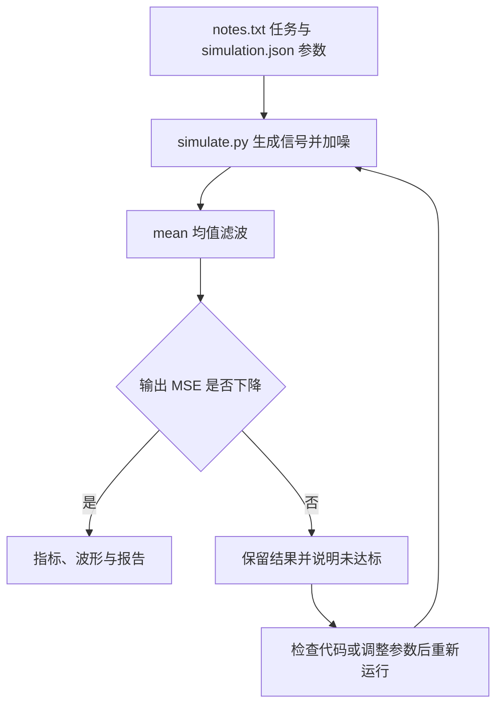

# 统一仿真任务

[Harness 总览](../README.md)

本章总览图如下：



## 任务提示词

每个组件根目录都包含同一份 `notes.txt`：

```text
任务：执行一次 Python 信号去噪仿真，并根据实际结果生成报告。
执行：python simulate.py --config simulation.json --output runs/simulation
输入：64 个采样点，2 个正弦周期，交替噪声幅度 0.3，均值滤波窗口 3。
检查：核对进程退出码和输出 MSE；若存在 stats.py，核对 mean 的除数和空列表处理。
产物：runs/simulation/metrics.json、runs/simulation/samples.csv、runs/simulation/report.md
要求：保留原始配置；报告引用真实指标，运行失败时记录原因，不编造成功。
```

保留仓库中的文件名 `notes.txt`，避免任务提示词、工具参数和读取路径出现两种拼写。

## 仿真代码

各组件的 `simulate.py` 调用 [simulation_core.py](simulation_core.py)。核心计算使用 Python 标准库，输入为一份 JSON 配置：

| 参数 | 默认值 | 含义 |
|---|---:|---|
| samples | 64 | 一个周期记录中的采样点数 |
| cycles | 2 | 记录内的完整正弦周期数 |
| noise_amplitude | 0.3 | 逐点正负交替的噪声幅度 |
| window | 3 | 均值滤波窗口，必须为正奇数 |

下面是可独立运行的最小计算。在任一组件目录执行，打印输入 MSE、输出 MSE 和改善量，不写文件：

```python
import math

n = 64
clean = [math.sin(2 * math.pi * 2 * i / n) for i in range(n)]
noisy = [x + (0.3 if i % 2 == 0 else -0.3) for i, x in enumerate(clean)]
filtered = [sum(noisy[(i + j) % n] for j in (-1, 0, 1)) / 3 for i in range(n)]
input_mse = sum((x - y) ** 2 for x, y in zip(noisy, clean)) / n
output_mse = sum((x - y) ** 2 for x, y in zip(filtered, clean)) / n
print(f"{input_mse:.6f} {output_mse:.6f} {10 * math.log10(input_mse / output_mse):.3f}")
```

标准输出：

```text
0.090000 0.010082 9.507
```

窗口跨越首尾时采用循环索引。MSE 是相对干净信号的平方误差均值；改善量为 `10 * log10(input_mse / output_mse)`。正负交替噪声使结果可重复，便于检查代码和产物。

## 执行与报告

在任一组件目录执行：

```bash
python simulate.py --config simulation.json --output runs/simulation
```

标准输出：

```text
samples=64 window=3
input_mse=0.090000 output_mse=0.010082
improvement_db=9.507 passed=True
artifacts=runs/simulation
```

| 产物 | 核对方式 |
|---|---|
| `config.json` | 本次实际参数的副本 |
| `metrics.json` | 完整数值、MSE 是否下降、配置及均值代码摘要 |
| `samples.csv` | 64 个采样点；列为 index、clean、noisy、filtered |
| `report.md` | 数值表、结论与上述文件的相对链接 |

[默认运行报告](reference/default/report.md)与[未滤波对照报告](reference/window-1/report.md)由本地执行生成。重复执行时使用新的输出目录，程序不会覆盖已有结果。

## 参数对照

以下完整代码在任一组件目录执行，生成新的配置文件；标准输出为 `simulation-window-1.json`：

```python
import json
from pathlib import Path

config = json.loads(Path("simulation.json").read_text())
config["window"] = 1
Path("simulation-window-1.json").write_text(json.dumps(config, indent=2) + "\n")
print("simulation-window-1.json")
```

运行新配置：

```bash
python simulate.py --config simulation-window-1.json --output runs/window-1
```

标准输出：

```text
samples=64 window=1
input_mse=0.090000 output_mse=0.090000
improvement_db=0.000 passed=False
artifacts=runs/window-1
```

窗口为 1 时输出等于加噪信号，误差没有下降。进程退出码仍为 0，表示脚本完成计算；`passed=False` 表示结果没有达到去噪要求。报告应保留这次结果。

## 执行循环中的修复

直接运行各章入口时使用共享实现中的正确均值函数。Agent Loop 的 v2—v4 则创建独立工作区，并复制一份除数错误的 `stats.py`；仿真脚本优先加载这份函数。Agent 修改它之后，需要重新执行仿真，再调用 `check_tests`。

验收器检查四项函数行为，并用正确实现重新计算 64 个波形点和指标。文件缺失、数值不符或 `stats.py` 在仿真后再次变化，都会导致验收失败。通过的离线运行及其真实产物见[执行循环参考记录](../03-agent-loop/reports/simulation-scenarios/normal/report.md)。

验证命令、覆盖范围与结果见[验证记录](verification.json)。仿真和离线实验已执行；真实模型调用需填写 API 配置后运行。
