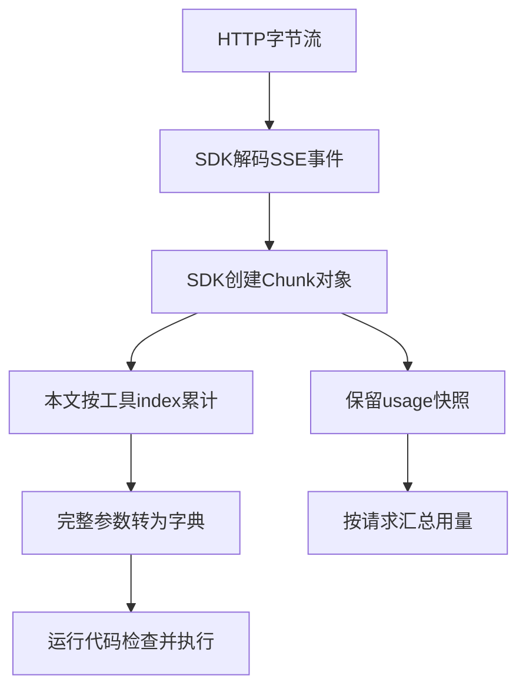

# 04｜对照官方 SDK 的响应与流处理

[阅读路线](README.md) · [上一篇](03-structured-output-and-usage.md)



前三篇已经实现模型接入。现在对照官方 SDK `3.16.2` 的实际源码，回答两件事：哪些工作 SDK 已经做了，哪些工作仍属于调用它的程序。快照取自本章验证环境的安装包，文件与许可证位于 `sources/`。

## 1. 先把类型声明对应到实际对象

打开 [chat_completion_message_function_tool_call.py](sources/chat_completion_message_function_tool_call.py)。其中 `Function` 继承 SDK 的 `BaseModel`，`arguments` 明确声明为 `str`，`name` 也为 `str`。

下面是该类字段声明的源码节选，省略文档字符串，不是独立脚本：

```python
class Function(BaseModel):
    arguments: str
    name: str
```

这正是第二篇需要 `json.loads` 的原因。SDK 已把 HTTP JSON 中的外层对象转成 `ChatCompletionMessageFunctionToolCall`，但参数字段本来就是 JSON 字符串；创建类型对象并不等于根据工具 Schema 校验其内容。

| 本文操作 | 固定版本源码对象 | 可以在文件中核对什么 |
|---|---|---|
| 读取工具名称与参数文本 | `Function` | `name: str`、`arguments: str` |
| 保存工具身份 | `ChatCompletionMessageFunctionToolCall` | `id`、`type`、`function` |
| 转成可派发字典 | 本章 `normalize_message` | SDK 类型外再做 JSON 对象解析与 ID 检查 |
| 检查可读取文件 | 本章 `tool_result` | 具体任务的 Schema 与工具白名单 |

SDK 与本章代码之间没有神秘的“动作识别”：每一步都有字段与类型转换。

## 2. 流式字段为什么允许缺失

打开 [chat_completion_chunk.py](sources/chat_completion_chunk.py) 的 `ChoiceDeltaToolCall`。以下是源码节选，省略文档字符串：

```python
class ChoiceDeltaToolCall(BaseModel):
    index: int
    id: Optional[str] = None
    function: Optional[ChoiceDeltaToolCallFunction] = None
    type: Optional[Literal["function"]] = None
```

`index` 必须出现，因为它让程序知道片段属于哪一个调用。其他字段可选，因此后续片段没有 ID 是合法情况。`ChoiceDeltaToolCallFunction.arguments` 同样是可选字符串，不能把没有该字段理解为“清空已经积累的参数”。

继续看 `Choice.finish_reason`：它在一般片段里可为 `None`，最终才提供结束原因。对应到本章实现：`feed` 在每一段只累积，`finish` 要求得到可处理的完成状态。读取完一个网络块与得到完整工具调用是不同事件。

文件末尾的 `ChatCompletionChunk.usage` 为可选 `CompletionUsage`；同一文件明确说明用量事件的 `choices` 可以为空。因此本章先读取 usage，再检查 choices，且不会在遇到 `finish_reason` 时立刻跳出迭代。

## 3. SDK 怎样把字节变成事件

打开 [_streaming.py](sources/_streaming.py)。`Stream._iter_events` 把 `response.iter_bytes()` 交给 SSE 解码器。以下是函数中的源码节选，依赖 SDK 内部对象，不能独立运行：

```python
yield from self._decoder.iter_bytes(self.response.iter_bytes())
```

这一层负责按网络字节还原 SSE 事件边界。一个网络块不一定正好是一条事件；本章使用 SDK 迭代器，因此无需自己用换行去切底层网络数据。

接着看 `Stream.__stream__`。它读取 SSE 数据，识别 `[DONE]`，将事件 JSON 转为目标 SDK 类型，并在 `finally` 中关闭响应。其关键分支的源码节选为：

```python
for sse in iterator:
    if sse.data.startswith("[DONE]"):
        break
```

| SDK 函数或类型 | 已经做的工作 | 本章仍要做的工作 |
|---|---|---|
| `SSEDecoder.iter_bytes`、`decode` | 还原事件边界与数据行 | 不按网络分块猜测语义 |
| `Stream._iter_events` | 读字节；把传输异常转为 SDK 连接/超时异常 | 保存本次已收到片段与失败记录 |
| `Stream.__stream__` | 识别结束事件、JSON 事件、服务错误；关闭响应 | 检查语义完成状态，拒绝半截工具调用 |
| `ChatCompletionChunk` | 表示一个候选的增量内容和可选 usage | 按 index 累积工具参数 |
| `CompletionUsage` | 保存服务 token 字段与细节 | 按请求统计已知值与缺失覆盖率 |

本章没有直接使用 SDK 更高层的 Chat Completions 流聚合接口，而是基于 `create(stream=True)` 展示如何积累增量。读者以后换用封装更完整的接口，仍可以用这些字段检查它交回了什么。

## 4. 断线后为什么没有完整 usage

在 `_iter_events` 中，超时异常被转成 `APITimeoutError`，请求异常被转成 `APIConnectionError`。本章捕获这两类错误并记录 `transport_error`。由于异常可能发生在已收到若干片段之后，记录中既可以存在 `chunks`，也可以存在错误，而没有 `normalized`。

[completion_usage.py](sources/completion_usage.py) 把 `prompt_tokens`、`completion_tokens`、`total_tokens` 声明为整数。对标准完整响应，这些字段是一组计数；为了处理兼容服务与缺失观测，本文每个字段额外允许 `None`，并把未收到的请求计入覆盖率分母。这是本程序的统计约定，不是修改供应商协议。

下面是完整本地片段，在章节目录执行。它用真实 SDK 类型读入本章样本，输出第一段工具参数类型和最后一段用量状态：

```python
import json
from pathlib import Path
from openai.types.chat import ChatCompletionChunk

raw = [json.loads(line) for line in Path("examples/stream-tools.jsonl").read_text().splitlines()]
first = ChatCompletionChunk.model_validate(raw[0])
last = ChatCompletionChunk.model_validate(raw[-1])
print(type(first.choices[0].delta.tool_calls[0].function.arguments).__name__)
print(len(last.choices), last.usage.total_tokens)
```

准确标准输出：

```text
str
0 10
```

这里验证的是类型与事件形状。实际模型是否按任务完成，还要回到 `live.py` 的真实入口和事实验收。

## 5. 让来源和本机依赖可核对

[manifest.json](sources/manifest.json) 列出四个快照文件的 SDK 路径与 SHA256；[LICENSE.openai](sources/LICENSE.openai) 保留该分发包的 Apache 2.0 许可证。源码文件来自安装的 `openai==3.16.2`，没有凭空写一个远端提交编号。

从章节目录运行：

```bash
python code/verify_sources.py
```

准确标准输出：

```text
sources=4 version=3.16.2 matched=true
```

脚本检查版本、文件摘要，并把快照与当前安装包逐字比较。若版本不同则明确失败，而不是在新代码上继续套用旧说明。

最后打开 [test_adapter.py](code/test_adapter.py) 的 `test_sdk_sse_stream_and_usage_only_event`：它使用实际 `OpenAI` 客户端、`httpx2.MockTransport` 和 SSE 文本，把请求序列化、SDK 解码、本文聚合串起来。测试断言 `stream_options.include_usage=true` 确实发出，最终工具参数与用量确实被接回。`test_interrupted_stream_records_unknown_usage` 则让字节流主动抛出 `ReadError`，核对既没有可执行字典，也没有捏造为零的 usage。

至此，模型接入交给下一层的是有明确字段、完成状态和用量观测的响应。下一组件将重复“请求—工具—观察”这个往返，直到任务结束或达到运行边界。
