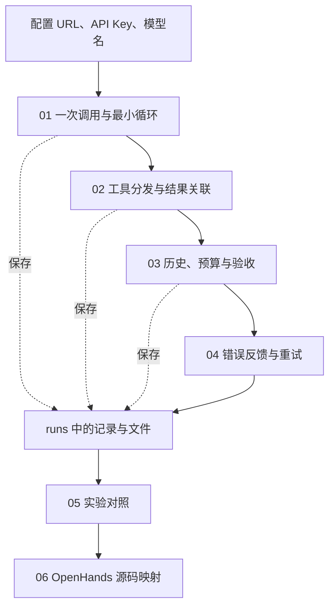

# 阅读路线｜Agent 执行循环

[组件总览](../../README.md) · [上一组件：模型接入](../02-model-adapters/README.md) · [下一组件：编排与调度](../04-orchestration-and-scheduling/README.md)

本章目录为 `10-Knowledge/02_Harness/03-agent-loop/`，文件编号 01—06 表示阅读顺序。

本章总览图如下：



## 阅读顺序

| 顺序 | 阅读文件 | 运行入口 | 这一阶段观察什么 |
|---|---|---|---|
| 01 | [模型调用与最小 Agent 循环](01-model-call-and-loop.md) | `v0_model_call.py`、`v1_minimal_loop.py` | prompt、response、工具结果怎样连起来 |
| 02 | [工具调用](02-tools-and-observations.md) | `v2_tool_dispatch.py` | 读文件、改文件、检查结果怎样分发 |
| 03 | [历史记录与退出条件](03-history-and-stopping.md) | `v3_controlled_loop.py` | 为什么停止，当前文件是否合格 |
| 04 | [错误处理与重试](04-errors-and-retries.md) | `v4_resilient_loop.py` | 错误怎样反馈，重试怎样计数 |
| 05 | [执行循环实验](05-loop-experiments.ipynb) | Notebook、`build_report.py` | 比较不同阶段与预算的运行记录 |
| 06 | [OpenHands 执行循环源码](06-openhands-source.md) | `sources/verify_sources.py` | 将本文循环对应到成熟项目的实际分支 |

表中 Python 入口位于 `code/`。

## 输入文件

| 文件 | 内容或用途 | 你可以怎样使用 |
|---|---|---|
| [notes.txt](notes.txt) | `本周完成了工具接入与循环日志。` | 打开修改文字，再运行 v1 |
| [examples/stats.py](examples/stats.py) | 除数写错的 `mean` 函数 | 作为 v2—v4 的修复起点 |
| `.env.example` | URL、API Key、Model 配置模板 | 复制为 `.env` 并填写 |
| [requirements.txt](requirements.txt) | OpenAI SDK 与配置读取依赖 | 安装后运行程序 |
| `runs/` | 运行时生成 | 查看输入副本、API 响应、文件修改和结果 |

每次运行会把当前的 `notes.txt` 和 `examples/stats.py` 复制到独立的 `runs/<运行编号>/workspace/`。修改根目录的笔记会影响下一次运行，已经保存的运行目录不受影响。

## API 配置

使用 Python 3.10 或更新版本，在章节目录执行：

```bash
python -m venv .venv
```

激活环境，然后安装依赖：

| 终端 | 激活命令 |
|---|---|
| macOS / Linux | `source .venv/bin/activate` |
| Windows PowerShell | `.venv\Scripts\Activate.ps1` |

```bash
python -m pip install -r requirements.txt
```

将 `.env.example` 复制为 `.env`。macOS / Linux 使用 `cp .env.example .env`，PowerShell 使用 `Copy-Item .env.example .env`。填写：

```dotenv
OPENAI_BASE_URL=https://api.openai.com/v1
OPENAI_API_KEY=你的实际密钥
OPENAI_MODEL=你的服务支持的模型名
```

| 配置项 | 对应 SDK 参数 | 填写规则 |
|---|---|---|
| `OPENAI_BASE_URL` | `base_url` | 填 API 基础 URL；不加 `/chat/completions` |
| `OPENAI_API_KEY` | `api_key` | 填该服务的实际密钥 |
| `OPENAI_MODEL` | `model` | 填支持 Chat Completions 工具调用的模型标识 |

程序使用官方 `openai` Python 包。接入兼容服务时，更换这三个值即可；具体工具调用能力以服务提供的接口为准。`.env` 不进入配套包与运行记录。

SDK 调用与工具消息格式参见 [OpenAI Python SDK 文档](https://developers.openai.com/api/docs/libraries)和 [Function calling 文档](https://developers.openai.com/api/docs/guides/function-calling)。

## 运行命令与产物

先检查输入文件，再按顺序运行：

```bash
python code/inspect_input.py
python code/v0_model_call.py
python code/v1_minimal_loop.py --manual
python code/v1_minimal_loop.py
python code/v2_tool_dispatch.py
python code/v3_controlled_loop.py
python code/v4_resilient_loop.py
python code/build_report.py
```

`inspect_input.py` 只读取文件；v0—v4 会请求配置的模型。v1 的 `--manual` 展示两次调用，默认命令展示自动循环。

一次运行的控制台输出结构如下。模型调用次数、检查结果和运行编号取自本次执行：

```text
status=<运行状态> reason=<退出原因> model_calls=<调用次数>
acceptance=<True 或 False，仅 v2—v4 输出>
artifacts=<本次运行目录>
```

v0 还会先打印模型回答。打开 `artifacts` 对应的目录，可以看到：

| 产物 | 用来查看什么 |
|---|---|
| `requests.jsonl` | 每次发给模型的原始请求，不含 API Key |
| `responses.jsonl` | 每次收到的原始响应，或错误类型 |
| `messages.json` | 本文循环保存的消息历史 |
| `trace.jsonl` | v2—v4 的模型响应、工具执行与退出事件 |
| `answer.md` | 模型最终正文或 `finish` 中的总结 |
| `workspace/notes.txt` | 这一次实际读取的笔记副本 |
| `workspace/stats.py` | 这一次修复后的函数 |
| `changes.diff` | `stats.py` 的前后差异 |
| `result.json` | 退出原因、调用次数和最终检查结果 |
| `report.md` | 本次运行的文字记录与结果表 |
| `runs/comparison.md` | 运行 `build_report.py` 后生成的跨次对照表 |

v0、v1 不检查 `stats.py`，因此它们的 `changes.diff` 为空；v0、v1 的 API 交互主要看 requests、responses 和 messages。

## 实验对照

修复任务检查四种输入：

| 输入 | 预期行为 |
|---|---|
| `[2, 4]` | 返回 `3` |
| `[-2, 2]` | 返回 `0` |
| `[10]` | 返回 `10` |
| `[]` | 抛出 `ValueError` |

`check_tests` 使用 Python 子进程检查运行目录中的函数。退出后再检查当前文件，结果记录在 `result.json` 与 `report.md`。运行模型生成的代码时，请使用隔离的实验环境。

自动化测试与固定故障场景放在辅助入口，不参与默认模型选择：

```bash
python -m unittest discover -s code -p 'test_*.py' -v
python code/run_scenarios.py all --summary
```

固定故障场景使用预设响应，用于复现提前结束、空响应、重复编号等分支。Notebook 的主线仍使用真实 API。

## OpenHands 源码

第 06 份文件使用 OpenHands SDK `v1.49.2` 的已保存快照，提交 `d128a786ee2ee570eb23ff5862ec148b43cfad0b`。相关原文件、切片与 MIT 许可证位于 `sources/`，可离线核对。

本次已验证本地代码、SDK 协议与文件保存流程；当前环境没有配置 API Key，真实模型运行记录由读者配置后生成。

从这里开始：[01｜模型调用与最小 Agent 循环](01-model-call-and-loop.md)。
