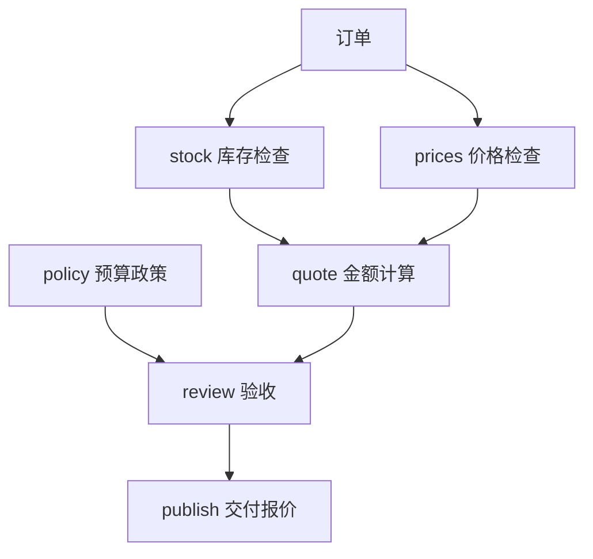

# 01｜任务图与角色选择

[阅读路线](README.md) · [下一篇：02｜任务状态与并发调度](02-scheduling-and-lifecycle.md)

本章总览图如下：



## 1. 订单金额

输入 [order.json](fixtures/order.json) 中有两行商品，单价在 [prices-v1.json](fixtures/prices-v1.json)。下面是完整可运行片段，工作目录为本章目录，依赖仅有 Python 标准库。把它放入 Python 解释器或临时脚本执行：

```python
import json
from pathlib import Path

order = json.loads(Path("fixtures/order.json").read_text(encoding="utf-8"))
prices = json.loads(Path("fixtures/prices-v1.json").read_text(encoding="utf-8"))
total = sum(item["quantity"] * prices["unit_cents"][item["sku"]]
            for item in order["items"])
print(total)
```

准确标准输出是 `5200`。`json.loads` 将文件文本转为字典；每个商品的数量乘以对应单价，最后求和。这个片段只打印，不创建文件。完整入口还会把订单 ID 和总额保存下来：

```bash
python code/v1_quote.py
```

标准输出：

```text
order=event-001 total_cents=5200
artifacts=runs/v1
```

打开 `runs/v1/result.json`，可以核对 `3 × 1200 + 2 × 800 = 5200`。此时价格计算成功，却还不能据此承诺交货：库存可能不足，预算也可能不允许。

## 2. 任务拆分

任务由库存检查、价格读取、金额计算与预算验收组成。拆分依据是输入依赖与返回结果。

| task_id | 直接输入或前驱结果 | 必须返回什么 | 失败的例子 |
|---|---|---|---|
| `stock` | 订单、库存文件 | `available` 和订单商品列表 | 文件无法读取 |
| `prices` | 订单、价格文件 | 已检查覆盖全部 SKU 的单价与版本 | 某个 SKU 没有价格 |
| `policy` | 政策文件 | `maximum_cents`、`shipping_cents` | 文件无法解析 |
| `quote` | `stock`、`prices` | 金额、库存结论、价格版本 | 前驱结果不齐，不应启动 |
| `review` | `quote`、`policy` | 验收通过的报价 | 库存不足或超过预算 |
| `publish` | `review` | 交付对象 | 验收失败，不应启动 |

`publish` 在本章只是构造最终结果字典，程序随后写本地文件；它不发布网页、不发送邮件，也不修改库存。`stock` 返回 `available=False` 是一次成功的检查，`review` 再据此拒绝订单；而 `prices` 缺项直接抛错，因为后续根本算不出完整金额。

完整业务函数在 [order_workflow.py](code/order_workflow.py) 的 `OrderWorker.__call__`。以下为其中 `quote` 分支的代码节选，依赖函数内已有的 `dependencies` 和 `inputs`；不是独立脚本：

```python
stock, prices = dependencies["stock"], dependencies["prices"]
total = sum(item["quantity"] * prices["unit_cents"][item["sku"]]
            for item in stock["items"])
fee = dependencies.get("shipping", {}).get("shipping_cents", 0)
return {"order_id": inputs["order"]["order_id"], "subtotal_cents": total,
        "shipping_cents": fee, "total_cents": total + fee,
        "available": stock["available"], "price_version": prices["version"]}
```

这个分支不打印，也不写文件，返回一个字典。初版没有 `shipping` 前驱，因此费用取 0。增加 `shipping` 节点后，金额计算会读取其返回的运费。

## 3. 任务图

`quote` 必须等待库存与价格，`review` 必须等待报价与政策。用前驱名字表示这些约束，得到有向无环图，简称 DAG：箭头从前驱指向后继，不允许依赖绕一圈回到自身。

下面是初始计划的完整片段。在本章目录运行，`sys.path` 让解释器找到配套模块；只创建和打印对象，不启动工作或写文件：

```python
import sys
sys.path.insert(0, "code")
from scheduler import Node, validate_plan

nodes = [
    Node("stock", (), "read"),
    Node("prices", (), "read"),
    Node("policy", (), "read"),
    Node("quote", ("stock", "prices"), "calculate"),
    Node("review", ("quote", "policy"), "review"),
    Node("publish", ("review",), "publish"),
]
plan = validate_plan(nodes)
print({key: list(node.dependencies) for key, node in plan.items()})
```

标准输出：

```text
{'stock': [], 'prices': [], 'policy': [], 'quote': ['stock', 'prices'], 'review': ['quote', 'policy'], 'publish': ['review']}
```

| `Node` 字段 | 类型 | 影响的决定 |
|---|---|---|
| `task_id` | `str` | 节点身份；计划中必须唯一 |
| `dependencies` | `tuple[str, ...]` | 哪些结果成功后才能启动 |
| `capability` | `str` | 选择具备哪项能力的执行角色 |
| `input_version` | `str`，默认 `"1"` | 当前节点所依赖输入的版本标记 |
| `timeout` | 正数秒，默认 `1.0` | 单次执行允许等待多久 |

`validate_plan` 先拒绝重名和不存在的前驱，再调用 `TopologicalSorter.prepare()` 检查环。不存在的前驱要单独查：标准库允许自动添加被引用的节点，但本章要求每个名字都有对应执行定义。标准库的图采用“节点 → 前驱集合”，方向别写反。[Python graphlib 文档](https://docs.python.org/3.11/library/graphlib.html)

修改片段，把 `stock` 的前驱改成 `("quote",)`。程序应抛出 `graphlib.CycleError`，因为库存等报价、报价又等库存。这个错误在启动任何执行者之前出现，避免所有任务无限等待。

## 4. 角色选择

角色先表达“哪个执行者能够接这个任务”。[scheduler.py](code/scheduler.py) 定义三类角色：

| 角色 | capabilities | capacity | cost |
|---|---|---:|---:|
| `reader` | `read` | 2 | 1 |
| `calculator` | `calculate` | 1 | 1 |
| `reviewer` | `review`、`publish` | 1 | 2 |

`cost` 是本章配置的选择优先级，不是 API 价格。调度器先筛选能力符合且未用满额度的角色，再按 `cost` 和名字选择。以下是方法节选，定义本身无标准输出，`self.roles` 和 `self.role_use` 由 `Scheduler` 初始化：

```python
def select_role(self, node):
    candidates = [role for role in self.roles
                  if node.capability in role.capabilities
                  and self.role_use[role.name] < role.capacity]
    return min(candidates, key=lambda role: (role.cost, role.name), default=None)
```

返回 `None` 表示合格角色暂时没有名额，要继续等待；如果整个配置中根本没有合格角色，构造调度器时就报错。这样不会把“暂时忙”误当成“永远无法执行”。权限和能力也不是同一个概念：真实 Agent 的工具白名单仍须由执行环境落实，角色名称本身不会施加访问限制。

[下一篇：02｜任务状态与并发调度](02-scheduling-and-lifecycle.md)
