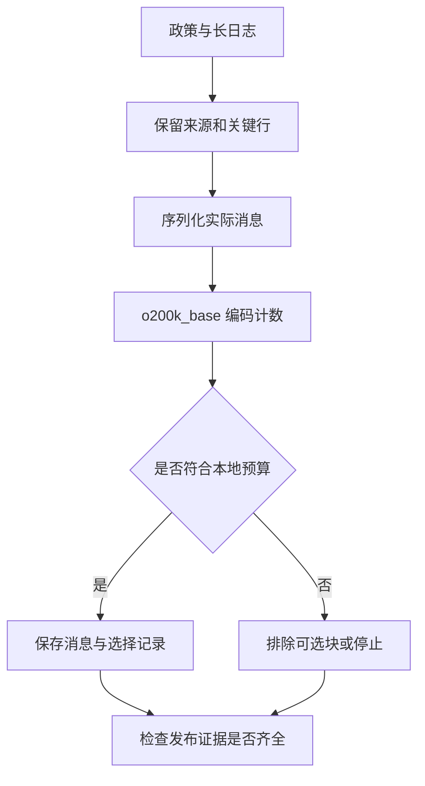

# 02｜Token 预算与工具结果裁剪

本章总览图如下：



[阅读路线](README.md) · [上一篇：独立上下文与按需加载](01-isolation-and-loading.md) · [下一篇：历史压缩与事实校验](03-history-compression.md)

## Token 计数

已加载的两份正文中，演练日志有 84 行。预算检查需要明确计数对象。本文固定使用 **tiktoken 0.12.0 的 `o200k_base`**，对明确的 JSON 字符串编码，再统计返回列表长度。

**完整可运行片段**；在章节目录执行，依赖已安装并预热的 tiktoken，无文件输入、不产生文件：

```python
import tiktoken

encoding = tiktoken.get_encoding("o200k_base")
ids = encoding.encode_ordinary("timeout_ms=3000")
print(ids)
print(len(ids))
```

准确输出：

```text
[32264, 50103, 28, 4095, 15]
5
```

`timeout_ms=3000` 不是 5 个字符，也不是按空格拆出的 5 个词。这五个整数才是本例编码 token 的可核验结果。`encode_ordinary` 把特殊 token 样式的文本当普通资料处理；这不改变真正 API 如何包装角色消息。

字符数、UTF-8 字节数和 token 数分别计量：`len(text)` 数字符，`len(text.encode("utf-8"))` 数字节，编码器返回的 ID 列表长度才是该编码器的 token 数。归档实验使用字节计数，不把它的字节压缩量直接换算为模型计费 token。

[context.py](code/context.py) 的 `measure` 对 `ensure_ascii=False`、`sort_keys=True`、紧凑分隔符的 JSON 编码。字段顺序、空白规则和编码器名称固定，才能让 402 这个数字可复现。把字典直接 `str()`、换一种序列化方式，再比较 token 数，比较的已经是另一段输入。

## 输入预算

本文用下面这组**实验参数**，不是宣称某个模型的窗口只有 2400：

| 符号 / 字段 | 值 | 本例意义 |
|---|---:|---|
| W / window | 2400 | 给本次演示分配的总额度 |
| O / output_reserve | 600 | 为后续生成预留 |
| M / framing_margin | 300 | 为未计入的服务包装留余量 |
| B / local_input_limit | 1500 | 本地序列化输入上限，W − O − M |

`serialized_input_tokens` 精确描述的是**本文 JSON 消息串在指定编码器下的 token 数**，不是服务账单的 `prompt_tokens`。真实服务可能使用不同编码、角色分隔符、工具描述和隐藏包装。接入具体模型时应核实其窗口、生成上限与 tokenizer，并用真实响应的 usage 观察偏差；余量不是模型永不超限的证明。

`pack` 的**函数定义节选**如下。依赖同文件的 `copy`、`dumps`、`measure`，完整代码在 [context.py](code/context.py)；定义本身不打印。

```python
limit = window - output_reserve - framing_margin
packed = copy.deepcopy(messages)
packed += [{"role": "user", "content": dumps(item)} for item in mandatory]
if measure(packed) > limit:
    raise ValueError(f"mandatory_overflow: {measure(packed)} > {limit}")
```

系统提示、当前任务、当前政策、已验证的历史事实属于必需块。它们放不下时直接报错，因为继续删除会改变任务或约束。可选块按传入顺序逐一试放，每次重新测量整个消息串；`decisions` 记录 id、是否纳入和试放后的数值。

排序决定资料的装入顺序；事实冲突和缺证据仍要单独处理。

## 证据选择

预算也可以写为 $B_{evidence}=W-O-P-H$：$W$ 是总额度，$O$ 是输出预留，$P$ 是协议、工具定义与包装占用，$H$ 是目标、约束和状态等必需输入。假设它们分别为 1000、200、50、250，可选证据还剩 500。这里的数字用于算例，实际计数以整份请求为准。

候选片段的成本为 $t_i$、预计价值为 $u_i$、是否选中为 $x_i\in\{0,1\}$，可将选择简化为在 $\sum_i t_ix_i\le B_{evidence}$ 下增大 $\sum_i u_ix_i$。按 $u_i/t_i$ 排序是一种近似：预算为 10，A 的成本/价值为 6/12，B、C 各为 5/9，贪心先选 A 得到 12，选 B+C 则得到 18。事实与限定条件还可能必须一起保留，不能只按单段分数取舍。

第 04 篇会把工具定义、输出 Schema 一起放入被计数的请求。当前函数的计数范围仍是消息列表；不要把不同计数范围的两个数字直接当作节省比例。

## 工具结果裁剪

[dry-run.log](fixtures/docs/dry-run.log) 前两行是运行元数据，中间 80 行是成功心跳，最后两行才是：

```text
rollback_check=FAILED reason=missing_permission
release_gate=BLOCKED
```

这是**输入文件节选**，不作为代码执行。取 `body[:180]` 得到的几乎全是“启动正常”“心跳正常”，不能回答“回滚演练是否通过”。本例真实实验中，头部裁剪保留失败证据为 False。

`crop_tool_result` 保留头两行、尾两行，同时保留文件版本、总行数、原始 SHA-256、原行号、遗漏区间与 `truncated` 标志。输出的关键字段是：

| 字段 | 本次值或结构 | 后续怎样使用 |
|---|---|---|
| path / version | docs/dry-run.log / run-17 | 确认回读哪份文件、哪次演练 |
| total_lines | 84 | 知道已拿到的不是全部内容 |
| omitted_lines | [3, 82] | 需要中段信息时回读该范围 |
| lines | 1、2、83、84 行及正文 | 引用错误位置，保留失败结论 |
| source_sha256 | 原正文的 64 位十六进制摘要 | 回读前确认源文件未被替换 |

完整函数在 [context.py](code/context.py)。裁剪后的 dict 是待嵌入消息的证据对象；若接回第三章的执行循环，还要放进对应 `tool_call_id` 的 tool 消息。

结构裁剪把该日志对象从 962 个编码 token 减到 150 个，并保留了失败行。但“头尾”只适合本次已知日志结构；如果异常在第 40 行，仍会遗漏。实际工具应按结构化状态字段或错误定位结果选取关键行，随后保留可回读路径；不能把头尾策略当作通用错误搜索。

## 预算与证据验收

**两次完整实验命令**，工作目录、依赖与 fixtures 同 README。输出分别写到两个独立目录：

```bash
python code/run_experiments.py
python code/run_experiments.py --window 1301 --out runs/tight
```

准确对照：

| 实验 | 本地输入 / 上限 | 日志块 | 发布检查 |
|---|---:|---|---|
| default | 402 / 1500 | 纳入，失败证据可见 | BLOCKED |
| tight | 234 / 401 | 试放需要 402，故排除 | NEEDS_EVIDENCE |

把日志放在“可选预算块”仅表示打包器可以排除它，不表示业务允许缺少演练结果。后面的 `acceptance` 检查仍要求演练证据；没有证据时应该换一个更窄的工具查询或提高预算，然后再次检查。

可以把窗口改为 1302，输入上限变成 402，恰好容纳同一份消息；发布状态又变为 BLOCKED。这里改变的是可见证据，不是演练本身。原始 fixture 从未修改。

## 完整工具交互

直接保留最后十条消息可能留下工具结果，却删掉它对应的调用。一次 assistant 消息可以请求多个工具，这条消息及其全部结果应作为一个动作组裁剪。最新用户更正、硬约束、未完成项和停止条件放在独立状态中，不随旧动作组删除。

下面是完整可运行片段，工作目录为本章，依赖 README 环境。它读取 task fixture，使用 `builder.py` 的实际裁剪函数，打印移除组数和保留的调用编号，不写文件。

```python
import sys
sys.path.insert(0, "code")
from builder import trim_action_groups
from context import initial_messages, read_fixture
from engineering_experiments import action_group

prefix = initial_messages(read_fixture("task.json"))
groups = [action_group("old-read", "启动成功。" * 200),
          action_group("dry-run-log", "rollback_check=FAILED")]
result = trim_action_groups(prefix, groups, 260)
print(result["removed_groups"])
print(result["messages"][-1]["tool_call_id"])
```

标准输出为两行 `1`、`dry-run-log`。函数同时计入“已移除动作”的通知，拒绝缺结果、重复调用编号和孤立工具消息。把 260 改为 5，会抛出 `latest_complete_group_overflow`；最新完整组放不下时不能拆组凑数。完整产物由 `engineering_experiments.py` 保存到 `trimmed-messages.json`。

分段读取也需要完整性标记：行号告诉读者读到哪里，`next_start` 告诉程序是否还有后续。把条件和结论拆开可能需要第二次读取，应沿段落或结构化记录边界取数据。第 06 篇实现带行号和下一页位置的回读。
